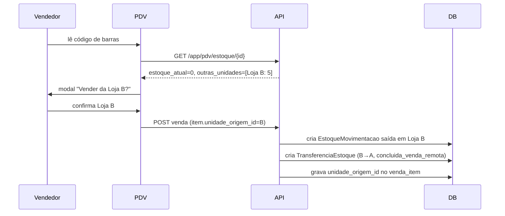

# ERP Comercial IA365 — Documentação Técnica

> SaaS ERP multi-tenant para PMEs. Admin (IA365) gerencia a plataforma; cada empresa-cliente tem múltiplas unidades com fiscal, estoque e caixa independentes. Integração 100% Focus NFe (NF-e, NFC-e, NFS-e, CC-e, manifestação do destinatário, backup XMLs).

**Última revisão:** 2026-07-25 · **Estado:** integração fiscal Fase 1-4 + multi-loja + regime de cobrança + auto-sync Focus + UX config fiscal + caixa por forma de pagamento (14/07) + Configurações da Loja/tabelas de preço/emissão parametrizada/adquirentes (24/07) + **Reforma Tributária NT 2025.002 (obrigatório 03/08/2026) + CNPJ alfanumérico NT 2025.001 (25/07)** — concluídos

---

## Sumário
1. [Stack e ambientes](#stack-e-ambientes)
2. [Multi-tenancy](#multi-tenancy)
3. [Integração fiscal Focus NFe](#integração-fiscal-focus-nfe)
4. [Multi-loja — política de estoque](#multi-loja--política-de-estoque)
5. [Regime de cobrança](#regime-de-cobrança--cortesiaparceiropós-pago-commit-a2121bf)
5b. [Configurações da Loja, tabelas de preço, emissão e caixa (Julho/2026)](#configurações-da-loja-tabelas-de-preço-emissão-e-caixa-julho2026)
6. [Schema essencial](#schema-essencial)
7. [Comandos artisan](#comandos-artisan)
8. [Crons agendados](#crons-agendados)
9. [Logins demo](#logins-demo)
10. [Armadilhas conhecidas](#armadilhas-conhecidas)
11. [Próximos passos](#próximos-passos)

---

## Stack e ambientes

| Camada | Tecnologia |
|---|---|
| Backend | Laravel 12, PHP 8.4 |
| Banco | MySQL 8.0 |
| Cache/Fila | Redis 7 |
| Frontend | Blade + Bootstrap 5.3 (CDN) + Chart.js + JsBarcode |
| Audit | spatie/laravel-activitylog |
| Fiscal | Focus NFe (REST v2) |
| Proxy | Caddy (host) |

### Containers em produção

Compose ativo: `docker-compose.prod.yml` (não o `.yml` padrão de dev).

| Container | Porta host | Porta interna |
|---|---|---|
| `erp-com-app` | 8091 | 80 |
| `erp-com-mysql` | 127.0.0.1:3310 | 3306 |
| `erp-com-redis` | 127.0.0.1:6381 | 6379 |

```bash
# .env não é bind-mounted em prod — usar docker cp
docker cp .env erp-com-app:/var/www/.env
docker exec -i erp-com-app php artisan config:clear

# Aplicar código novo + migrations
tar cf - app database resources routes config | docker exec -i erp-com-app tar xf - -C /var/www/
docker exec -i erp-com-app php artisan migrate --force

# Tarefas operacionais
docker exec -i erp-com-app php artisan schedule:list
docker exec -i erp-com-app php artisan tinker
```

### Variáveis sensíveis no .env

```env
APP_URL=https://erp.ia365.com.br
APP_PORT=8091

# Focus NFe — token master (modelo revenda)
FOCUS_MASTER_TOKEN=rriUTW5kJHPHmoNBmqyIxjDnae5raCn3
FOCUS_NFE_AMBIENTE=homologacao
FOCUS_WEBHOOK_BASE_URL=${APP_URL}
```

---

## Multi-tenancy

- **`empresa_id`** em TODAS as tabelas de dados. Trait `BelongsToEmpresa` + scope `EmpresaScope` (com flag anti-recursão `static $applying`).
- **`unidade_id`** em tabelas operacionais (vendas, estoque, caixa, notas, config fiscal). Trait `BelongsToUnidade` + scope `UnidadeScope`.
- Admin/Dono enxergam todas as unidades; outros perfis ficam scoped.
- `session('unidade_id')` define a unidade ativa do usuário.

### RBAC

7 perfis (`App\Enums\Perfil`): `admin` (100), `dono` (90), `gerente` (70), `financeiro` (60), `vendedor` (50), `caixa` (40), `consulta` (10).

Middleware: `permission:modulo,acao` (default `ver`) + `plano:feature` (gating por plano).

---

## Integração fiscal Focus NFe

### Arquitetura — modelo revenda

A plataforma IA365 opera como **revenda Focus**: 1 token master (`FOCUS_MASTER_TOKEN`) cria empresas-filhas via `POST /v2/empresas`. Cada empresa-cliente recebe seus próprios tokens (homologação + produção) que são usados nas emissões.

### Auto-provisionamento (Fase 1 — commit `305a950`)

Quando admin cria uma empresa ou unidade no CRUD comum, o sistema dispara `ProvisionarEmpresaFocusJob` que:

1. `POST /v2/empresas` na Focus (ou `PUT` se já existe — idempotente)
2. Persiste `focus_empresa_id`, `focus_token_producao`, `focus_token_homologacao` em `configuracoes_fiscais`
3. Sincroniza webhooks: **1 chamada `POST /v2/hooks` por evento** (Focus NÃO aceita array em `eventos`, é `event` singular)
4. Persiste mapa evento→hook_id em `configuracoes_fiscais.focus_webhook_ids` (JSON)
5. Notifica o dono no sino quando concluído ou falha

**Eventos suportados** (`FocusEmpresaService::EVENTOS_SUPORTADOS`):
- `nfe`, `nfse`, `nfce_contingencia`, `nfe_recebida`, `nfse_recebida`, `inutilizacao`, `cte`, `mdfe`

**Página de saúde**: `/admin/empresas/{id}/saude-focus` mostra status por unidade + botão Resincronizar / Provisionar N pendentes.

### Pipeline de emissão (Fase 2 + 3 — commit `5c1ded5`)

`FiscalPayloadBuilder` (`app/Services/FocusNFe/`) centraliza a montagem do payload. Estrutura comum: emitente, destinatário, responsável técnico, itens, totais, pagamentos.

**Componentes plugados:**

| Componente | Responsabilidade |
|---|---|
| `ICMSCalculator::calcular` | ICMS-ST interestadual quando CST de ST e UF origem ≠ destino |
| `ReformaTributariaCalculator::blocoPayload` | IBS/CBS/IS por item, gated por flags em `configuracoes_fiscais` |
| `FiscalAutoConfig::defaults` | Presets CST/CFOP/alíquotas por regime tributário |
| `VendaItem::fiscal()` | Lê snapshot fiscal com fallback no produto atual |

**Pre-flight validation** (rejeita antes de chamar Focus):
- NCM ≠ `00000000`
- CFOP definido
- Destinatário NF-e com endereço completo
- Responsável técnico configurado (NT 2018/003)

### Campos do payload por tipo de nota

| Campo | NF-e | NFC-e | NFS-e |
|---|---|---|---|
| `cnpj_responsavel_tecnico` + bloco | ✅ | ✅ opcional | — |
| `local_destino` | ✅ | ✅ | — |
| `indicador_intermediario` | ✅ | — | — |
| `valor_total_tributos` (IBPT) | ✅ | ✅ | — |
| `valor_troco` | — | ✅ | — |
| ICMS-ST + FCP-ST | ✅ | ✅ | — |
| IBS / CBS / IS (Reforma) | ✅ | ✅ | ✅ (Nacional) |
| Bloco DI (importação) | ✅ | ✅ | — |
| `numero_fatura` + `duplicatas[]` | ✅ se a prazo | — | — |
| Aninhamento `prestador/tomador/servico` | — | — | ✅ |
| `codigo_municipio` IBGE 7 dígitos | — | — | ✅ |

### Snapshot fiscal (Fase 3 — commit `5c1ded5`)

Para que re-emissões e auditoria reflitam o estado fiscal no **momento da venda** (não o estado atual do produto), `VendaItemObserver` copia automaticamente os campos fiscais do produto para o item ao criar:

```
snapshot_ncm, snapshot_cest, snapshot_cfop, snapshot_cst_csosn,
snapshot_cst_pis, snapshot_cst_cofins, snapshot_cst_ipi,
snapshot_origem, snapshot_icms_aliquota, snapshot_pis_aliquota,
snapshot_cofins_aliquota, snapshot_ipi_aliquota, snapshot_unidade_medida
```

O builder consulta via `$item->fiscal('ncm')` — com fallback no produto se snapshot vazio.

### Robustez operacional (Fase 4 — commit `56b1616`)

- **Backup XMLs** (`fiscal:backup-xmls`, diário 3h): solicita backup mensal Focus, baixa para `storage/app/fiscal/backups/{cnpj}/{YYYY-MM}.zip`. Retenção 5 anos.
- **Saúde de webhooks** (`fiscal:saude-webhooks`, segunda 4h): compara `focus_webhook_ids` locais vs lista remota Focus; recadastra ausentes; notifica dono.
- **Alerta certificado** (`fiscal:alertar-certificado`, diário 8h): janelas 30/15/7/1 dias antes do vencimento.
- **Dashboard fiscal** `/app/fiscal/dashboard`: NF-es por status (30d), top 5 erros, série diária 14d (Chart.js), saúde por unidade, status SEFAZ por UF.

### Auto-sincronização total com Focus (commit `b5487bd`)

Quando há `FOCUS_MASTER_TOKEN`, toda mudança na configuração fiscal propaga automaticamente para a Focus — sem precisar colar token manualmente em nenhum momento.

| Ação no ERP | O que acontece na Focus |
|---|---|
| Admin cria nova empresa | `POST /v2/empresas` + 1 `POST /v2/hooks` por evento aplicável (idempotente) |
| Marca `emite_nfse=true` na config | `PUT /v2/empresas/{id}` com `habilita_nfse=true` + recadastra hooks `nfse`/`nfse_recebida` |
| Preenche CSC NFC-e | `PUT /v2/empresas/{id}` com `csc_nfce_producao` + `id_token_nfce_producao` |
| Edita endereço/IE/IM | `PUT /v2/empresas/{id}` via `ProvisionarEmpresaFocusJob` |
| Há empresas legadas com `focus_token` colado | `php artisan fiscal:migrar-empresas-legadas` migra todas |

**Bug fixado:** webhook ID da Focus é **string alfanumérica** (ex: `Y5P0na15`), não inteiro. `(int) $data['id']` virava 0 e quebrava sincronizações silenciosamente. Corrigido para `(string)`.

### UX da config fiscal (commits `2097213` + `de8bb16`)

- **Checklist de prontidão** no topo da tela: cards por tipo de nota (NF-e/NFC-e/NFS-e) com progresso `X/Y` + lista visual de itens prontos/faltando + "Pronto para emitir!" quando 100%.
- **Badges `★ obrigatório`** nos campos críticos (CSC, ID CSC, Série, Resp.Técnico) — usuário não confunde com opcionais.
- **Texto explicativo** no card Responsável Técnico ("geralmente o dono, contador, ou TI da empresa") + botão **"Usar meus dados"** auto-preenche CNPJ empresa + nome + email do user logado em 1 clique.
- **Mensagem SEFAZ status** mais amigável quando empresa ainda não tem token ("Aguardando provisionamento" em vez de erro técnico).

### Reforma Tributária — IBS/CBS obrigatórios 03/08/2026 (NT 2025.002 v1.40) — branch `feat/reforma-agosto2026-cnpj-alfanumerico` (25/07)

**Contexto legal:** a partir de **03/08/2026** a SEFAZ **rejeita** NF-e/NFC-e do regime
normal (CRT=3 — Lucro Presumido/Real) sem os grupos IBS/CBS (UB/W03). Simples Nacional
entra em **04/01/2027**. Desde 01/07/2026 os campos já são exigidos em homologação.

**O que mudou no ERP:**

- **Envio automático**: `ReformaTributariaCalculator::paraEmissao($config, $empresa)` liga o
  bloco IBS/CBS para toda empresa `lucro_presumido`/`lucro_real`, **independente das flags**
  `ibs_ativo`/`cbs_ativo` (que agora servem para antecipar o envio no Simples). IS continua
  só por flag. Vale para NF-e, NFC-e e NFS-e nacional.
- **Alíquotas-teste 2026 corrigidas** (estavam INVERTIDAS): **CBS 0,9% + IBS 0,1%**
  (LC 214/2025; IBS integral na esfera estadual em 2026, municipal = 0). Migration
  `2026_07_25_120000` anula o par invertido persistido em `configuracoes_fiscais`.
- **Payload no formato flat da Focus** (antes eram arrays aninhados `ibs`/`cbs` que a Focus
  ignorava): item ganha `ibs_cbs_situacao_tributaria` (CST, default `000`),
  `ibs_cbs_classificacao_tributaria` (cClassTrib, default `000001`), `ibs_cbs_base_calculo`,
  `ibs_uf_aliquota/valor`, `ibs_mun_aliquota/valor`, `ibs_valor_total`, `cbs_aliquota/valor`
  (+ `is_*` se IS ativo). Totais: `ibs_cbs_base_calculo`, `ibs_uf_valor_total`,
  `ibs_mun_valor_total`, `ibs_valor_total`, `cbs_valor_total`, `is_valor_total`
  (só entram quando os itens carregam o grupo). Na NFS-e nacional os campos flat vão dentro
  de `servico` (substituiu `servico.tributos_reforma`).
- **Overrides por produto** continuam: `produtos.ibs_aliquota/cbs_aliquota/is_aliquota`,
  `cst_ibs_cbs`, `classificacao_ibs` (formulário de produto já expõe).
- **UI**: tela de Configuração Fiscal explica o envio automático + alíquotas corretas;
  tooltips de IBS/CBS atualizados; defaults dos inputs de alíquota agora em branco
  (= usa valores legais).
- **Regime tributário configurável pelo cliente (25/07)**: card "Regime tributário da
  empresa" no topo da Configuração Fiscal — **só o perfil dono** altera (outros veem
  read-only), com `data-confirm` de impacto e flash orientando o contador. Rota
  `PUT app/configuracao-fiscal/regime` → `ConfiguracaoFiscalController::atualizarRegime`.
  Trocar para Presumido/Real liga o IBS/CBS automático na nota seguinte; voltar ao Simples
  desliga (obrigação 01/2027). Validado E2E via curl (dono muda → badge "Envio automático
  ativo" → volta). ⚠️ Blade: dois `@php(...)` inline consecutivos não compilam — usar
  bloco `@php ... @endphp` (quebrou a tela em produção por minutos até o fix).
- **Varredura E2E rodada 2 (telas de detalhe, 25/07)**: 46 rotas `GET` com parâmetro
  testadas com IDs reais → 10×500 + achado grave via scanner de reflexão (rota × assinatura
  do controller): **route model binding quebrado em 13 rotas** — parâmetro da URL não casava
  com o nome da variável (`{contas_pagar}` vs `$contaPagar` etc.), o Laravel injetava model
  VAZIO em silêncio. Consequência real: **baixar/excluir contas a pagar/receber nunca
  funcionou**, editar plano de contas e ordens de serviço (show/edit/update/destroy)
  operavam num registro vazio. Fix: `->parameters([...])` nos resources
  (movimentacoes→movimentacao, contas-receber→contaReceber, contas-pagar→contaPagar,
  plano-contas→planoContas, ordens-servico→ordemServico) + rotas custom `baixar` renomeadas.
  Rotas `resource` para métodos inexistentes removidas com `->except`/`->only`
  (vendas edit/update, contas edit/update, movimentações edit/update/destroy, planos show,
  transferências edit/update, plano-contas/centros-custo show); `admin/unidades/{id}` show →
  redirect ao edit (view nunca existiu). Scanner final: ZERO bindings quebrados/métodos
  ausentes; sweep: zero 5xx nas 2 personas. ⚠️ Armadilha: em `Route::resource` SEMPRE conferir
  se o parâmetro (singular do slug) casa com o nome da variável tipada do controller —
  binding que não casa NÃO dá erro, entrega model vazio (Laravel aceita snake_case do nome
  da variável; qualquer outra diferença falha).
- **Varredura E2E 25/07 (107 rotas GET × persona dono e admin)**: 3 bugs 500 corrigidos —
  (1) `ExportController::export` quebrava com enum (`StatusVenda`) → cast `BackedEnum->value`
  (afetava `/app/export/vendas` para clientes); (2) DRE (index/porUnidade/exportar) 500 para
  admin da plataforma → guard armadilha 21; (3) `/app/fiscal/calcular-st` sem parâmetros
  dava TypeError 500 → validação (422). Sweep final: dono 0×5xx, admin 0×5xx. Metodologia:
  usuário QA temporário (removido ao final) + seleção de unidade via `POST /selecionar-unidade`.
- **UI v2 (review 25/07 tarde)**: card da Reforma na config fiscal com **status dinâmico
  por regime** — regime normal: badge verde "Envio automático ativo", alerta verde, chaves
  IBS/CBS viram badges "automático" (hidden inputs preservam o valor persistido); Simples:
  badge "obrigatório em 01/2027" + chaves para antecipar. Tiles com alíquotas em uso
  (padrão da config ou teste legal) + "impacto no cliente R$ 0,00". Cadastro de produto:
  seção Reforma agora aparece **também no regime normal** (era gated só pelas flags) e
  ganhou o campo **cClassTrib (`classificacao_ibs`)** que o controller já validava mas o
  form nunca enviava; CST/cClassTrib primeiro, alíquotas depois, placeholders com os
  defaults. Cupom não-fiscal revisado (usa dados da venda — sem impacto do vProd);
  DANFE/DANFE-NFC-e vêm prontos da Focus com o detalhamento IBS/CBS.

### CNPJ alfanumérico (NT Conjunta 2025.001 — produção desde 06/07/2026)

CNPJs novos podem ter **letras nas 12 primeiras posições** (DV continua numérico,
módulo 11 sobre `ASCII−48`). O que mudou:

- **`App\Support\Cnpj`**: `limpar()` (preserva letras, caixa alta), `limparCpfCnpj()`,
  `pareceCpf()/pareceCnpj()`, `valido()` (DV alfanumérico — validado contra o exemplo
  oficial `12.ABC.345/01DE-35`), `dv()`, `formatar()`.
- **Sweep completo**: todos os `preg_replace('/\D/')` sobre CNPJ trocados por
  `Cnpj::limpar()` (payload builder, services Focus, webhook, commands, imports, filtros).
  Webhook `resolveConfig` compara com `UPPER(...)` no SQL.
- **Validação**: rule `App\Rules\CnpjValido` aplicada em Empresa (create/update) e Unidade.
- **Máscaras JS** (`erp-core.js`): `cnpj`/`cpfCnpj` aceitam letras (qualquer letra ⇒ trata
  como CNPJ); `buscaCNPJ` pula a BrasilAPI para CNPJ alfanumérico (API só numérico).
- **⚠️ Máscaras INLINE fora do erp-core (fix 25/07 madrugada)**: 9 telas tinham máscara
  própria com `replace(/\D/g)` que apagava as letras ao digitar — clientes create/edit,
  fornecedores create/edit, admin empresas create/edit (`maskCNPJ`), admin unidades
  create/edit, pedidos create (`maskCnpj` do cadastro rápido). Todas corrigidas (12 primeiras
  posições alfanuméricas + DV numérico, caixa alta) e lookup BrasilAPI/ReceitaWS pulado
  quando há letra. Validado E2E: cliente PJ criado via POST com `12.ABC.345/01DE-35`,
  exibido e editável. **Ao criar máscara nova de CNPJ, nunca usar `\D` — copiar o padrão
  dessas telas ou usar `data-mask="cnpj"` do erp-core.**

**Estado em produção (25/07):** as 2 empresas ativas são Simples Nacional — nada muda nas
notas de hoje; a plataforma fica pronta para clientes do regime normal e para a virada do
Simples em 2027.

### O que a Focus NÃO consegue gerenciar (limite do SEFAZ)

Mesmo com auto-sync, **estes 3 itens dependem do cliente final** (a Focus é só intermediária):

1. **Certificado A1 (.pfx)**: comprado em AC (Certisign, Serasa, AC SOLUTI — ~R$200/ano). Upload direto pra Focus, não fica no servidor.
2. **CSC NFC-e + ID**: gerado no portal SEFAZ do **estado da empresa-cliente** (e-CAC → menu NFC-e → "Gerar CSC"). Único por estabelecimento.
3. **Responsável Técnico** (NT 2018/003): cada empresa preenche o próprio (decisão arquitetural deste projeto — opção B).

### Arquivos críticos da integração

```
app/Services/FocusNFe/
├── FocusNFeClient.php           # HTTP client + rate limit + per-ambiente
├── FocusEmpresaService.php      # modelo revenda + webhooks (event singular!)
├── FiscalPayloadBuilder.php     # builder central NF-e/NFC-e
├── NFeService.php               # /v2/nfe (assíncrona + polling)
├── NFCeService.php              # /v2/nfce (síncrona)
├── NFSeService.php              # /v2/nfse aninhado prestador/tomador/servico
├── NFSeNacionalService.php      # padrão nacional RFB
├── CertificadoDigitalService.php # upload A1 multipart
├── ManifestacaoService.php      # MDe destinatário
├── ReformaTributariaCalculator.php
├── SefazStatusService.php
├── BackupXmlService.php
├── NFSesRecebidasService.php
└── NFesRecebidasService.php

app/Jobs/
├── ProvisionarEmpresaFocusJob.php
├── EmitirNFeJob.php
├── EmitirNFCeJob.php
├── EmitirNFSeJob.php
├── ConsultarNotaFiscalJob.php
├── SincronizarNFesRecebidasJob.php
└── SincronizarNFSesRecebidasJob.php

app/Console/Commands/
├── BackupXmlsFiscaisCommand.php
├── VerificarSaudeWebhooksCommand.php
├── AlertarCertificadoVencendoCommand.php
└── MigrarEmpresasLegadasFocusCommand.php

app/Observers/
└── VendaItemObserver.php        # snapshot fiscal automático

app/Http/Controllers/Admin/
└── SaudeFocusController.php     # /admin/empresas/{id}/saude-focus

app/Http/Controllers/App/
└── DashboardFiscalController.php # /app/fiscal/dashboard
```

---

## Multi-loja — política de estoque

### O problema

Empresas com múltiplas lojas (`Unidade`) precisavam decidir: filial vê estoque das outras? Pode vender? Como contabilizar?

### Solução (commit `af4d4d9`)

Campo `empresas.politica_estoque_inter_unidade` (enum) com 3 modos:

| Política | Comportamento |
|---|---|
| `silos` | Cada loja só vê o próprio estoque (legado) |
| `ver_apenas` | Visualiza saldo das outras lojas, mas precisa criar Transferência com aprovação |
| `ver_e_vender` *(default)* | PDV pode vender direto de outra unidade — sistema cria `TransferenciaEstoque` automática origem→destino |

Configuração em `/admin/empresas/{id}/edit` (radio cards visuais — só aparece se empresa tem >1 unidade).

### Fluxo no PDV (política `ver_e_vender`)



### Componentes

- **`Empresa::permiteVerEstoqueOutrasUnidades()`** / **`permiteVenderEstoqueRemoto()`** — helpers booleanos
- **`EstoqueMultiUnidadeService`**:
  - `saldoPorUnidade(empresa_id, produto_id, unidade_atual)` → array ordenado (atual primeiro, depois saldo desc)
  - `outrasUnidadesComEstoque()` → filtro de outras unidades com saldo > 0
  - `registrarVendaRemota(venda, vendaItem, origem, userId)` → transaction: baixa estoque + cria transferência
- **`venda_itens.unidade_origem_id`** (FK `unidades`) — null quando venda local
- **`VendaItem::isVendaRemota()`** / **`unidadeOrigem()`** relation

### UI

- **Detalhe do produto** (`/app/produtos/{id}`): tabela "Estoque por Unidade" (só se >1 unidade) com saldo + status (OK/baixo/zerado) + indicador da unidade atual
- **Editar empresa**: 3 cards radio com descrição de cada política
- **PDV**: modal de seleção quando estoque local zerado + badge `↔ Loja X` no item da venda

### Fiscalmente

Cada `Unidade` continua sendo um CNPJ independente na Focus NFe. Empresa com 5 unidades = 5 empresas-filhas Focus = 5 certificados A1 = 5 conjuntos de webhooks. A venda remota é registrada como saída no CNPJ da origem e, fiscalmente, depende da operação:

- Modo simples (atual): venda emitida pela unidade que finalizou (CNPJ do destino) — adequado quando a empresa opera como rede com CNPJs sob mesmo grupo.
- Modo completo (futuro): emitir NF-e de transferência B→A (CFOP 5152/6152) + NF-e/NFC-e de venda A→cliente. Não implementado.

---

## Regime de cobrança — cortesia/parceiro/pós-pago (commit `a2121bf`)

Admin (IA365) pode liberar empresas-cliente do funil normal de trial+pago sem gateway de pagamento. Campo `empresas.regime_cobranca`:

| Regime | Cobra? | Limites do plano | Caso de uso |
|---|---|---|---|
| `padrao` | Sim (trial → pago) | Aplica | Cliente normal |
| `cortesia` | Não | Aplica | Amigo, beta tester, VIP |
| `parceiro` | Não | **Ignora** (tudo liberado) | Cliente-âncora, case |
| `pos_pago` | Manual fora | Aplica | Grandes contas faturadas externamente |

**Como funciona internamente:**
- `Empresa::isAssinaturaAtiva()` retorna `true` direto se `regime_cobranca` ≠ `padrao` → nunca cai em "plano expirado"
- `Empresa::limiteAtingido()` retorna `false` direto se `bypassaLimitesPlano()` (apenas parceiro)
- `CheckPlano` middleware pula feature gate quando parceiro
- `cortesia_concedida_por` registra qual admin aplicou (auditoria)

**UI:**
- `/admin/empresas/{id}/edit` — 4 radio cards visuais (só >1 unidade tem o card de multi-loja, regime de cobrança aparece sempre)
- Listagem `/admin/empresas` — badge colorido ao lado da razão social + botão `+30d` (trial extension)
- Dashboard admin — card "Cortesias / Parceiros" linkando para lista filtrada
- `Empresa::estenderTrial(N)` — extende `trial_fim` em N dias; se já tem assinatura paga, extende `assinatura_fim` em vez de regredir para trial; lança `DomainException` se empresa já é gratuita (não usa trial)

---

## Configurações da Loja, tabelas de preço, emissão e caixa (Julho/2026)

> Branch `feat/config-loja-precos-caixa` (24/07/2026). Origem: doc de melhorias do Dennis.
> **Todos os comportamentos novos nascem desligados/neutros** — loja sem registro em
> `configuracoes_loja` opera exatamente como antes.

### Central de Configurações da Loja (`/app/configuracoes`)

> Tela escrita para lojista leigo (24/07): aviso "nada muda até salvar", comportamento
> ligado×desligado por opção, exemplo numérico das 3 tabelas de preço, exemplos de split por
> combinação de formas, ordem de decisão do documento no PDV e mapa "onde isso aparece".

Tabela `configuracoes_loja` (unique `empresa_id+unidade_id`, mesma regra da config fiscal:
NUNCA `updateOrCreate`). Model `ConfiguracaoLoja::daUnidade()` devolve instância não persistida
com defaults quando a loja nunca salvou (checar `->exists` para distinguir). Parâmetros:

| Campo | Default | Efeito |
|---|---|---|
| `vendedor_responsavel_caixa` | off | vendedor do PDV vira `user_id` das MovimentacaoCaixa da venda |
| `regra_preco_split` | `cartao_maior` | split: `cartao_maior` = maior tabela entre as formas presentes; `sempre_menor`; `sempre_maior` |
| `percentual_debito` / `percentual_credito` | 0 | regra geral das tabelas de preço (acréscimo % sobre o base) |
| `max_parcelas` | 6 | parcelas do crédito no PDV + parcela exibida na etiqueta |
| `cupom_automatico_cartao` | off | venda com cartão emite NFC-e automaticamente |
| `cpf_emite_fiscal` | off | cliente informado na venda → NFC-e na hora |
| `padrao_impressao` | `recibo` | documento default nas demais vendas |

### Tabelas de preço por forma de pagamento

- Base (`produtos.preco_venda`) = tabela **Dinheiro/PIX**. Débito/crédito saem da regra geral
  (percentuais acima) com **override por produto** em `produto_precos`
  (produto_id+modalidade unique; modalidades `dinheiro_pix|debito|credito`).
- `TabelaPrecoService`: `precosDoProduto()` e `modalidadeDosPagamentos()` (venda simples segue
  a forma; split segue `regra_preco_split`). Boleto/crediário/transferência/vale usam a base.
- **PDV**: reprecifica os itens ao escolher a forma (hook em `openPagamento`, reverte se o modal
  fechar sem confirmar), badge "Tabela: Débito/Crédito" no resumo. O servidor recalcula o preço
  autoritativo em `registrarVenda` **somente quando o payload traz `tabela_precos: 1`** (abas do
  PDV abertas antes do deploy continuam funcionando com preço do cliente).
- **Cadastro de produto** (create/edit): campos "Preço no Débito/Crédito" (vazio = regra geral).
  Import/export CSV: colunas opcionais `preco_debito`/`preco_credito`.
- **Etiquetas**: quando tabela crédito > base, sai "6x R$ 59,90 / ou R$ 300,00 no PIX"
  (parcelas = `max_parcelas`); sem configuração a etiqueta fica como sempre foi.

### Emissão parametrizada

- **PDV**: seletor Auto/Recibo/Cupom Fiscal acima do FINALIZAR (escolha manual prevalece).
  Modo Auto (só quando a loja TEM registro de config): cartão+`cupom_automatico_cartao` → NFC-e;
  cliente+`cpf_emite_fiscal` → NFC-e; senão `padrao_impressao`. Sem registro → comportamento
  antigo (fiscal ativo = sempre NFC-e). Falha de NFC-e continua caindo no recibo.
- **Pedidos**: "Faturar Pedido" abre modal com **recibo / cupom fiscal (NFC-e) / nota fiscal
  (NF-e mod. 55) / nenhum**. Faturamento gera `Venda` (tipo `'pedido'`, `vendas.pedido_id`) que
  carrega o documento e aparece nos relatórios. NF-e autorizada (webhook OU polling — hook em
  `NotaFiscal::booted`) dispara `EnviarEmailNotaFiscalJob` → XML+DANFE por e-mail ao cliente
  via Focus `/v2/nfe/{ref}/email`. Rota `vendas/{venda}/recibo` imprime o cupom de qualquer venda.

### Caixa

- **Fechamento**: além do dinheiro (único que fecha gaveta), campos de conferência para
  PIX/débito/crédito e demais formas com movimento — resultado em `caixas.conferencia` JSON
  `{forma: {esperado, contado, diferenca}}`, exibido no extrato (`/app/caixa/{id}`).
- **Comprovantes**: uploads opcionais no fechamento (máquina/crédito/débito) em `caixa_anexos`
  (storage local `caixas/{id}/`, download em `/app/caixa/anexo/{anexo}` com a mesma
  visibilidade do caixa).

### Financeiro — máquinas de cartão (`/app/adquirentes`)

- `adquirente_taxas`: nome, forma (`cartao_debito|credito`), faixa de parcelas, taxa %, prazo D+N.
  `AdquirenteTaxa::paraPagamento()` escolhe a regra ativa mais específica.
- **PDV**: crédito pergunta parcelas (até `max_parcelas`). Cartão com regra cadastrada gera
  ContaReceber **pendente** por parcela (1ª em D+prazo, demais +30d cada) com `taxa_percentual`
  e `valor_liquido`; **sem regra → comportamento antigo** (conta paga à vista, valor cheio).
- Relatório `/app/adquirentes/recebiveis`: bruto × taxas × líquido por período.

### Miudezas

- Relatório de vendas: filtro **Origem** (Vendas PDV/balcão × Pedidos faturados).
- Movimentação de estoque: multi-itens no padrão visual da transferência (o `store` agora recebe
  `itens[]`; a movimentação continua 1 registro por produto).

### Ajustes do teste ao vivo do Dennis (24/07, tarde — commits `2926af0..7dc58b9`)

**PDV / emissão**
- Modal **"Qual documento imprimir?"** (Cupom Fiscal × Recibo) na finalização quando o modo Auto
  não tem regra automática decidindo; padrão da loja destacado, Enter confirma. Cartão/CPF com
  flags ligadas seguem emitindo direto, sem pergunta.
- Modal **Faturar Pedido** mostra a prontidão fiscal: opções NFC-e/NF-e desabilitadas com badge
  "indisponível" + lista do que falta (emissão ativa, certificado A1, resp. técnico, CSC,
  habilitar o tipo) + link para a Configuração Fiscal (`PedidoController::show` monta
  `$fiscalPedido`).
- Listagem `/app/notas-fiscais`: botão **Emitir NF-e (DANFE)** (→ vendas) + guia de onde cada
  tipo de nota é emitido (NF-e na venda/pedido, NFC-e no PDV, NFS-e ali).

**Produto**
- Campo único **"Preço no Cartão (Crédito e Débito)"** — grava o mesmo valor nas duas
  modalidades de `produto_precos`; preço base renomeado "Preço à vista (Dinheiro/PIX)".
  Controller ainda aceita `preco_debito`/`preco_credito` (import/integrações).
- **Máscara de dinheiro** nos preços (`data-mask="money"` em input text): formata 1.500,00 ao
  digitar e converte para decimal no submit (listener global em `initMasks`);
  `ERP.moneyToDecimal()` para cálculos (markup usa).
- **SKU sequencial automático** (`SKU-<codigo_interno>`) e **código de barras EAN-13 interno**
  (prefixo 2/in-store: `2 + empresa%1000 (3) + codigo_interno (8) + DV`) quando os campos vêm
  vazios no cadastro.
- **NCM com lista ao clicar**: novo atributo `data-autocomplete-focus` no erp-core lista
  sugestões ao focar sem digitar; endpoint NCM sem termo devolve os NCMs já usados pela empresa
  com a **nomenclatura oficial** (`FocusReferenciasService::ncmDescricao`, cache 30d, nível
  específico da hierarquia; fallback "usado em N produtos" sem cache). Digitando: busca oficial
  — Focus manda a nomenclatura em `descricao_completa` (não `descricao`).

**Pedidos**
- Autocomplete de produto/serviço lista os primeiros ao focar (search `?q=` vazio) e filtra ao
  digitar. Bugs corrigidos: URL era `app/pdv/buscar-produto` (**404 desde sempre**, engolido sem
  catch) — a rota real é `app/pdv/produto/{codigo}`; e o dropdown `position:fixed` perdia para
  as classes Bootstrap `position-absolute`/`w-100` (**!important**) — são removidas ao abrir.

**Infra/UX geral**
- `SearchController`: admin da plataforma (empresa_id null) busca pela **empresa da sessão** —
  antes clientes/produtos/fornecedores/vendedores/global voltavam vazios para o admin.
- **Paginação**: `Paginator::useBootstrapFive()` no AppServiceProvider (a view Tailwind padrão
  sem Tailwind renderizava seta SVG gigante) + traduções em `resources/lang/pt_BR/pagination.php`
  e `resources/lang/pt_BR.json` (langPath apontado para `resources/lang` — raiz é root-owned).
- Fechamento de caixa: **2 colunas no desktop** (cabe na tela) + responsivo mobile + inputs
  numéricos sem spinner.
- `erp-core.js` com **cache-busting** por `filemtime` no layout.
- Pedido **#3 é de teste** (Carla Menezes Souza, produto teste) — criado na validação, pode
  ser cancelado.

### PDV — CPF na nota + transparência da NFC-e (25/07 madrugada)

- **Campo "CPF/CNPJ na nota (opcional)"** no painel direito do PDV — o documento do
  consumidor vai no cupom fiscal **sem precisar cadastrar cliente** (`vendas.cpf_cnpj_nota`,
  migration 2026_07_25_140000). Aceita CNPJ alfanumérico; máscara própria no PDV (que não
  carrega erp-core). Vira `cpf/cnpj_destinatario` na NFC-e
  (`destinatarioNFCePayload($cliente, $cpfCnpjAvulso)` — cliente cadastrado tem prioridade),
  sai impresso no cupom não-fiscal, conta para a regra `cpf_emite_fiscal` da Config da Loja
  e é limpo a cada venda.
- **Falha de NFC-e deixou de ser silenciosa**: o modal "Venda Finalizada" mostra alerta
  amarelo com o motivo ("Cupom fiscal não emitido — saiu recibo: NCM inválido...").
  Backend devolve `nfce_erro` no JSON do PDV; `tipo_cupom` só é `fiscal` quando a nota
  realmente saiu. Diagnóstico que motivou (venda 28 do Dennis, cartão): pre-flight barrou
  por **NCM inválido no produto** e caiu no recibo sem avisar. Para o cupom fiscal sair de
  verdade ainda faltam **CSC + certificado A1** na config fiscal da unidade, e o modo
  automático por cartão exige **salvar a Configuração da Loja** (unidade Matriz não tem
  registro — modo legado: fiscal ativo → tenta NFC-e em toda venda).

### Armadilhas novas

1. `ConfiguracaoLoja::daUnidade()` retorna instância **não salva** quando a loja nunca configurou —
   usar `->exists` para diferenciar "sem config" (comportamento legado) de "configurado".
2. Repricing do PDV é gated pelo flag `tabela_precos` no payload — não remover, protege abas antigas.
3. Split no modo `cartao_maior` usa a **maior** tabela entre as formas presentes (débito+PIX →
   débito; crédito em qualquer split → crédito).
4. ContaReceber de cartão pendente tem `valor_pago = 0` e `pago_em = null` — relatórios que
   assumiam PDV = sempre pago precisam considerar isso quando houver regras de adquirente.
5. E-mail automático de NF-e só para vendas `tipo='pedido'` (hook no model NotaFiscal).
6. **Admin da plataforma não tem empresa** (`empresa_id` null): Produto e Plano ganharam guards
   (redirect com aviso) em 24/07 — commit `c160b9b`. Toda tela `/app/*` nova precisa tratar
   `auth()->user()->empresa` null, senão 500 para o admin.
7. **Classes utilitárias do Bootstrap têm `!important`** (`position-absolute`, `w-100`...) e
   vencem estilo inline via JS — remover a classe antes de posicionar por style.
8. **Dropdowns dentro de `.table-responsive` são clipados** pelo overflow — usar
   `position: fixed` ancorado no input (padrão dos pedidos) para escapar.
9. **Campos com `data-mask="money"` devem ser `type="text"`** — o submit converte
   "1.500,00" → "1500.00" automaticamente; não usar type=number com a máscara.
10. **Assets em `public/` exigem cache-busting** — o layout versiona `erp-core.js` por
    `filemtime`; JS/CSS novos sem isso ficam presos no cache do navegador do cliente.

---

## Schema essencial

### Tabelas-chave (campos relevantes)

```text
empresas
  cnpj, razao_social, nome_fantasia, regime_tributario, plano_id,
  em_trial, trial_inicio/fim, status,
  politica_estoque_inter_unidade ENUM('silos','ver_apenas','ver_e_vender'),
  regime_cobranca ENUM('padrao','cortesia','parceiro','pos_pago'),
  cortesia_motivo, cortesia_concedida_em, cortesia_revisar_em, cortesia_concedida_por,
  codigo_municipio (IBGE 7 dígitos)

unidades
  empresa_id, nome, cnpj, ie, im, endereço completo,
  codigo_municipio, status ('ativa','inativa','em_implantacao')

users
  empresa_id, perfil (enum Perfil), is_admin, comissao_percentual, status

produtos
  empresa_id, codigo_interno, descricao, preco_custo, markup, preco_venda,
  ncm, cest, cfop, cst_csosn, origem,
  icms_aliquota, icms_modalidade_bc, icms_modalidade_bc_st, mva_st,
  pis_aliquota, cst_pis,
  cofins_aliquota, cst_cofins,
  ipi_aliquota, cst_ipi,
  percentual_tributos_ibpt,
  ibs_aliquota, cbs_aliquota, is_aliquota, cst_ibs_cbs, classificacao_ibs,
  di_* (importação)

clientes
  empresa_id, tipo_pessoa, cpf_cnpj, nome_razao_social, ie, im,
  endereço completo (NULLABLE), codigo_municipio

vendas
  empresa_id, unidade_id, total, status ('concluida','cancelada','devolvida')

venda_itens
  venda_id, produto_id, servico_id, descricao, quantidade,
  preco_unitario, desconto_valor, total,
  unidade_origem_id (NULL = venda local),
  snapshot_ncm, snapshot_cest, snapshot_cfop, snapshot_cst_csosn,
  snapshot_cst_pis, snapshot_cst_cofins, snapshot_cst_ipi,
  snapshot_origem, snapshot_icms_aliquota, snapshot_pis_aliquota,
  snapshot_cofins_aliquota, snapshot_ipi_aliquota, snapshot_unidade_medida

configuracoes_fiscais
  empresa_id+unidade_id UNIQUE,
  ambiente, focus_token, focus_empresa_id,
  focus_token_producao, focus_token_homologacao,
  webhook_secret, focus_webhook_ids (JSON), webhooks_sincronizados_em,
  emissao_fiscal_ativa, emite_nfe, emite_nfce, emite_nfse,
  serie_nfe, serie_nfce, serie_nfse,
  csc_nfce, csc_id_nfce,
  nfse_item_lista_servico, nfse_codigo_tributacao, nfse_regime_especial,
  nfse_incentivador_cultural, nfse_padrao,
  certificado_validade, certificado_enviado_em, certificado_cnpj, certificado_nome,
  ibs_ativo, cbs_ativo, is_ativo, ibs_aliquota_padrao, cbs_aliquota_padrao,
  responsavel_tecnico_cnpj, responsavel_tecnico_nome,
  responsavel_tecnico_email, responsavel_tecnico_telefone

transferencias_estoque
  empresa_id, unidade_origem_id, unidade_destino_id,
  user_solicitante_id, user_aprovador_id,
  status ('pendente','aprovada','concluida','cancelada','concluida_venda_remota')

notas_fiscais
  tipo (nfe/nfce/nfse), status, focus_ref, chave_acesso, xml_url, danfe_url,
  cartas_correcao (HasMany)

cartas_correcao
  nota_fiscal_id, numero_sequencia (1-20), correcao, status, protocolo

nfes_recebidas
  chave_acesso UNIQUE, cnpj_emitente, tipo_ultima_manifestacao,
  protocolo_manifestacao
```

---

## Comandos artisan

```bash
# Migrations
docker exec -i erp-com-app php artisan migrate --force

# Limpar caches
docker exec -i erp-com-app php artisan optimize:clear

# Listar rotas
docker exec -i erp-com-app php artisan route:list | grep fiscal

# Comandos fiscais (rodar manualmente)
docker exec -i erp-com-app php artisan fiscal:backup-xmls
docker exec -i erp-com-app php artisan fiscal:backup-xmls --mes=2026-04 --apenas-download
docker exec -i erp-com-app php artisan fiscal:saude-webhooks
docker exec -i erp-com-app php artisan fiscal:alertar-certificado

# Migrar empresas legadas (que têm focus_token colado mas focus_empresa_id NULL)
docker exec -i erp-com-app php artisan fiscal:migrar-empresas-legadas --dry-run
docker exec -i erp-com-app php artisan fiscal:migrar-empresas-legadas --sync

# Filas (jobs assíncronos)
docker exec -i erp-com-app php artisan queue:work

# Scheduler (no host: cron * * * * * cd /root/erp-comercial && docker exec ...)
docker exec -i erp-com-app php artisan schedule:work
docker exec -i erp-com-app php artisan schedule:list
```

---

## Crons agendados

```text
0 */4 * * *  sincronizar-nfes-recebidas       (jobs por unidade fiscal-ativa)
0 */6 * * *  sincronizar-nfses-recebidas      (apenas unidades com NFS-e)
0 3   * * *  fiscal:backup-xmls               (backup mensal Focus)
0 4   * * 1  fiscal:saude-webhooks            (segunda — comparar local vs Focus)
0 8   * * *  fiscal:alertar-certificado       (alerta vencimento A1)
```

---

## Logins demo

| Perfil | Email | Senha |
|---|---|---|
| Admin | admin@ia365.com.br | admin123 |
| Dono | dono@demo.com | dono123 |
| Gerente | gerente@demo.com | gerente123 |
| Vendedor | vendedor@demo.com | vendedor123 |
| Caixa | caixa@demo.com | caixa123 |

> ⚠️ Em **produção** só o Admin funciona (verificado 24/07/2026) — os usuários `@demo.com`
> valem para o seed de desenvolvimento (`migrate:fresh --seed`).

---

## Armadilhas conhecidas

1. **EmpresaScope recursão**: `auth()->user()` dentro do scope chama User model que tem o scope → loop infinito. Scopes têm flag `static $applying`. Não remover.
2. **Fornecedor NÃO tem `nome_razao_social`** — usa `razao_social`. Cliente SIM tem `nome_razao_social`.
3. **Fornecedor NÃO tem `status`** — não filtrar por status.
4. **Servico usa `codigo_lc116`** — NÃO `codigo` nem `codigo_servico_municipal`.
5. **Unidade.status é `ativa/inativa`** — NÃO `ativo/inativo`.
6. **Venda.status é `concluida`** — NÃO `finalizada`.
7. **VendaItem.total é `total`** — NÃO `subtotal`.
8. **ConfiguracaoFiscal unique (empresa_id, unidade_id)** — NÃO usar `updateOrCreate` direto. Usar `where()->first()` + `update()` ou `create()` em fallback.
9. **`$user->perfil` é enum Perfil** — converter com `->value` antes de usar como string/array key.
10. **`$errors` pode ser null em views standalone** — `$errors = $errors ?? new ViewErrorBag()`.
11. **OrdemServico table = `ordens_servico`** — definir `$table` no model.
12. **Porta nginx é 8091** (não 8080, que estava ocupada na primeira versão).
13. **Services Focus NFe exigem FocusNFeClient com token** — usar `FocusNFeClient::forUnidade($unidade)` ou `fromConfig($config)`, nunca `app(NFeService::class)`.
14. **NFSeService::emitir aceita aliases** (`descricao` → `discriminacao`, `valor_servico` → `valor_servicos`). Validação de obrigatórios é ANTES da chamada à Focus.
15. **Certificado .pfx NÃO é persistido local** — upload direto à Focus via multipart. Só metadados ficam no banco.
16. **Activity log** automaticamente preserva `empresa_id` nas properties via listener no `AppServiceProvider`.
17. **`.env` em produção NÃO é bind-mounted** — usar `docker cp` para atualizar. Build da imagem usa Dockerfile próprio.
18. **Focus webhook é 1 evento por chamada** — payload `{event: "nfe", ...}` singular. Mandar `{eventos: [...]}` falha silenciosamente (corrigido em `cadastrarWebhook`).
19. **Migration de campos NFS-e (`codigo_municipio`)** assume tabelas `empresas/unidades/clientes` — usuário precisa preencher manualmente ou via autocomplete `/app/focus-autocomplete/municipio`.
20. **Snapshot fiscal só é aplicado em `creating`** do VendaItem — itens criados antes da migration 2026-05-28 não têm snapshot (caem no fallback `produto->*`).
21. **NUNCA sanitizar CNPJ com `preg_replace('/\D/')`** — destrói as letras do CNPJ
    alfanumérico (NT 2025.001). Usar `App\Support\Cnpj::limpar()` /
    `limparCpfCnpj()`. Para decidir CPF×CNPJ usar `Cnpj::pareceCpf()`, não `strlen == 11`.
22. **Alíquotas-teste 2026 são CBS 0,9% + IBS 0,1%** (LC 214/2025) — cuidado com material
    antigo do projeto que trazia o par invertido. Defaults corretos no
    `ReformaTributariaCalculator`; não preencher `*_aliquota_padrao` na config sem motivo.
23. **`ReformaTributariaCalculator::blocoPayload` retorna campos FLAT da Focus**
    (`ibs_cbs_*`, `ibs_uf_*`, `cbs_*`) para mesclar direto no item — não aninhar em
    `ibs`/`cbs`/`tributos_reforma` (formato antigo, ignorado pela Focus).
24. **IBS/CBS é automático para lucro_presumido/lucro_real** via `paraEmissao()` — não
    condicionar emissão só nas flags `ibs_ativo`/`cbs_ativo` (rejeição SEFAZ 03/08/2026).
24b. **`VendaItem.total` é LÍQUIDO do desconto do item** — no payload fiscal, `valor_bruto`
    (vProd) = `preco_unitario × quantidade` e o desconto vai em `valor_desconto`;
    `valor_desconto` do documento = Σ descontos dos itens + desconto global da venda
    (vNF = vProd − vDesc). Base dos tributos (ICMS/PIS/COFINS/IBS/CBS) = total líquido.
    Corrigido no review de 25/07 — antes `valor_bruto` recebia o líquido e desconto de
    item causaria rejeição SEFAZ (qtd×unitário ≠ vProd) + desconto em dobro.
25. **Admin da plataforma tem `empresa_id` NULL** — `auth()->user()->empresa` retorna null e qualquer deref direto (`->regime_tributario`, `->getPlanoAtivo()`) dá 500. O `EnsureUnidadeSelected` e o `CheckPlano` dão bypass para admin, então telas `/app/*` PRECISAM de guard próprio. Padrão adotado (fix 24/07/2026): telas de criação redirecionam com aviso (`ProdutoController::create/store`), telas de item existente usam a empresa do próprio registro (`ProdutoController::edit/show` → `?? $produto->empresa`), telas de plano redirecionam para `admin.dashboard` (`PlanoController`). Ao criar tela nova em `/app/*`, nunca derefar `->empresa->` sem guard — usar `?->` ou redirect. 25/07: `ConfiguracaoFiscalController::edit/update` ganharam o mesmo guard (dava 500 pro admin da plataforma).

---

## Próximos passos

- **Validar em produção (24/07)**: tabelas de preço no PDV com produto piloto; 1º fechamento de
  caixa com conferência completa; 1º pedido faturado com NF-e + e-mail automático.
- **Reforma Tributária**: emitir 1 NF-e de teste em homologação com os grupos IBS/CBS
  (`docker exec ... php artisan tinker` ou venda piloto) para validar aceite da Focus/SEFAZ;
  ao onboardar o primeiro cliente Lucro Presumido/Real, conferir cClassTrib dos produtos
  (default `000001` = tributação integral — casos de isenção/redução precisam do código
  próprio da tabela RT 2025.002).
- **CNPJ alfanumérico**: BrasilAPI ainda não consulta CNPJ com letras — quando surgir um
  cliente com CNPJ novo, cadastro manual (autopreenchimento pulado por design).
- **Fase 5 (opcional)**: CT-e + MDF-e (transportadoras) — `CTeService`, `MDFeService`, UI gated por plano.
- **NF-e de transferência automática** entre unidades em vendas remotas (CFOP 5152/6152) — hoje é registro interno; emitir nota torna o fluxo 100% fiscal.
- **Autocomplete `/v2/municipios`** na edição de empresa/unidade/cliente para popular `codigo_municipio` IBGE automaticamente.
- **Detector de mudança de regime tributário**: ao trocar `empresa.regime_tributario`, abrir modal "N produtos têm CST não compatível — revisar?" (M3 do plano original).
- **Responsividade mobile/tablet**: revisão do PDV em tablet (só 1 `@media` em `erp.css`).

---

## Referências

- Plano detalhado da integração fiscal: [`docs/PLANO_INTEGRACAO_FISCAL.md`](docs/PLANO_INTEGRACAO_FISCAL.md)
- Guia para agentes (Claude Code): [`CLAUDE.md`](CLAUDE.md)
- Focus NFe API: [postman collection](https://ia365.com.br/Focus%20NFe.postman_collection.json)
- Tabelas SEFAZ (CFOP/CST/CSOSN): CONFAZ + Receita Federal
- TIPI (NCM/IPI): Receita Federal
- IBPT (valor aproximado de tributos): LC 165/2018
