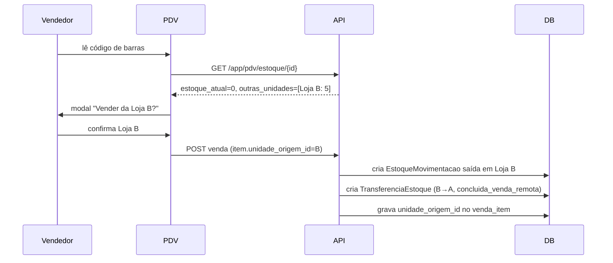

# ERP Comercial IA365 — Documentação Técnica

> SaaS ERP multi-tenant para PMEs. Admin (IA365) gerencia a plataforma; cada empresa-cliente tem múltiplas unidades com fiscal, estoque e caixa independentes. Integração 100% Focus NFe (NF-e, NFC-e, NFS-e, CC-e, manifestação do destinatário, backup XMLs).

**Última revisão:** 2026-09-03 (**Trocas no PDV (F6) + vale de crédito + relatório de vendas com listas** — o ERP não tinha troca: só "Cancelar Venda" (tudo ou nada, sem mexer no caixa), as tabelas `devolucoes`/`devolucao_itens` existiam desde abril com model e **zero controller/rota/tela** (o CLAUDE.md dizia que Devoluções estava pronto), e o botão Vale do PDV era um rótulo que aceitava qualquer valor; agora o caixa aperta **F6**, acha a venda (número, cupom bipado `V{id}` ou cliente — de qualquer dia e de qualquer loja), marca o que volta e bipa o que o cliente leva: a diferença é cobrada, zera ou vira **vale com código** (`VT-XXXX-XXXX`, saldo, validade, uso parcial, código de barras no comprovante) ou dinheiro pela gaveta, conforme **Configurações da Loja → Trocas** (prazo 30 dias, sobra em vale por padrão, validade 90 dias, fora da política pede e-mail+senha de um gerente); `TrocaService` é o ponto único (estoque de volta na loja da SESSÃO, abate de crediário/boleto em aberto antes do crédito, tipo `devolucao` no caixa com sinal −1 que entra no fechamento); tela `/app/trocas` + `/app/trocas/vales`; relatório de vendas ganhou select de vendedor, autocomplete de cliente, filtro de loja, card de trocas e **deixou de somar canceladas** no faturamento; armadilhas 61-63; seção própria) · 2026-09-02 (**fornecedor no cadastro do produto, opcional** — não era campo de tela faltando: `produtos` **não tinha `fornecedor_id`**, as duas tabelas nunca se falaram; entrou na **etapa 2** do wizard ("Identificação — opcional"), ao lado do SKU, com `Sem fornecedor` por padrão, e é opcional nas 4 camadas (coluna nullable, FK `nullOnDelete` para que excluir o fornecedor não trave o produto, validação nullable, enviar vazio limpa o vínculo); 🔑 a validação é **escopada à empresa** — `exists:fornecedores,id` solto aceitaria o id de fornecedor de outro cliente do SaaS; ⚠️ `fornecedor_id` no `$fillable` do Produto, senão a chave seria descartada calada (armadilha 53); os ~2.500 produtos existentes ficam NULL; seção própria) · 2026-09-02 (**textos da OS: o limite de 500 não existia** — a Realiza Phone reportou que os Termos de garantia paravam em 500 caracteres; nas 4 camadas o campo aceitava **5.000** (coluna TEXT, `max:5000`, zero `maxlength` no HTML, sem corte na impressão) e um teste ao vivo em produção gravou 1.439 de 1.440 enviados — 📌 o que existia era uma **tela muda**: `rows="4"` e nenhum contador, então o texto rola para fora da caixa e o lojista conclui que bateu no teto (as 14 configurações de loja estavam com os 4 textos da OS NULL — ninguém nunca preencheu); ganhou contador `247 de 15.000 caracteres` lendo o MESMO número da validação, campos mais altos (garantia 4→12 linhas) e tetos ampliados (garantia e texto legal 5.000→15.000, cabeçalho e rodapé 2.000→5.000, sem migration); armadilha 60, seção própria) · 2026-09-02 (**gerente entra em Configurações da Loja e Multilojas** — o gerente não tinha `/app/multilojas/estoque` nem `/app/configuracoes`, e o bloqueio de cada uma era de natureza diferente: multiloja era `abort(403)` **hardcoded** nos 4 métodos do controller (a rota nem consultava a matriz), configurações era a matriz, e Plano de Contas / Centros de Custo eram **só o menu** — a matriz já liberava; 🔑 o módulo `configuracoes` cobria, sob o mesmo nome, a tela operacional da loja **e** o certificado A1 + token da Focus + tokens da API, então liberar o módulo inteiro teria entregado tudo calado: separado em `configuracoes` (gerente entra), `configuracoes_fiscais` e `integracoes` (admin/dono); multiloja virou módulo próprio com escopo — o gerente vê só as lojas **vinculadas** (`unidade_user`), mesmo critério do `LojaController::podeEditar`, e o POST de ajuste usa a mesma lista (POST forjado para loja alheia não grava); o menu passou a perguntar à matriz em vez de repetir a lista de perfis, o que também tirou o link de Configuração Fiscal da cara do vendedor e do caixa; armadilhas 57-59, seção própria) · 2026-09-02 (**limite de lojas por plano — a troca de plano no admin não valia** — a MISS MERLINDA não cadastrava a 4ª loja mesmo com badge `enterprise`: `empresas` tem `plano` (enum, o que o select do admin grava e as badges mostram) e `plano_id` (FK, o que `getPlanoAtivo()` lê para TODOS os limites), e **nenhuma tela altera o `plano_id` depois do onboarding** — ela seguia no Profissional (3 lojas); as lojas que existem nunca passaram pelo limite porque só a tela do CLIENTE o checa, o `Admin\UnidadeController` não (é assim que a STILO VINTE tem 8 lojas num plano de 3); destravada em produção com **plano de exceção `ativo = 0`** ("Profissional 6 Lojas", teto 6) apontado pelo `plano_id` — some de todo select porque as telas usam `Plano::ativo()` e continua valendo porque o `belongsTo` não filtra `ativo`, sem tocar no pacote de DONA DOURO e STILO VINTE e sem deploy; ⚠️ segue em aberto: o select do admin gravar `plano_id`, a N S BORBA sem `plano_id` nenhum (não cria loja pela tela dela desde que nasceu) e a própria ia365 no Básico com 4 lojas, salva só pelo `pos_pago`; armadilha 56, seção própria) · 2026-09-02 (**CPF/CNPJ opcional por empresa + juros de parcelamento por loja** — entrega da N S BORBA SERVICOS (empresa 6) que precisava entrar **sem mexer nas outras 5 empresas**: a obrigatoriedade do documento vira `empresas.exige_documento_cadastro` (default TRUE, switch no admin da plataforma porque a NF-e modelo 55 continua exigindo destinatário com CPF/CNPJ) e o parcelamento no crédito ganha a tabela `configuracoes_loja.juros_por_parcela` (nasce vazia, no formato em que a adquirente manda a dela, com o servidor refazendo a conta em `registrarVenda` e a NFC-e mandando `vOutro` — sem ele `vNF = vProd − vDesc + vOutro` não fecha e a SEFAZ rejeita); o que **vazava** para as outras lojas era o select de parcelas do PDV, que passava a mostrar o valor de cada parcela em todo mundo — agora depende de `pdv_mostrar_valor_parcelas`, **mas tabela de juros cadastrada ignora o flag desligado**, porque esconder o acréscimo de uma venda que encarece surpreende o cliente no total; merge das duas branches sem cherry-pick — o `UTC` na ponta da branch de juros era herança do merge-base, não mudança dela (armadilha 54); **rodada 2 no mesmo dia**: no teste ao vivo a tela de configuração do juros se mostrou ilegível — faltava o 1x na tabela (que mora no "Acréscimo no Crédito", em outro card), o exemplo era texto fixo e nada avisava que os dois acréscimos SOMAM numa loja que já cobra 4% no crédito; ganhou linha do 1x travada, simulador ao vivo por parcela e aviso da soma com número real; seção própria) · 2026-08-31 (**preço de atacado por cliente + módulo de Ordem de Serviço** — `produto_precos` ganha a 4ª modalidade `atacado` e `clientes.tipo_preco` decide a tabela: cliente de atacado leva o preço de atacado em QUALQUER forma de pagamento, com o servidor refazendo a conta em `registrarVenda` (senão a venda voltaria para varejo na gravação); OS ganha cadastro de cliente na própria abertura, impressão com textos e blocos por loja (7 colunas em `configuracoes_loja`, lidas da loja DONA da OS) e — o que faltava — **baixa de estoque na conversão em venda**, que até aqui deixava a peça sair da loja sem registro nenhum; `entregue`/`cancelada` viram estados finais; **fix junto**: a conversão gravava a chave `desconto`, que não existe em `vendas` nem no `$fillable`, e a venda nascia com subtotal − desconto ≠ total (armadilha 53); o merge da produção `2037c47` foi feito na branch ANTES do build para não reverter o fuso (armadilha 52); seção própria) · 2026-08-25 noite (**fuso horário: app sai de UTC para America/Sao_Paulo SEM data-fix** — o Histórico de Caixas da DONA DOURO exibia abertura "12:13" para um caixa aberto às 9:13: `config/app.php` tinha `timezone => 'UTC'` hardcoded desde o nascimento; como TODAS as 178 colunas de data são **TIMESTAMP** (epoch UTC convertido pelo fuso da SESSÃO MySQL), bastou virar o app (`APP_TIMEZONE` no .env + config env-driven) e o MySQL (`SET GLOBAL time_zone='-03:00'` + `--default-time-zone=-03:00` no compose) — o histórico INTEIRO passou a exibir hora local sozinho, zero UPDATE; o script de shift -3h chegou a ser preparado e foi DESCARTADO (teria causado correção dupla); backup prévio `pre-fuso-fix-20260825.sql.gz` mantido; crons `dailyAt` passam a valer em hora LOCAL; armadilha 51b) · 2026-08-25 noite (**entrega na CONVERSA do agente — fecha a "próxima fase" da Fase 3**: rota nova `POST /api/integracao/v1/entrega/cotar` sempre-200 response-driven; `POST /pedidos` aceita `entrega{metodo,endereço}` gravando endereço no CLIENTE + `pedidos.metodo_entrega` (migration `2026_08_25_170000`); `DespacharEntregaUberJob` respeita `retirada`; `GET /pedidos` com bloco `entrega` + rastreio Uber; template/agentes do app.ia365 sincronizados lá (§282); ver subseção na Fase 3) · 2026-08-25 tarde (**vendedor troca a foto do produto** — ação nova `foto` no módulo produtos (matriz do CheckPermission) + rota própria `POST produtos/{produto}/foto` + formulário discreto na tela do produto, visível só para quem tem a ação; vendedor NÃO ganhou `editar` — preço/fiscal seguem fora do alcance; **rodada 2**: no teste real a vendedora usou o botão Editar e tomou 403 no PUT — a tela de edição agora funciona em modo "só foto" para o perfil (campos bloqueados + salvar só da imagem no próprio update); ver seção RBAC) · 2026-08-25 (**card Uber Direct: rótulos iguais aos do painel do Uber + guarda anti-inversão** — a DONA DOURO cadastrou o "ID do usuário" no campo Client ID e vice-versa (o painel do Uber em PT chama Client ID de "ID de cliente do desenvolvedor" e Customer ID de "ID do usuário"); data-fix aplicado em produção e o card agora usa os nomes do painel, com validação que recusa UUID no Client ID e vice-versa; ⚠️ a conta Uber da DONA DOURO ainda NÃO tem o escopo `eats.deliveries` liberado — só `direct.organizations`; ver seção Fase 3) · 2026-08-20 (**fix da conferência de bobina nas etiquetas** — o bloco de JS entrou fora da tag `<script>` do push e era IMPRESSO como texto no rodapé de `/app/etiquetas`; a conta da bobina ficou 8 dias morta; armadilha 51 — e **auditoria de produção completa**: a worktree que builda a imagem está ATRÁS do container e um rebuild reverteria 3 entregas (armadilha 52), o webhook da Focus AINDA responde 419, rate limit fantasma em toda chamada à Focus e R$ 13.264/ano contratados sem fatura; seção própria) · 2026-08-14 (**Landing V2 "formato Apple" PROMOVIDA A PADRÃO** — site público redesenhado no estilo Apple/Find My é a página oficial em `/`; v1 clássica segue no ar via `/?visual=classico`; 2 fixes de mobile no mesmo dia: botão Entrar visível e overflow horizontal do `span 6` inline; seção própria) · 2026-08-13 tarde (**Agente IA v2** — busca com ordenar/preco_min/max + fallback de catálogo + JSON forçado no api/integracao + merge do admin-acesso-como + armadilha 50; seção 9f) · 2026-08-13 (**"Acessar como"** — admin da plataforma entra no sistema logado como o dono de qualquer empresa-cliente, com banner, bypass de suspensão e rastro `acesso_como_admin_id` em toda activity da sessão) · 2026-08-13 noite (**PIX Sicredi no Agente IA** — gateway por empresa em `empresa_gateways` com credenciais cifradas + cobrança automática no pedido do agente + webhook re-consultado via mTLS + cron de sincronização; piloto DONA DOURO; seção 9f) · 2026-08-13 (**Agente IA** — banco vetorial pgvector `erp-com-vector` + busca semântica multi-tenant + pedidos rascunho via API, módulo ativável por empresa no admin; consumido pelo app.ia365; seção 9f) · 2026-08-12 (**API de Integração v1 — Gersen**: primeira API externa do ERP, somente leitura, token por empresa gerado no admin; seção própria) · 2026-08-12 madrugada (**backup mensal de XMLs virou pacote LOCAL** — o `/v2/backups` da Focus não existe, armadilha 49; **DONA DOURO em `producao`** com série 2 e CSC na Focus) · 2026-08-12 noite (**editor visual de layout de etiqueta** — arrasta-e-solta com imagens e formas, branch `layout-etiquetas` DEPLOYADA em produção; armadilha 48 + lição de deploy na 26b) · 2026-08-12 (vários estoques por loja + contagem cega + bonificação que deve voltar + estilo de etiqueta "nome no topo" + conferência de bobina; armadilhas 43-47; **imagem rebuildada** e main promovida) · 2026-08-11 (formato de etiqueta cadastrável pelo lojista + fix do CRUD de categorias — `status` feminino, armadilha 42) · 2026-08-05 (filtro por loja em vendas + imports de vendas/contas a receber + import robusto + lojas mesmo CNPJ compartilham empresa Focus) · **Estado:** integração fiscal Fase 1-4 + multi-loja + regime de cobrança + auto-sync Focus + UX config fiscal + caixa por forma de pagamento (14/07) + Configurações da Loja/tabelas de preço/emissão parametrizada/adquirentes (24/07) + **Reforma Tributária NT 2025.002 (obrigatório 03/08/2026) + CNPJ alfanumérico NT 2025.001 (25/07)** + **e-mails/no-reply + cobrança direta mensal/anual com bloqueio + pode_ver_financeiro (04/08)** + **doc de alterações do Dennis (05/08)** + **etiqueta cadastrável pelo lojista em cm + fix do CRUD de categorias + auditoria de produção (11/08)** — concluídos

---

## Sumário
1. [Stack e ambientes](#stack-e-ambientes)
2. [Multi-tenancy](#multi-tenancy)
3. [Integração fiscal Focus NFe](#integração-fiscal-focus-nfe)
4. [Multi-loja — política de estoque](#multi-loja--política-de-estoque)
5. [Regime de cobrança](#regime-de-cobrança--cortesiaparceiropós-pago-commit-a2121bf)
5b. [Configurações da Loja, tabelas de preço, emissão e caixa (Julho/2026)](#configurações-da-loja-tabelas-de-preço-emissão-e-caixa-julho2026)
6. [Schema essencial](#schema-essencial)
7. [Comandos artisan](#comandos-artisan)
8. [Crons agendados](#crons-agendados)
9. [Logins demo](#logins-demo)
9b. [Vários estoques por loja](#vários-estoques-por-loja-12082026)
9c. [Relatório de contagem cega](#relatório-de-contagem-cega-12082026)
9d. [Bonificação que deve voltar](#bonificação-que-deve-voltar--peças-em-poder-de-terceiros-12082026)
9e. [API de Integração — Gersen](#api-de-integração-gersen-12082026)
9f. [Agente IA — busca semântica + pedidos](#agente-ia--busca-semântica--pedidos-via-whatsapp-13082026)
9g. [Auditoria de produção (20/08/2026)](#auditoria-de-produção-20082026)
9h. [Preço de atacado + módulo de Ordem de Serviço (31/08/2026)](#preço-de-atacado-por-cliente--módulo-de-ordem-de-serviço-31082026)
9i. [CPF/CNPJ opcional + juros de parcelamento (02/09/2026)](#cpfcnpj-opcional-por-empresa--juros-de-parcelamento-por-loja-02092026)
9j. [Limite de lojas por plano — `plano` × `plano_id` (02/09/2026)](#limite-de-lojas-por-plano--plano--plano_id-02092026)
9k. [Gerente em Configurações da Loja e Multilojas (02/09/2026)](#gerente-entra-em-configurações-da-loja-e-multilojas-02092026)
9l. [Textos da OS: o limite que não existia (02/09/2026)](#textos-da-os-o-limite-que-não-existia-02092026)
9m. [Fornecedor no cadastro do produto (02/09/2026)](#fornecedor-no-cadastro-do-produto--opcional-02092026)
9n. [Trocas no PDV + vale de crédito + relatório (03/09/2026)](#trocas-no-pdv-f6-vale-de-crédito-e-relatório-de-vendas-com-listas-03092026)
10. [Armadilhas conhecidas](#armadilhas-conhecidas)
11. [Próximos passos](#próximos-passos)

---

## Stack e ambientes

| Camada | Tecnologia |
|---|---|
| Backend | Laravel 12, PHP 8.4 |
| Banco | MySQL 8.0 |
| Cache/Fila | Redis 7 |
| Frontend | Blade + Bootstrap 5.3 (CDN) + Chart.js + JsBarcode |
| Audit | spatie/laravel-activitylog |
| Fiscal | Focus NFe (REST v2) |
| Proxy | Caddy (host) |

### Containers em produção

Compose ativo: `docker-compose.prod.yml` (não o `.yml` padrão de dev).

| Container | Porta host | Porta interna |
|---|---|---|
| `erp-com-app` | 8091 | 80 |
| `erp-com-mysql` | 127.0.0.1:3310 | 3306 |
| `erp-com-redis` | 127.0.0.1:6381 | 6379 |

```bash
# .env não é bind-mounted em prod — usar docker cp
docker cp .env erp-com-app:/var/www/.env
docker exec -i erp-com-app php artisan config:clear

# Aplicar código novo + migrations
tar cf - app database resources routes config | docker exec -i erp-com-app tar xf - -C /var/www/
docker exec -i erp-com-app php artisan migrate --force

# Tarefas operacionais
docker exec -i erp-com-app php artisan schedule:list
docker exec -i erp-com-app php artisan tinker
```

### Variáveis sensíveis no .env

```env
APP_URL=https://erp.ia365.com.br
APP_PORT=8091

# Focus NFe — token master (modelo revenda)
FOCUS_MASTER_TOKEN=rriUTW5kJHPHmoNBmqyIxjDnae5raCn3
FOCUS_NFE_AMBIENTE=homologacao
FOCUS_WEBHOOK_BASE_URL=${APP_URL}
```

---

## Multi-tenancy

- **`empresa_id`** em TODAS as tabelas de dados. Trait `BelongsToEmpresa` + scope `EmpresaScope` (com flag anti-recursão `static $applying`).
- **`unidade_id`** em tabelas operacionais (vendas, estoque, caixa, notas, config fiscal). Trait `BelongsToUnidade` + scope `UnidadeScope`.
- Admin/Dono enxergam todas as unidades; outros perfis ficam scoped.
- `session('unidade_id')` define a unidade ativa do usuário.

### RBAC

7 perfis (`App\Enums\Perfil`): `admin` (100), `dono` (90), `gerente` (70), `financeiro` (60), `vendedor` (50), `caixa` (40), `consulta` (10).

Middleware: `permission:modulo,acao` (default `ver`) + `plano:feature` (gating por plano).

**Ação `foto` no módulo produtos (25/08/2026):** o vendedor atualiza a imagem do produto sem
ganhar `editar` (preço/fiscal continuam fora). Rota própria `POST produtos/{produto}/foto`
(`ProdutoController::atualizarFoto`, `permission:produtos,foto`) + formulário discreto na tela do
produto, renderizado só para quem tem a ação (`CheckPermission::can()` — o helper público que as
views podem usar para esconder botão). Ao criar ação granular nova, seguir esse padrão: rota
dedicada + ação própria na matriz, nunca alargar `editar` do perfil.

**A tela de EDIÇÃO também funciona no modo "só foto" (25/08 tarde, rodada 2):** no teste real
(vendedora da DONA DOURO, produto 909) o 403 veio do caminho natural — botão Editar → salvar o
formulário completo (`PUT produtos/{id}` deriva `editar` no gate por verbo). Ajuste: o update saiu
do gate por verbo e entrou com `permission:produtos,foto` (registrado com `Route::match` ANTES do
resource, que ganhou `->except(['update'])`), e o `ProdutoController::update` bifurca — quem não
tem `editar` cai num ramo que valida/salva SOMENTE a foto e redireciona ao show; quem tem segue no
update completo. A view de edição, para o perfil só-foto: banner explicando, todos os campos
`disabled` (menos hidden — o `_token`/`_method` precisam ir), salto direto ao passo 2 (onde a foto
mora) e botão "Salvar foto" próprio injetado ao lado do input (o submit original fica no passo 3).
⚠️ Campo `disabled` NÃO é enviado no POST — é o que garante que nada além da foto chega ao servidor,
e é também por isso que os hidden ficam de fora do bloqueio.

---

## Integração fiscal Focus NFe

### Arquitetura — modelo revenda

A plataforma IA365 opera como **revenda Focus**: 1 token master (`FOCUS_MASTER_TOKEN`) cria empresas-filhas via `POST /v2/empresas`. Cada empresa-cliente recebe seus próprios tokens (homologação + produção) que são usados nas emissões.

### Auto-provisionamento (Fase 1 — commit `305a950`)

Quando admin cria uma empresa ou unidade no CRUD comum, o sistema dispara `ProvisionarEmpresaFocusJob` que:

1. `POST /v2/empresas` na Focus (ou `PUT` se já existe — idempotente)
2. Persiste `focus_empresa_id`, `focus_token_producao`, `focus_token_homologacao` em `configuracoes_fiscais`
3. Sincroniza webhooks: **1 chamada `POST /v2/hooks` por evento** (Focus NÃO aceita array em `eventos`, é `event` singular)
4. Persiste mapa evento→hook_id em `configuracoes_fiscais.focus_webhook_ids` (JSON)
5. Notifica o dono no sino quando concluído ou falha

**Eventos suportados** (`FocusEmpresaService::EVENTOS_SUPORTADOS`):
- `nfe`, `nfse`, `nfce_contingencia`, `nfe_recebida`, `nfse_recebida`, `inutilizacao`, `cte`, `mdfe`

**Página de saúde**: `/admin/empresas/{id}/saude-focus` mostra status por unidade + botão Resincronizar / Provisionar N pendentes.

### Pipeline de emissão (Fase 2 + 3 — commit `5c1ded5`)

`FiscalPayloadBuilder` (`app/Services/FocusNFe/`) centraliza a montagem do payload. Estrutura comum: emitente, destinatário, responsável técnico, itens, totais, pagamentos.

**Componentes plugados:**

| Componente | Responsabilidade |
|---|---|
| `ICMSCalculator::calcular` | ICMS-ST interestadual quando CST de ST e UF origem ≠ destino |
| `ReformaTributariaCalculator::blocoPayload` | IBS/CBS/IS por item, gated por flags em `configuracoes_fiscais` |
| `FiscalAutoConfig::defaults` | Presets CST/CFOP/alíquotas por regime tributário |
| `VendaItem::fiscal()` | Lê snapshot fiscal com fallback no produto atual |

**Pre-flight validation** (rejeita antes de chamar Focus):
- NCM ≠ `00000000`
- CFOP definido
- Destinatário NF-e com endereço completo
- Responsável técnico configurado (NT 2018/003)

### Campos do payload por tipo de nota

| Campo | NF-e | NFC-e | NFS-e |
|---|---|---|---|
| `cnpj_responsavel_tecnico` + bloco | ✅ | ✅ opcional | — |
| `local_destino` | ✅ | ✅ | — |
| `indicador_intermediario` | ✅ | — | — |
| `valor_total_tributos` (IBPT) | ✅ | ✅ | — |
| `valor_troco` | — | ✅ | — |
| ICMS-ST + FCP-ST | ✅ | ✅ | — |
| IBS / CBS / IS (Reforma) | ✅ | ✅ | ✅ (Nacional) |
| Bloco DI (importação) | ✅ | ✅ | — |
| `numero_fatura` + `duplicatas[]` | ✅ se a prazo | — | — |
| Aninhamento `prestador/tomador/servico` | — | — | ✅ |
| `codigo_municipio` IBGE 7 dígitos | — | — | ✅ |

### Snapshot fiscal (Fase 3 — commit `5c1ded5`)

Para que re-emissões e auditoria reflitam o estado fiscal no **momento da venda** (não o estado atual do produto), `VendaItemObserver` copia automaticamente os campos fiscais do produto para o item ao criar:

```
snapshot_ncm, snapshot_cest, snapshot_cfop, snapshot_cst_csosn,
snapshot_cst_pis, snapshot_cst_cofins, snapshot_cst_ipi,
snapshot_origem, snapshot_icms_aliquota, snapshot_pis_aliquota,
snapshot_cofins_aliquota, snapshot_ipi_aliquota, snapshot_unidade_medida
```

O builder consulta via `$item->fiscal('ncm')` — com fallback no produto se snapshot vazio.

### Robustez operacional (Fase 4 — commit `56b1616`)

- **Backup XMLs** (`fiscal:backup-xmls`, diário 3h): monta LOCALMENTE o pacote mensal por
  CNPJ a partir das cópias por nota (`BaixarXmlNotaJob`/`fiscal:baixar-xmls-notas`) em
  `storage/app/private/fiscal/backups/{cnpj}/{YYYY-MM}.zip` (XMLs + `manifest.json`;
  sem `--mes`, remonta mês corrente + anterior; lojas do mesmo CNPJ no mesmo zip).
  Retenção 5 anos. Download do cliente em `/app/backups-xml` (rota `download/{mes}` serve
  do nosso disco). **Não fala mais com a Focus** — ver armadilha 49.
- **Saúde de webhooks** (`fiscal:saude-webhooks`, segunda 4h): compara `focus_webhook_ids` locais vs lista remota Focus; recadastra ausentes; notifica dono.
- **Alerta certificado** (`fiscal:alertar-certificado`, diário 8h): janelas 30/15/7/1 dias antes do vencimento.
- **Dashboard fiscal** `/app/fiscal/dashboard`: NF-es por status (30d), top 5 erros, série diária 14d (Chart.js), saúde por unidade, status SEFAZ por UF.

### Auto-sincronização total com Focus (commit `b5487bd`)

Quando há `FOCUS_MASTER_TOKEN`, toda mudança na configuração fiscal propaga automaticamente para a Focus — sem precisar colar token manualmente em nenhum momento.

| Ação no ERP | O que acontece na Focus |
|---|---|
| Admin cria nova empresa | `POST /v2/empresas` + 1 `POST /v2/hooks` por evento aplicável (idempotente) |
| Marca `emite_nfse=true` na config | `PUT /v2/empresas/{id}` com `habilita_nfse=true` + recadastra hooks `nfse`/`nfse_recebida` |
| Preenche CSC NFC-e | `PUT /v2/empresas/{id}` com `csc_nfce_producao` + `id_token_nfce_producao` |
| Edita endereço/IE/IM | `PUT /v2/empresas/{id}` via `ProvisionarEmpresaFocusJob` |
| Há empresas legadas com `focus_token` colado | `php artisan fiscal:migrar-empresas-legadas` migra todas |

**Bug fixado:** webhook ID da Focus é **string alfanumérica** (ex: `Y5P0na15`), não inteiro. `(int) $data['id']` virava 0 e quebrava sincronizações silenciosamente. Corrigido para `(string)`.

### UX da config fiscal (commits `2097213` + `de8bb16`)

- **Checklist de prontidão** no topo da tela: cards por tipo de nota (NF-e/NFC-e/NFS-e) com progresso `X/Y` + lista visual de itens prontos/faltando + "Pronto para emitir!" quando 100%.
- **Badges `★ obrigatório`** nos campos críticos (CSC, ID CSC, Série, Resp.Técnico) — usuário não confunde com opcionais.
- **Texto explicativo** no card Responsável Técnico ("geralmente o dono, contador, ou TI da empresa") + botão **"Usar meus dados"** auto-preenche CNPJ empresa + nome + email do user logado em 1 clique.
- **Mensagem SEFAZ status** mais amigável quando empresa ainda não tem token ("Aguardando provisionamento" em vez de erro técnico).

### Reforma Tributária — IBS/CBS obrigatórios 03/08/2026 (NT 2025.002 v1.40) — branch `feat/reforma-agosto2026-cnpj-alfanumerico` (25/07)

**Contexto legal:** a partir de **03/08/2026** a SEFAZ **rejeita** NF-e/NFC-e do regime
normal (CRT=3 — Lucro Presumido/Real) sem os grupos IBS/CBS (UB/W03). Simples Nacional
entra em **04/01/2027**. Desde 01/07/2026 os campos já são exigidos em homologação.

**O que mudou no ERP:**

- **Envio automático**: `ReformaTributariaCalculator::paraEmissao($config, $empresa)` liga o
  bloco IBS/CBS para toda empresa `lucro_presumido`/`lucro_real`, **independente das flags**
  `ibs_ativo`/`cbs_ativo` (que agora servem para antecipar o envio no Simples). IS continua
  só por flag. Vale para NF-e, NFC-e e NFS-e nacional.
- **Alíquotas-teste 2026 corrigidas** (estavam INVERTIDAS): **CBS 0,9% + IBS 0,1%**
  (LC 214/2025; IBS integral na esfera estadual em 2026, municipal = 0). Migration
  `2026_07_25_120000` anula o par invertido persistido em `configuracoes_fiscais`.
- **Payload no formato flat da Focus** (antes eram arrays aninhados `ibs`/`cbs` que a Focus
  ignorava): item ganha `ibs_cbs_situacao_tributaria` (CST, default `000`),
  `ibs_cbs_classificacao_tributaria` (cClassTrib, default `000001`), `ibs_cbs_base_calculo`,
  `ibs_uf_aliquota/valor`, `ibs_mun_aliquota/valor`, `ibs_valor_total`, `cbs_aliquota/valor`
  (+ `is_*` se IS ativo). Totais: `ibs_cbs_base_calculo`, `ibs_uf_valor_total`,
  `ibs_mun_valor_total`, `ibs_valor_total`, `cbs_valor_total`, `is_valor_total`
  (só entram quando os itens carregam o grupo). Na NFS-e nacional os campos flat vão dentro
  de `servico` (substituiu `servico.tributos_reforma`).
- **Overrides por produto** continuam: `produtos.ibs_aliquota/cbs_aliquota/is_aliquota`,
  `cst_ibs_cbs`, `classificacao_ibs` (formulário de produto já expõe).
- **UI**: tela de Configuração Fiscal explica o envio automático + alíquotas corretas;
  tooltips de IBS/CBS atualizados; defaults dos inputs de alíquota agora em branco
  (= usa valores legais).
- **Regime tributário configurável pelo cliente (25/07)**: card "Regime tributário da
  empresa" no topo da Configuração Fiscal — **só o perfil dono** altera (outros veem
  read-only), com `data-confirm` de impacto e flash orientando o contador. Rota
  `PUT app/configuracao-fiscal/regime` → `ConfiguracaoFiscalController::atualizarRegime`.
  Trocar para Presumido/Real liga o IBS/CBS automático na nota seguinte; voltar ao Simples
  desliga (obrigação 01/2027). Validado E2E via curl (dono muda → badge "Envio automático
  ativo" → volta). ⚠️ Blade: dois `@php(...)` inline consecutivos não compilam — usar
  bloco `@php ... @endphp` (quebrou a tela em produção por minutos até o fix).
- **Varredura E2E rodada 2 (telas de detalhe, 25/07)**: 46 rotas `GET` com parâmetro
  testadas com IDs reais → 10×500 + achado grave via scanner de reflexão (rota × assinatura
  do controller): **route model binding quebrado em 13 rotas** — parâmetro da URL não casava
  com o nome da variável (`{contas_pagar}` vs `$contaPagar` etc.), o Laravel injetava model
  VAZIO em silêncio. Consequência real: **baixar/excluir contas a pagar/receber nunca
  funcionou**, editar plano de contas e ordens de serviço (show/edit/update/destroy)
  operavam num registro vazio. Fix: `->parameters([...])` nos resources
  (movimentacoes→movimentacao, contas-receber→contaReceber, contas-pagar→contaPagar,
  plano-contas→planoContas, ordens-servico→ordemServico) + rotas custom `baixar` renomeadas.
  Rotas `resource` para métodos inexistentes removidas com `->except`/`->only`
  (vendas edit/update, contas edit/update, movimentações edit/update/destroy, planos show,
  transferências edit/update, plano-contas/centros-custo show); `admin/unidades/{id}` show →
  redirect ao edit (view nunca existiu). Scanner final: ZERO bindings quebrados/métodos
  ausentes; sweep: zero 5xx nas 2 personas. ⚠️ Armadilha: em `Route::resource` SEMPRE conferir
  se o parâmetro (singular do slug) casa com o nome da variável tipada do controller —
  binding que não casa NÃO dá erro, entrega model vazio (Laravel aceita snake_case do nome
  da variável; qualquer outra diferença falha).
- **Varredura E2E 25/07 (107 rotas GET × persona dono e admin)**: 3 bugs 500 corrigidos —
  (1) `ExportController::export` quebrava com enum (`StatusVenda`) → cast `BackedEnum->value`
  (afetava `/app/export/vendas` para clientes); (2) DRE (index/porUnidade/exportar) 500 para
  admin da plataforma → guard armadilha 21; (3) `/app/fiscal/calcular-st` sem parâmetros
  dava TypeError 500 → validação (422). Sweep final: dono 0×5xx, admin 0×5xx. Metodologia:
  usuário QA temporário (removido ao final) + seleção de unidade via `POST /selecionar-unidade`.
- **UI v2 (review 25/07 tarde)**: card da Reforma na config fiscal com **status dinâmico
  por regime** — regime normal: badge verde "Envio automático ativo", alerta verde, chaves
  IBS/CBS viram badges "automático" (hidden inputs preservam o valor persistido); Simples:
  badge "obrigatório em 01/2027" + chaves para antecipar. Tiles com alíquotas em uso
  (padrão da config ou teste legal) + "impacto no cliente R$ 0,00". Cadastro de produto:
  seção Reforma agora aparece **também no regime normal** (era gated só pelas flags) e
  ganhou o campo **cClassTrib (`classificacao_ibs`)** que o controller já validava mas o
  form nunca enviava; CST/cClassTrib primeiro, alíquotas depois, placeholders com os
  defaults. Cupom não-fiscal revisado (usa dados da venda — sem impacto do vProd);
  DANFE/DANFE-NFC-e vêm prontos da Focus com o detalhamento IBS/CBS.

### CNPJ alfanumérico (NT Conjunta 2025.001 — produção desde 06/07/2026)

CNPJs novos podem ter **letras nas 12 primeiras posições** (DV continua numérico,
módulo 11 sobre `ASCII−48`). O que mudou:

- **`App\Support\Cnpj`**: `limpar()` (preserva letras, caixa alta), `limparCpfCnpj()`,
  `pareceCpf()/pareceCnpj()`, `valido()` (DV alfanumérico — validado contra o exemplo
  oficial `12.ABC.345/01DE-35`), `dv()`, `formatar()`.
- **Sweep completo**: todos os `preg_replace('/\D/')` sobre CNPJ trocados por
  `Cnpj::limpar()` (payload builder, services Focus, webhook, commands, imports, filtros).
  Webhook `resolveConfig` compara com `UPPER(...)` no SQL.
- **Validação**: rule `App\Rules\CnpjValido` aplicada em Empresa (create/update) e Unidade.
- **Máscaras JS** (`erp-core.js`): `cnpj`/`cpfCnpj` aceitam letras (qualquer letra ⇒ trata
  como CNPJ); `buscaCNPJ` pula a BrasilAPI para CNPJ alfanumérico (API só numérico).
- **⚠️ Máscaras INLINE fora do erp-core (fix 25/07 madrugada)**: 9 telas tinham máscara
  própria com `replace(/\D/g)` que apagava as letras ao digitar — clientes create/edit,
  fornecedores create/edit, admin empresas create/edit (`maskCNPJ`), admin unidades
  create/edit, pedidos create (`maskCnpj` do cadastro rápido). Todas corrigidas (12 primeiras
  posições alfanuméricas + DV numérico, caixa alta) e lookup BrasilAPI/ReceitaWS pulado
  quando há letra. Validado E2E: cliente PJ criado via POST com `12.ABC.345/01DE-35`,
  exibido e editável. **Ao criar máscara nova de CNPJ, nunca usar `\D` — copiar o padrão
  dessas telas ou usar `data-mask="cnpj"` do erp-core.**

**Estado em produção (25/07):** as 2 empresas ativas são Simples Nacional — nada muda nas
notas de hoje; a plataforma fica pronta para clientes do regime normal e para a virada do
Simples em 2027.

### O que a Focus NÃO consegue gerenciar (limite do SEFAZ)

Mesmo com auto-sync, **estes 3 itens dependem do cliente final** (a Focus é só intermediária):

1. **Certificado A1 (.pfx)**: comprado em AC (Certisign, Serasa, AC SOLUTI — ~R$200/ano). Upload direto pra Focus, não fica no servidor.
2. **CSC NFC-e + ID**: gerado no portal SEFAZ do **estado da empresa-cliente** (e-CAC → menu NFC-e → "Gerar CSC"). Único por estabelecimento.
3. **Responsável Técnico** (NT 2018/003): cada empresa preenche o próprio (decisão arquitetural deste projeto — opção B).

### Arquivos críticos da integração

```
app/Services/FocusNFe/
├── FocusNFeClient.php           # HTTP client + rate limit + per-ambiente
├── FocusEmpresaService.php      # modelo revenda + webhooks (event singular!)
├── FiscalPayloadBuilder.php     # builder central NF-e/NFC-e
├── NFeService.php               # /v2/nfe (assíncrona + polling)
├── NFCeService.php              # /v2/nfce (síncrona)
├── NFSeService.php              # /v2/nfse aninhado prestador/tomador/servico
├── NFSeNacionalService.php      # padrão nacional RFB
├── CertificadoDigitalService.php # upload A1 multipart
├── ManifestacaoService.php      # MDe destinatário
├── ReformaTributariaCalculator.php
├── SefazStatusService.php
├── BackupXmlService.php
├── NFSesRecebidasService.php
└── NFesRecebidasService.php

app/Jobs/
├── ProvisionarEmpresaFocusJob.php
├── EmitirNFeJob.php
├── EmitirNFCeJob.php
├── EmitirNFSeJob.php
├── ConsultarNotaFiscalJob.php
├── SincronizarNFesRecebidasJob.php
└── SincronizarNFSesRecebidasJob.php

app/Console/Commands/
├── BackupXmlsFiscaisCommand.php
├── VerificarSaudeWebhooksCommand.php
├── AlertarCertificadoVencendoCommand.php
└── MigrarEmpresasLegadasFocusCommand.php

app/Observers/
└── VendaItemObserver.php        # snapshot fiscal automático

app/Http/Controllers/Admin/
└── SaudeFocusController.php     # /admin/empresas/{id}/saude-focus

app/Http/Controllers/App/
└── DashboardFiscalController.php # /app/fiscal/dashboard
```

---

## Multi-loja — política de estoque

### O problema

Empresas com múltiplas lojas (`Unidade`) precisavam decidir: filial vê estoque das outras? Pode vender? Como contabilizar?

### Solução (commit `af4d4d9`)

Campo `empresas.politica_estoque_inter_unidade` (enum) com 3 modos:

| Política | Comportamento |
|---|---|
| `silos` | Cada loja só vê o próprio estoque (legado) |
| `ver_apenas` | Visualiza saldo das outras lojas, mas precisa criar Transferência com aprovação |
| `ver_e_vender` *(default)* | PDV pode vender direto de outra unidade — sistema cria `TransferenciaEstoque` automática origem→destino |

Configuração em `/admin/empresas/{id}/edit` (radio cards visuais — só aparece se empresa tem >1 unidade).

### Fluxo no PDV (política `ver_e_vender`)



### Componentes

- **`Empresa::permiteVerEstoqueOutrasUnidades()`** / **`permiteVenderEstoqueRemoto()`** — helpers booleanos
- **`EstoqueMultiUnidadeService`**:
  - `saldoPorUnidade(empresa_id, produto_id, unidade_atual)` → array ordenado (atual primeiro, depois saldo desc)
  - `outrasUnidadesComEstoque()` → filtro de outras unidades com saldo > 0
  - `registrarVendaRemota(venda, vendaItem, origem, userId)` → transaction: baixa estoque + cria transferência
- **`venda_itens.unidade_origem_id`** (FK `unidades`) — null quando venda local
- **`VendaItem::isVendaRemota()`** / **`unidadeOrigem()`** relation

### UI

- **Detalhe do produto** (`/app/produtos/{id}`): tabela "Estoque por Unidade" (só se >1 unidade) com saldo + status (OK/baixo/zerado) + indicador da unidade atual
- **Editar empresa**: 3 cards radio com descrição de cada política
- **PDV**: modal de seleção quando estoque local zerado + badge `↔ Loja X` no item da venda

### Fiscalmente

Cada `Unidade` continua sendo um CNPJ independente na Focus NFe. Empresa com 5 unidades = 5 empresas-filhas Focus = 5 certificados A1 = 5 conjuntos de webhooks. A venda remota é registrada como saída no CNPJ da origem e, fiscalmente, depende da operação:

- Modo simples (atual): venda emitida pela unidade que finalizou (CNPJ do destino) — adequado quando a empresa opera como rede com CNPJs sob mesmo grupo.
- Modo completo (futuro): emitir NF-e de transferência B→A (CFOP 5152/6152) + NF-e/NFC-e de venda A→cliente. Não implementado.

---

## Regime de cobrança — cortesia/parceiro/pós-pago (commit `a2121bf`)

Admin (IA365) pode liberar empresas-cliente do funil normal de trial+pago sem gateway de pagamento. Campo `empresas.regime_cobranca`:

| Regime | Cobra? | Limites do plano | Caso de uso |
|---|---|---|---|
| `padrao` | Sim (trial → pago) | Aplica | Cliente normal |
| `cortesia` | Não | Aplica | Amigo, beta tester, VIP |
| `parceiro` | Não | **Ignora** (tudo liberado) | Cliente-âncora, case |
| `pos_pago` | Manual fora | Aplica | Grandes contas faturadas externamente |

**Como funciona internamente:**
- `Empresa::isAssinaturaAtiva()` retorna `true` direto se `regime_cobranca` ≠ `padrao` → nunca cai em "plano expirado"
- `Empresa::limiteAtingido()` retorna `false` direto se `bypassaLimitesPlano()` (apenas parceiro)
- `CheckPlano` middleware pula feature gate quando parceiro
- `cortesia_concedida_por` registra qual admin aplicou (auditoria)

**UI:**
- `/admin/empresas/{id}/edit` — 4 radio cards visuais (só >1 unidade tem o card de multi-loja, regime de cobrança aparece sempre)
- Listagem `/admin/empresas` — badge colorido ao lado da razão social + botão `+30d` (trial extension)
- Dashboard admin — card "Cortesias / Parceiros" linkando para lista filtrada
- `Empresa::estenderTrial(N)` — extende `trial_fim` em N dias; se já tem assinatura paga, extende `assinatura_fim` em vez de regredir para trial; lança `DomainException` se empresa já é gratuita (não usa trial)

---

## Configurações da Loja, tabelas de preço, emissão e caixa (Julho/2026)

> Branch `feat/config-loja-precos-caixa` (24/07/2026). Origem: doc de melhorias do Dennis.
> **Todos os comportamentos novos nascem desligados/neutros** — loja sem registro em
> `configuracoes_loja` opera exatamente como antes.

### Central de Configurações da Loja (`/app/configuracoes`)

> Tela escrita para lojista leigo (24/07): aviso "nada muda até salvar", comportamento
> ligado×desligado por opção, exemplo numérico das 3 tabelas de preço, exemplos de split por
> combinação de formas, ordem de decisão do documento no PDV e mapa "onde isso aparece".

Tabela `configuracoes_loja` (unique `empresa_id+unidade_id`, mesma regra da config fiscal:
NUNCA `updateOrCreate`). Model `ConfiguracaoLoja::daUnidade()` devolve instância não persistida
com defaults quando a loja nunca salvou (checar `->exists` para distinguir). Parâmetros:

| Campo | Default | Efeito |
|---|---|---|
| `vendedor_responsavel_caixa` | off | vendedor do PDV vira `user_id` das MovimentacaoCaixa da venda |
| `regra_preco_split` | `cartao_maior` | split: `cartao_maior` = maior tabela entre as formas presentes; `sempre_menor`; `sempre_maior` |
| `percentual_debito` / `percentual_credito` | 0 | regra geral das tabelas de preço (acréscimo % sobre o base) |
| `max_parcelas` | 6 | parcelas do crédito no PDV + parcela exibida na etiqueta |
| `cupom_automatico_cartao` | off | venda com cartão emite NFC-e automaticamente |
| `cpf_emite_fiscal` | off | cliente informado na venda → NFC-e na hora |
| `padrao_impressao` | `recibo` | documento default nas demais vendas |

### Tabelas de preço por forma de pagamento

- Base (`produtos.preco_venda`) = tabela **Dinheiro/PIX**. Débito/crédito saem da regra geral
  (percentuais acima) com **override por produto** em `produto_precos`
  (produto_id+modalidade unique; modalidades `dinheiro_pix|debito|credito`).
- `TabelaPrecoService`: `precosDoProduto()` e `modalidadeDosPagamentos()` (venda simples segue
  a forma; split segue `regra_preco_split`). Boleto/crediário/transferência/vale usam a base.
- **PDV**: reprecifica os itens ao escolher a forma (hook em `openPagamento`, reverte se o modal
  fechar sem confirmar), badge "Tabela: Débito/Crédito" no resumo. O servidor recalcula o preço
  autoritativo em `registrarVenda` **somente quando o payload traz `tabela_precos: 1`** (abas do
  PDV abertas antes do deploy continuam funcionando com preço do cliente).
- **Cadastro de produto** (create/edit): campos "Preço no Débito/Crédito" (vazio = regra geral).
  Import/export CSV: colunas opcionais `preco_debito`/`preco_credito`.
- **Etiquetas**: quando tabela crédito > base, saem os valores secos "Cartão R$ X" +
  "PIX R$ Y" (sem parcelamento — pedido do Dennis 25/07); sem configuração a etiqueta
  fica como sempre foi (preço único).

### Emissão parametrizada

- **PDV**: seletor Auto/Recibo/Cupom Fiscal acima do FINALIZAR (escolha manual prevalece).
  Modo Auto (só quando a loja TEM registro de config): cartão+`cupom_automatico_cartao` → NFC-e;
  cliente+`cpf_emite_fiscal` → NFC-e; senão `padrao_impressao`. Sem registro → comportamento
  antigo (fiscal ativo = sempre NFC-e). Falha de NFC-e continua caindo no recibo.
- **Pedidos**: "Faturar Pedido" abre modal com **recibo / cupom fiscal (NFC-e) / nota fiscal
  (NF-e mod. 55) / nenhum**. Faturamento gera `Venda` (tipo `'pedido'`, `vendas.pedido_id`) que
  carrega o documento e aparece nos relatórios. NF-e autorizada (webhook OU polling — hook em
  `NotaFiscal::booted`) dispara `EnviarEmailNotaFiscalJob` → XML+DANFE por e-mail ao cliente
  via Focus `/v2/nfe/{ref}/email`. Rota `vendas/{venda}/recibo` imprime o cupom de qualquer venda.

### Caixa

- **Fechamento**: além do dinheiro (único que fecha gaveta), campos de conferência para
  PIX/débito/crédito e demais formas com movimento — resultado em `caixas.conferencia` JSON
  `{forma: {esperado, contado, diferenca}}`, exibido no extrato (`/app/caixa/{id}`).
- **Comprovantes**: uploads opcionais no fechamento (máquina/crédito/débito) em `caixa_anexos`
  (storage local `caixas/{id}/`, download em `/app/caixa/anexo/{anexo}` com a mesma
  visibilidade do caixa).

### Financeiro — máquinas de cartão (`/app/adquirentes`)

- `adquirente_taxas`: nome, forma (`cartao_debito|credito`), faixa de parcelas, taxa %, prazo D+N.
  `AdquirenteTaxa::paraPagamento()` escolhe a regra ativa mais específica.
- **PDV**: crédito pergunta parcelas (até `max_parcelas`). Cartão com regra cadastrada gera
  ContaReceber **pendente** por parcela (1ª em D+prazo, demais +30d cada) com `taxa_percentual`
  e `valor_liquido`; **sem regra → comportamento antigo** (conta paga à vista, valor cheio).
- Relatório `/app/adquirentes/recebiveis`: bruto × taxas × líquido por período.

### Miudezas

- Relatório de vendas: filtro **Origem** (Vendas PDV/balcão × Pedidos faturados).
- Movimentação de estoque: multi-itens no padrão visual da transferência (o `store` agora recebe
  `itens[]`; a movimentação continua 1 registro por produto).

### Ajustes do teste ao vivo do Dennis (24/07, tarde — commits `2926af0..7dc58b9`)

**PDV / emissão**
- Modal **"Qual documento imprimir?"** (Cupom Fiscal × Recibo) na finalização quando o modo Auto
  não tem regra automática decidindo; padrão da loja destacado, Enter confirma. Cartão/CPF com
  flags ligadas seguem emitindo direto, sem pergunta.
- Modal **Faturar Pedido** mostra a prontidão fiscal: opções NFC-e/NF-e desabilitadas com badge
  "indisponível" + lista do que falta (emissão ativa, certificado A1, resp. técnico, CSC,
  habilitar o tipo) + link para a Configuração Fiscal (`PedidoController::show` monta
  `$fiscalPedido`).
- Listagem `/app/notas-fiscais`: botão **Emitir NF-e (DANFE)** (→ vendas) + guia de onde cada
  tipo de nota é emitido (NF-e na venda/pedido, NFC-e no PDV, NFS-e ali).

**Produto**
- Campo único **"Preço no Cartão (Crédito e Débito)"** — grava o mesmo valor nas duas
  modalidades de `produto_precos`; preço base renomeado "Preço à vista (Dinheiro/PIX)".
  Controller ainda aceita `preco_debito`/`preco_credito` (import/integrações).
- **Máscara de dinheiro** nos preços (`data-mask="money"` em input text): formata 1.500,00 ao
  digitar e converte para decimal no submit (listener global em `initMasks`);
  `ERP.moneyToDecimal()` para cálculos (markup usa).
- **SKU sequencial automático** (`SKU-<codigo_interno>`) e **código de barras EAN-13 interno**
  (prefixo 2/in-store: `2 + empresa%1000 (3) + codigo_interno (8) + DV`) quando os campos vêm
  vazios no cadastro.
- **NCM com lista ao clicar**: novo atributo `data-autocomplete-focus` no erp-core lista
  sugestões ao focar sem digitar; endpoint NCM sem termo devolve os NCMs já usados pela empresa
  com a **nomenclatura oficial** (`FocusReferenciasService::ncmDescricao`, cache 30d, nível
  específico da hierarquia; fallback "usado em N produtos" sem cache). Digitando: busca oficial
  — Focus manda a nomenclatura em `descricao_completa` (não `descricao`).

**Pedidos**
- Autocomplete de produto/serviço lista os primeiros ao focar (search `?q=` vazio) e filtra ao
  digitar. Bugs corrigidos: URL era `app/pdv/buscar-produto` (**404 desde sempre**, engolido sem
  catch) — a rota real é `app/pdv/produto/{codigo}`; e o dropdown `position:fixed` perdia para
  as classes Bootstrap `position-absolute`/`w-100` (**!important**) — são removidas ao abrir.

**Infra/UX geral**
- `SearchController`: admin da plataforma (empresa_id null) busca pela **empresa da sessão** —
  antes clientes/produtos/fornecedores/vendedores/global voltavam vazios para o admin.
- **Paginação**: `Paginator::useBootstrapFive()` no AppServiceProvider (a view Tailwind padrão
  sem Tailwind renderizava seta SVG gigante) + traduções em `resources/lang/pt_BR/pagination.php`
  e `resources/lang/pt_BR.json` (langPath apontado para `resources/lang` — raiz é root-owned).
- Fechamento de caixa: **2 colunas no desktop** (cabe na tela) + responsivo mobile + inputs
  numéricos sem spinner.
- `erp-core.js` com **cache-busting** por `filemtime` no layout.
- Pedido **#3 é de teste** (Carla Menezes Souza, produto teste) — criado na validação, pode
  ser cancelado.

### PDV — CPF na nota + transparência da NFC-e (25/07 madrugada)

- **Campo "CPF/CNPJ na nota (opcional)"** no painel direito do PDV — o documento do
  consumidor vai no cupom fiscal **sem precisar cadastrar cliente** (`vendas.cpf_cnpj_nota`,
  migration 2026_07_25_140000). Aceita CNPJ alfanumérico; máscara própria no PDV (que não
  carrega erp-core). Vira `cpf/cnpj_destinatario` na NFC-e
  (`destinatarioNFCePayload($cliente, $cpfCnpjAvulso)` — cliente cadastrado tem prioridade),
  sai impresso no cupom não-fiscal, conta para a regra `cpf_emite_fiscal` da Config da Loja
  e é limpo a cada venda.
- **Falha de NFC-e deixou de ser silenciosa**: o modal "Venda Finalizada" mostra alerta
  amarelo com o motivo ("Cupom fiscal não emitido — saiu recibo: NCM inválido...").
  Backend devolve `nfce_erro` no JSON do PDV; `tipo_cupom` só é `fiscal` quando a nota
  realmente saiu. Diagnóstico que motivou (venda 28 do Dennis, cartão): pre-flight barrou
  por **NCM inválido no produto** e caiu no recibo sem avisar. Para o cupom fiscal sair de
  verdade ainda faltam **CSC + certificado A1** na config fiscal da unidade, e o modo
  automático por cartão exige **salvar a Configuração da Loja** (unidade Matriz não tem
  registro — modo legado: fiscal ativo → tenta NFC-e em toda venda).

### Armadilhas novas

1. `ConfiguracaoLoja::daUnidade()` retorna instância **não salva** quando a loja nunca configurou —
   usar `->exists` para diferenciar "sem config" (comportamento legado) de "configurado".
2. Repricing do PDV é gated pelo flag `tabela_precos` no payload — não remover, protege abas antigas.
3. Split no modo `cartao_maior` usa a **maior** tabela entre as formas presentes (débito+PIX →
   débito; crédito em qualquer split → crédito).
4. ContaReceber de cartão pendente tem `valor_pago = 0` e `pago_em = null` — relatórios que
   assumiam PDV = sempre pago precisam considerar isso quando houver regras de adquirente.
5. E-mail automático de NF-e só para vendas `tipo='pedido'` (hook no model NotaFiscal).
6. **Admin da plataforma não tem empresa** (`empresa_id` null): Produto e Plano ganharam guards
   (redirect com aviso) em 24/07 — commit `c160b9b`. Toda tela `/app/*` nova precisa tratar
   `auth()->user()->empresa` null, senão 500 para o admin.
7. **Classes utilitárias do Bootstrap têm `!important`** (`position-absolute`, `w-100`...) e
   vencem estilo inline via JS — remover a classe antes de posicionar por style.
8. **Dropdowns dentro de `.table-responsive` são clipados** pelo overflow — usar
   `position: fixed` ancorado no input (padrão dos pedidos) para escapar.
9. **Campos com `data-mask="money"` devem ser `type="text"`** — o submit converte
   "1.500,00" → "1500.00" automaticamente; não usar type=number com a máscara.
10. **Assets em `public/` exigem cache-busting** — o layout versiona `erp-core.js` por
    `filemtime`; JS/CSS novos sem isso ficam presos no cache do navegador do cliente.

---

## Schema essencial

### Tabelas-chave (campos relevantes)

```text
empresas
  cnpj, razao_social, nome_fantasia, regime_tributario, plano_id,
  em_trial, trial_inicio/fim, status,
  politica_estoque_inter_unidade ENUM('silos','ver_apenas','ver_e_vender'),
  regime_cobranca ENUM('padrao','cortesia','parceiro','pos_pago'),
  cortesia_motivo, cortesia_concedida_em, cortesia_revisar_em, cortesia_concedida_por,
  codigo_municipio (IBGE 7 dígitos)

unidades
  empresa_id, nome, cnpj, ie, im, endereço completo,
  codigo_municipio, status ('ativa','inativa','em_implantacao')

users
  empresa_id, perfil (enum Perfil), is_admin, comissao_percentual, status

produtos
  empresa_id, codigo_interno, descricao, preco_custo, markup, preco_venda,
  ncm, cest, cfop, cst_csosn, origem,
  icms_aliquota, icms_modalidade_bc, icms_modalidade_bc_st, mva_st,
  pis_aliquota, cst_pis,
  cofins_aliquota, cst_cofins,
  ipi_aliquota, cst_ipi,
  percentual_tributos_ibpt,
  ibs_aliquota, cbs_aliquota, is_aliquota, cst_ibs_cbs, classificacao_ibs,
  di_* (importação)

clientes
  empresa_id, tipo_pessoa, cpf_cnpj, nome_razao_social, ie, im,
  endereço completo (NULLABLE), codigo_municipio

vendas
  empresa_id, unidade_id, total, status ('concluida','cancelada','devolvida')

venda_itens
  venda_id, produto_id, servico_id, descricao, quantidade,
  preco_unitario, desconto_valor, total,
  unidade_origem_id (NULL = venda local),
  snapshot_ncm, snapshot_cest, snapshot_cfop, snapshot_cst_csosn,
  snapshot_cst_pis, snapshot_cst_cofins, snapshot_cst_ipi,
  snapshot_origem, snapshot_icms_aliquota, snapshot_pis_aliquota,
  snapshot_cofins_aliquota, snapshot_ipi_aliquota, snapshot_unidade_medida

configuracoes_fiscais
  empresa_id+unidade_id UNIQUE,
  ambiente, focus_token, focus_empresa_id,
  focus_token_producao, focus_token_homologacao,
  webhook_secret, focus_webhook_ids (JSON), webhooks_sincronizados_em,
  emissao_fiscal_ativa, emite_nfe, emite_nfce, emite_nfse,
  serie_nfe, serie_nfce, serie_nfse,
  csc_nfce, csc_id_nfce,
  nfse_item_lista_servico, nfse_codigo_tributacao, nfse_regime_especial,
  nfse_incentivador_cultural, nfse_padrao,
  certificado_validade, certificado_enviado_em, certificado_cnpj, certificado_nome,
  ibs_ativo, cbs_ativo, is_ativo, ibs_aliquota_padrao, cbs_aliquota_padrao,
  responsavel_tecnico_cnpj, responsavel_tecnico_nome,
  responsavel_tecnico_email, responsavel_tecnico_telefone

transferencias_estoque
  empresa_id, unidade_origem_id, unidade_destino_id,
  user_solicitante_id, user_aprovador_id,
  status ('pendente','aprovada','concluida','cancelada','concluida_venda_remota')

notas_fiscais
  tipo (nfe/nfce/nfse), status, focus_ref, chave_acesso, xml_url, danfe_url,
  cartas_correcao (HasMany)

cartas_correcao
  nota_fiscal_id, numero_sequencia (1-20), correcao, status, protocolo

nfes_recebidas
  chave_acesso UNIQUE, cnpj_emitente, tipo_ultima_manifestacao,
  protocolo_manifestacao
```

---

## Comandos artisan

```bash
# Migrations
docker exec -i erp-com-app php artisan migrate --force

# Limpar caches
docker exec -i erp-com-app php artisan optimize:clear

# Listar rotas
docker exec -i erp-com-app php artisan route:list | grep fiscal

# Comandos fiscais (rodar manualmente)
docker exec -i erp-com-app php artisan fiscal:backup-xmls
docker exec -i erp-com-app php artisan fiscal:backup-xmls --mes=2026-04 --apenas-download
docker exec -i erp-com-app php artisan fiscal:saude-webhooks
docker exec -i erp-com-app php artisan fiscal:alertar-certificado

# Migrar empresas legadas (que têm focus_token colado mas focus_empresa_id NULL)
docker exec -i erp-com-app php artisan fiscal:migrar-empresas-legadas --dry-run
docker exec -i erp-com-app php artisan fiscal:migrar-empresas-legadas --sync

# Filas (jobs assíncronos)
docker exec -i erp-com-app php artisan queue:work

# Scheduler (no host: cron * * * * * cd /root/erp-comercial && docker exec ...)
docker exec -i erp-com-app php artisan schedule:work
docker exec -i erp-com-app php artisan schedule:list
```

---

## Crons agendados

```text
0 */4 * * *  sincronizar-nfes-recebidas       (jobs por unidade fiscal-ativa)
0 */6 * * *  sincronizar-nfses-recebidas      (apenas unidades com NFS-e)
0 3   * * *  fiscal:backup-xmls               (backup mensal Focus)
0 4   * * 1  fiscal:saude-webhooks            (segunda — comparar local vs Focus)
0 8   * * *  fiscal:alertar-certificado       (alerta vencimento A1)
```

---

## Logins demo

| Perfil | Email | Senha |
|---|---|---|
| Admin | admin@ia365.com.br | admin123 |
| Dono | dono@demo.com | dono123 |
| Gerente | gerente@demo.com | gerente123 |
| Vendedor | vendedor@demo.com | vendedor123 |
| Caixa | caixa@demo.com | caixa123 |

> ⚠️ Em **produção** só o Admin funciona (verificado 24/07/2026) — os usuários `@demo.com`
> valem para o seed de desenvolvimento (`migrate:fresh --seed`).

---

### Planilhas (.xlsx), importação e uploads — 25/07 tarde

**Modelos de planilha agora são .xlsx de verdade** (`App\Support\Planilha`, gerador+leitor de
XLSX sem dependência externa — PhpSpreadsheet não existe no vendor e sumiria em rebuild da
imagem). O modelo antigo era um CSV com `;` que o Excel/Numbers abria em coluna única.

- `Planilha::gerar/download/ler/pareceXlsx` — escrita com strings inline, cabeçalho em negrito
  congelado, autofiltro e larguras; leitura resolve sharedStrings, inlineStr, rich text e
  células ausentes. Colunas "de código" (CPF/CNPJ, CEP, NCM, EAN, SKU...) saem **como texto** —
  se virassem número o Excel comeria o zero à esquerda e faria notação científica com o EAN.
- `/app/import/template/{tipo}` devolve .xlsx com as colunas aceitas + linhas de exemplo
  (`?formato=csv` mantém o texto puro). As linhas de exemplo são **descartadas na importação**
  (`ehLinhaDeExemplo`) — o lojista preenche embaixo e não apaga o exemplo.
- **Importação lê .xlsx nativo** (antes o arquivo era lido como texto e virava lixo, apesar de
  `mimes` já aceitar xlsx). `.xls` binário é recusado com instrução para salvar como .xlsx.
- Célula vazia vira `null` — string vazia em coluna decimal (`limite_credito`, preços) é
  erro MySQL 1366 e derrubava a linha inteira.
- Exportações (`/app/export/*`) também saem em .xlsx; `preco_debito`/`preco_credito` agora
  vêm da relação `produto_precos` (antes saíam sempre vazios).
- Upload do certificado virou **área de arrastar-e-soltar** com nome do arquivo escolhido e
  dica de usar o Buscar do seletor (o lojista não achava o .pfx na pasta cheia de downloads).
- Card NFC-e com paridade ao sistema antigo: Ambiente/Versão 4.00/Última NFC-e como campos
  informativos + mapa recolhido "onde ficou cada campo" (Token do Gestão = ID CSC).
- Front: botões viraram "Importar planilha" / "Modelo Excel"; o handler mostra o motivo real
  de 419/413/500 (antes: "Erro ao importar arquivo" para tudo).

**⚠️ Causa raiz do "não consigo importar" (500 em QUALQUER upload):** no container, o worker do
nginx roda como `www-data` mas `/var/lib/nginx` era do usuário `nginx` com 0700 — todo upload
maior que o buffer em memória morria em `open() "/var/lib/nginx/tmp/client_body/..." failed
(13: Permission denied)` **antes de chegar no PHP**. Afetava importação, certificado A1 e
anexos de caixa. Corrigido no container ativo, no `entrypoint.sh` e no `docker/prod/Dockerfile`.

### Fiscal — correções do teste ao vivo (25/07 tarde)

- **Certificado A1 nunca funcionou**: chamava `POST /v2/empresas/{cnpj}/certificado` com o token
  da empresa no host de homologação — rota inexistente, 404 → "Erro desconhecido" na tela.
  A Focus instala certificado pela **API de empresas, com token master em api.focusnfe.com.br**:
  `PUT /v2/empresas/{focus_empresa_id}` com `arquivo_certificado_base64` + `senha_certificado`.
  Agora o .pfx também é aberto localmente (openssl) antes de enviar: senha errada, arquivo
  inválido, certificado vencido e CNPJ de outro titular são barrados com mensagem clara, e a
  validade sai do próprio certificado. Erro da Focus é lido de `erros[0].mensagem`
  (a raiz traz só "Erro de validação").
- **Seletor de arquivo não mostrava o .pfx no macOS**: o `accept` com mimetype desconhecido
  esmaece o arquivo no Chrome/mac (só dava para arrastar). Removido — a validação é no servidor.
- **500 ao salvar a Configuração Fiscal**: a máscara manda `23.237.062/0001-17` (18 chars) e a
  coluna é `varchar(14)` → SQLSTATE 22001. O controller agora sanitiza resp. técnico
  (`Cnpj::limparCpfCnpj`) e telefone (dígitos) antes de gravar.
- **NFC-e rejeitada com "Erro na validação do Schema XML"** — duas causas reais:
  1. `VendaItem::fiscal()` usava `?? $fallback`, então **CFOP em branco no produto** (string
     vazia, não null) ia para o XML como `""`. Agora `''` cai no fallback (CFOP 5102 etc.).
  2. **Inscrição Estadual não cadastrada** ia como `""`. O emitente agora omite campos vazios e
     o pre-flight da NFC-e barra antes, dizendo onde cadastrar (IE e CSC/ID CSC).
- **Nota rejeitada travava a venda**: a tela só oferecia emissão quando não havia NENHUMA nota.
  Agora, se não existe nota viva (autorizada/pendente/contingência), aparecem "Emitir NFC-e
  novamente" e "Emitir NF-e" com o aviso do que houve.
- **`app(NFeService::class)` / `app(NFCeService::class)`** nos botões de emissão estouravam
  `BindingResolutionException` (armadilha 13) — trocados por `::forUnidade($config->unidade)`.
  `emitirNFCe` responde JSON para o PDV e redirect+flash para formulário.
- **Campo "Informações complementares"** (`configuracoes_fiscais.informacoes_complementares`,
  migration 2026_07_25_180000): mensagem fixa do rodapé que o lojista tinha no sistema antigo —
  entra em `informacoes_adicionais_contribuinte` na NF-e e na NFC-e, junto das observações da venda.
- **Numeração/"Última NFC-e"**: não existe campo equivalente porque **quem numera é a Focus**,
  não o ERP (o payload da NFC-e não aceita número nem série). Ao migrar de outro sistema, usar
  **série nova** ou pedir à Focus para iniciar a numeração — senão a SEFAZ rejeita por
  duplicidade. Aviso explícito no card da NFC-e.

### Cupom fiscal na térmica + cancelamento + arquivos da Focus (25/07 noite)

- **404 ao abrir cupom/XML**: a Focus devolve `caminho_danfe`/`caminho_xml` RELATIVOS ao host
  dela; o redirect jogava em erp.ia365.com.br/... Accessors `danfe_url_completa`/`xml_url_completa`
  no model resolvem para api.focusnfe.com.br (produção) ou homologacao.focusnfe.com.br pelo
  `ambiente` da NOTA. Usados nos downloads e no JSON do PDV.
- **Botão "Cupom" imprime na térmica**: NFC-e autorizada abre `vendas/{id}/recibo?print=1` —
  cupom 80mm do ERP com QR Code, chave e protocolo + `window.print()` automático. Colunas novas
  `notas_fiscais.qrcode_url` e `protocolo` (migration 2026_07_25_200000), gravadas na emissão,
  na consulta e no webhook; a view do cupom já as esperava (nunca existiam → cupom sem QR).
  Rótulos por tipo: NFC-e = "Cupom"/"Imprimir Cupom", NF-e = "DANFE", NFS-e = "PDF".
- **Tributos aproximados no cupom térmico** (Lei 12.741/2012): linha "Tributos Totais
  Incidentes" no cupom 80mm — mesmo cálculo do payload (IBPT do item via `fiscal()`,
  fallback 25%). Obrigatória no documento ao consumidor.
- **Cupom térmico 100% conforme o Manual DANFE NFC-e (NT 2020.006)**: nome completo do
  documento + "Não permite aproveitamento de crédito de ICMS", nº/série/data de emissão,
  "Via Consumidor", "Consulte pela chave de acesso em <url da SEFAZ>" (coluna nova
  `notas_fiscais.url_consulta`, vem de `url_consulta_nf` da Focus), chave em grupos de 4,
  bloco CONSUMIDOR (identificado ou "NÃO IDENTIFICADO"), QR Code, protocolo com data/hora,
  tarja "EMITIDA EM AMBIENTE DE HOMOLOGAÇÃO" quando aplicável e a linha da Lei 12.741.
  Bug junto: a view usava `numero_nota` (coluna é `numero`) — nº/série nunca saíam.
- **"Erro inesperado ao cancelar a nota"**: `resolveService()` usava `app(NF*Service)`
  (armadilha 13) — cancelar, consultar, inutilizar E carta de correção estavam quebrados
  desde sempre. Agora `::forUnidade` com a unidade da PRÓPRIA nota.
- **Cupom saía claro demais na térmica**: térmica só imprime preto puro — cinza vira chuviscado
  e Courier fino sai fraco. Corpo do cupom com `font-weight:700`, zero cinza (era #555/#888),
  fontes mínimas 9px (eram 8px), corpo 13px, separadores 2px e `color:#000 !important` no
  @media print. Vale para recibo E cupom fiscal (mesma view `cupom-nao-fiscal`).
- **Cancelar cupom**: número da nota na venda linka para a página da nota (botão Cancelar com
  justificativa). `VendaController::destroy` agora BLOQUEIA cancelar a venda com documento
  fiscal vivo e redireciona para a nota (NFC-e tem prazo curto de cancelamento na SEFAZ).
- **Etiquetas "validation.required" ao selecionar todos**: 515 produtos × 2 inputs = 1030 campos
  e o PHP corta em 1000 (`max_input_vars`) — o corte silencioso chegava como validação. Form
  agora manda 1 input por produto (`produtos[<id>]=qtd`, aceita o formato antigo),
  `max_input_vars=10000` no php.ini de produção.
- **`resources/lang/pt_BR/validation.php` criado** — o langPath repointado desligava o fallback
  do framework e TODA validação aparecia crua ("validation.required").

### Etiquetas

Novo formato **Tag Roupa 35 × 60 mm — 3 colunas** (`termica-tag-35x60`): bobina de 105 mm,
grid `repeat(3, 35mm)`, conteúdo deslocado 7 mm do topo para não cair no furo da tag,
código de barras de 13 mm e código do produto visível.

**Preços e logo (26/07):**
- Etiqueta dupla mostra valores secos — **"Cartão R$ X" em cima, "PIX R$ Y" embaixo**
  (sem "6x de"; ordem final definida pelo Dennis 26/07). Sem tabela de cartão, preço único
  como sempre. Linhas com `white-space: nowrap` (não quebram "Cartão R$ 22,00" no meio).
- **Logo da empresa no lugar do nome** quando `empresas.logo` preenchido (vale para todas
  as unidades; sem logo, cai no nome). Na impressão o logo sai em **preto sólido**
  (`filter: brightness(0)`) — dourado/colorido imprime apagado na térmica. Na tela do
  sistema o logo continua nas cores originais.
- Logo da J S COMERCIO (STILO VINTE): `storage/app/public/logos/empresa-3-v2.png`
  (volume `app_storage`, sobrevive a recreate). **Arquivo TRATADO antes de instalar** — o
  original tinha canvas 500×500 com o desenho numa faixa de 408×156 (172px de vazio em
  cima/baixo encolhiam o logo visível pra ~2mm na etiqueta) e cor rosé claro: recortado no
  conteúdo (424×172) + pintado de preto puro via PIL. ⚠️ Ao instalar logo de cliente,
  SEMPRE conferir margens vazias do canvas e cor clara — e salvar com nome novo (v2, v3...)
  para furar o cache do navegador.
- **Upload de logo no admin CORRIGIDO**: o form de empresa sempre teve o campo mas
  `store`/`update` ignoravam o arquivo — agora valida (image, 2MB), salva em `logos/` no
  disco público e apaga o anterior ao trocar.
- Zero cinza também nas etiquetas (preço PIX era #333, código #777) — térmica.

**Formato 36 × 20 mm — 2 colunas / Argox (05/08, DONA DOURO):** `termica-36x20-2col`,
página de **74 mm** (2 × 36 mm + 2 mm de espaço entre colunas), `repeat(2, 36mm)`.
Equivale ao layout **"27 – Etiqueta adesiva de produtos 2 col (com espaços) com preço"**
da Hiper Loja, sistema de origem da DONA DOURO. Conteúdo na ordem da Hiper —
descrição → código interno → código de barras (com número) → preço — obtida por
`order` no flex, já que no template padrão o código vem por último. Nome/logo da
empresa ficam ocultos (não cabem em 20 mm), barras de 7 mm.
⚠️ A Hiper escreve o tamanho como **altura × largura** ("20.00mm X 36.00mm"); aqui a
etiqueta é **36 mm de largura por 20 mm de altura** (deitada, como na prévia do sistema
antigo). Se a bobina do cliente tiver espaçamento diferente de 2 mm, só a largura da
página muda.
⚠️ **Barra de ponta a ponta (feedback do Dennis 05/08)**: o SVG do JsBarcode escala
mantendo a proporção — com o intrínseco padrão (~2,3:1) e altura CSS de 7 mm, a
ALTURA vira o limite e a barra encolhia para ~16 mm com margens dos dois lados,
dígitos ilegíveis. Fix definitivo (pós-processamento JS): `preserveAspectRatio='none'`
+ inline `width:100%` — o SVG estica para o box exato, independente da lib. Ao criar
formato térmico novo, conferir qual dimensão está limitando o SVG antes de mexer em fonte.
⚠️ **Dígitos em linha única (Hiper-style) — 36×20, 33×22 E Tag 35×60 (Dennis 05/08,
"número para fora")**: o layout EAN-13 clássico do JsBarcode (`displayValue`) desenha
o 1º dígito FORA das barras-guarda; com a barra esticada ele encostava na borda da
etiqueta. Nos três formatos o JsBarcode roda com `displayValue:false` (SVG só de
barras, `margin:10` no intrínseco ≈ 1,5 mm de quiet zone por lado após o stretch) e
os 13 dígitos saem numa **div `.barcode-digits`** própria — linha única centrada,
bold, monospace, grupos `X XXXXXX XXXXXX`. Vale também para o fallback CODE128
(mostra o código cru). Alturas de barra: 36×20 = 6 mm, 33×22 = 6,5 mm, Tag = 10 mm.
Os formatos de 1 coluna (40×25, 50×30, 60×40) seguem com o EAN-13 clássico —
mudança scoped por `in_array($formato, [...])`.
As melhorias do 33×22 e da Tag 35×60 valem para TODAS as empresas que os usam
(STILO VINTE inclusa) — OK do Dennis 05/08 ("deixa as duas prontas" / "33×22 arruma este").

### Formato de etiqueta cadastrado pelo lojista (11/08/2026)

> Branch `feat/etiqueta-formato-personalizado`. Origem: bobina **~32 × 25 mm, 3 colunas**
> (impressora **Elgin**, MISS MERLINDA) que não existia no sistema — o Dennis tentou o
> `termica-tag-35x60` (único de 3 colunas) e saiu cortado nas laterais e fora da etiqueta.

**Por que virou motor e não mais um formato fixo:** já eram 4 one-offs hardcoded em 3 semanas
(33×22, 36×20 Argox, Tag 35×60 e agora 32×25). Cliente novo com bobina diferente = código +
deploy. Agora a medida é **dado**, não CSS.

- Tabela **`etiqueta_formatos`** (`empresa_id` + `nome` unique): `largura_mm`, `altura_mm`,
  `colunas`, `espaco_mm`, `mostrar_empresa`, `ativo`. Model `EtiquetaFormato`.
- **O lojista digita em CENTÍMETROS** (é o que ele mede com a régua) e aceita vírgula —
  o controller converte para mm, que é a unidade do banco e do CSS. `espaco_cm` é a folga
  entre uma etiqueta e a vizinha; a **largura da página** = `colunas × largura + (colunas−1) × espaço`.
- **Tudo o mais é DERIVADO** em `EtiquetaFormato::layout()`: tamanhos de fonte, altura das
  barras, se cabe nome/logo (≥ 22 mm de altura) e código interno (≥ 18 mm). As fórmulas foram
  calibradas nos formatos fixos que já funcionam, então cadastrar "3,6 × 2,0 cm, 2 colunas,
  0,2 cm" sai praticamente igual ao `termica-36x20-2col`. Tudo clampado — medida absurda não
  gera etiqueta ilegível.
- ⚠️ **O preço duplo (Cartão + PIX) é limitado pela LARGURA, não pela altura**: são 2 linhas de
  ~16 caracteres ("Cartão R$ 110,00"). `fonte_preco_duplo` usa `(largura − 2) / 3,3` — foi o que
  cortou o texto na tentativa do Dennis.
- Formato personalizado entra **sempre** no tratamento de barra esticada
  (`preserveAspectRatio="none"`) + dígitos em linha única embaixo — é o que torna etiqueta
  pequena legível (mesmo padrão do 36×20 e do Tag).
- **UI**: os formatos fixos continuam exatamente como estavam. "Meus formatos" (radios) só
  aparece se a empresa cadastrou algum, e o cadastro fica num `collapse` **recolhido**
  ("Cadastrar o formato da minha bobina"). Erro de validação **reabre o painel** — senão a
  mensagem ficaria escondida dentro do bloco fechado.
- ⚠️⚠️ **A chave do formato PRECISA começar com `termica-`** (`termica-custom-<id>`, constante
  `EtiquetaFormato::PREFIXO_CHAVE`). O `print.blade` zera `min-height`, `margin`, `gap` e a
  **borda tracejada** dos formatos de bobina pelo seletor **`[class*="formato-termica"]`** —
  casamento por SUBSTRING da classe. Na 1ª versão a chave era `custom-<id>` (classe
  `formato-custom-1`), que não casava: a etiqueta herdava o `min-height: 297mm` do A4 e
  **uma linha da bobina virava uma página A4 espalhada por ~12 páginas de 25 mm**, quase todas
  em branco, com o conteúdo de UMA etiqueta partido em duas (nome+barras numa, Cartão/PIX na
  outra) e as bordas tracejadas impressas. Pego pelo Dennis em 11/08 imprimindo em PDF antes de
  gastar bobina. A regra do `.page.formato-*` custom repete `min-height: 0; margin: 0;
  overflow: hidden` de propósito, para não depender só do substring.
- ⚠️ **HTML não aceita form aninhado**: o cadastro e as exclusões são `<form>` separados,
  fora do `#formEtiquetas`, e os campos apontam para eles por `form="..."`. O `data-confirm`
  do erp-core já resolve isso porque usa `button.form` (respeita o atributo), não `closest('form')`.
- Rota `DELETE /app/etiquetas/formatos/{etiquetaFormato}` — o parâmetro casa com a variável
  tipada do controller (armadilha do route model binding).

---

## E-mails transacionais + Financeiro da plataforma + Equipe IA365 (04/08/2026)

> Branch `feat/financeiro-plataforma-emails`. Pedido do Dennis: botão de login na home,
> e-mails de cadastro/recuperação, cobrança direta (cliente paga a IA365 sem gateway,
> mensal ou anual, com bloqueio) e admins IA365 com/sem acesso a valores.

### E-mails (remetente `no-reply@iautomation.com.br`)

- SMTP: `smtp.hostinger.com:465` SSL (mesmo host de antes; remetente trocado de
  dennis.canteli@ para no-reply@ no `.env` — lembrar `docker cp` + restart).
- **`App\Mail\BoasVindasUsuario`** (fila): disparado em TODO cadastro de usuário —
  contexto `dono` (onboarding step3), `funcionario` (FuncionarioController e
  Admin\UsuarioController p/ usuário de empresa) e `equipe` (admin IA365).
  **A senha digitada no cadastro VAI no e-mail** (decisão do Dennis 04/08, revisando
  a escolha da manhã: "tem que ter a senha, senão como ele acessa") — 3º parâmetro
  do Mailable; sem senha o template mostra "definida por quem realizou o cadastro".
- **Reenviar dados de acesso**: card "Acessos do cliente" no fim de
  `/admin/empresas/{id}/edit` lista os usuários da empresa com botão
  **Reenviar acesso** (`POST empresas/{id}/reenviar-acesso`): gera **senha nova**
  (Str::random(10) — a original é hash, irrecuperável), salva e envia o
  boas-vindas com a senha. `data-confirm` avisa que a senha atual deixa de valer.
- **`App\Mail\RedefinirSenha`** (fila): link com token válido por **60 min**
  (`PasswordResetController`). ⚠️ **Brecha fechada**: antes o "reset" NÃO enviava
  e-mail — mostrava o link de troca NA TELA para qualquer um que digitasse o e-mail
  (tomada de conta trivial). Agora resposta neutra ("se o e-mail existir...").
- Templates em `resources/views/emails/` (`layout` + `boas-vindas` + `redefinir-senha`),
  inline CSS, tabela — compatível Gmail/Outlook.

### Home / landing

- **"Entrar"** no nav da landing → `/login`: **link discreto** (`.nav__login`), não botão —
  3 botões estouravam o nav em duas linhas ("ficou grotesco", Dennis 04/08). Visível no
  mobile; botões do nav com `white-space: nowrap`.
- `GET /app` redireciona para `/app/dashboard` (dava 404 seco).

### Cobrança direta (financeiro da plataforma — sem gateway)

- **Campos na `empresas`**: `cobranca_periodicidade` (mensal|anual, null = desligada),
  `cobranca_valor`, `cobranca_dia_vencimento` (mensal, 1-28),
  `cobranca_proxima_renovacao` (anual), `cobranca_geracao` (automatica|manual),
  `cobranca_bloqueio_automatico`, `cobranca_tolerancia_dias` (default 5),
  `cobranca_suspensa_em`.
- **`plataforma_faturas`**: competência (`YYYY-MM` mensal / `YYYY` anual), valor,
  vencimento, status (pendente|paga|cancelada), pago_em, forma, marcada_por.
  NÃO confundir com contas_receber (financeiro interno das empresas).
- **`plataforma:processar-cobrancas`** (diário 06h): gera fatura do ciclo (mensal:
  competência do mês; anual: 30 dias antes da renovação — só geração `automatica`),
  avisa o dono no sino (vence ≤3 dias / em atraso, dedup por não-lida) e **SUSPENDE**
  a empresa quando fatura pendente passa de vencimento+tolerância com bloqueio ligado.
- **Bloqueio TOTAL** (decisão do Dennis): middleware `suspensao` no grupo `/app` —
  todos os usuários da empresa caem em `/acesso-suspenso` (tela dark com pendências
  visíveis só para o perfil dono). Admin IA365 nunca bloqueia. Marcar a fatura como
  paga reativa na hora (anual também avança `cobranca_proxima_renovacao` +1 ano).
- **Prioridade em `isAssinaturaAtiva()`**: cobrança direta configurada > regime
  gratuito (cortesia/parceiro/pos_pago) > trial/assinatura. Ou seja: com cobrança
  direta ativa o trial deixa de contar.
- **Trial encerra ao contratar**: salvar cobrança direta zera `em_trial` (update do
  EmpresaController) e o banner "Período de avaliação" também checa
  `temCobrancaDireta()`/`ehGratuita()` — cliente com licença anual via banner de
  "4 dias restantes" (caso STILO VINTE, 04/08).
- **UI**: card "Cobrança direta" em `/admin/empresas/{id}/edit` (só admins com
  `pode_ver_financeiro`) + tela `/admin/financeiro` (cards a receber/em atraso/
  recebido/MRR, contratos, faturas com filtros, gerar fatura manual, marcar paga,
  cancelar, suspender/reativar manual).

### Equipe IA365 — `users.pode_ver_financeiro`

- Flag booleana (só faz sentido com `is_admin`); migration deu a flag aos admins
  existentes. `User::podeVerFinanceiro()` = is_admin && flag.
- Sem a flag: menu Financeiro some, card Cobrança direta some, rotas do financeiro
  dão 403 e o update da empresa ignora os campos `cobranca_*`.
- Só quem TEM a flag concede/revoga a flag de outro admin.
- **Fix de segurança no deploy**: `comercial@ebgestaoevendas.com.br` (user 3) tinha
  `is_admin=1` + `empresa_id NULL` — enxergava TODAS as empresas (o EmpresaScope só
  filtra quando `empresa_id` não é null). Rebaixado a dono da empresa 2 (EB Gestão).

### Bugfix junto

- **`fiscal:backup-xmls` falhava TODA noite desde 29/05/2026** (68 execuções, zero
  backups): `handle(BackupXmlService $service)` fazia o container resolver
  `FocusNFeClient` sem token → `BindingResolutionException` antes do handle
  (armadilha 13 na assinatura de um Command). Parâmetro removido — o método já
  instanciava o service por unidade.

### Cópia local dos XMLs por nota (04/08 tarde)

> Contexto: o XML mora na Focus (ela monta/assina/transmite; o ERP guarda chave +
> link). O pacote mensal (`fiscal:backup-xmls`) é assíncrono no ritmo da Focus.
> Pedido do Dennis: o cliente precisa de acesso fácil e cópia nossa.

- **Hook `saved` no model NotaFiscal**: nota com chave+XML (autorizada, cancelada,
  mudança de status) dispara `BaixarXmlNotaJob` (delay 15s, 4 tentativas com
  backoff 30s/2min/10min) → salva em `storage/app/private/fiscal/xmls/{empresa_id}/{chave}.xml`
  (volume `app_storage`, sobrevive a recreate).
- **`fiscal:baixar-xmls-notas`** (diário 03h30): varredura que garante a cópia de
  toda nota com chave — backfill + rede de segurança se worker/Focus falharem.
- **Download do cliente (`/app/notas-fiscais/{id}/xml`) é local-first**: serve a
  cópia do nosso disco (`Storage::download`); sem cópia, tenta baixar na hora;
  só em último caso redireciona para a Focus (comportamento antigo).
- Cópia avulsa fora do app: `/home/ubuntu/erp-backups/xmls-focus/` (3 XMLs de
  produção baixados à mão em 04/08) + dump diário do MySQL às 02h30
  (`/home/ubuntu/erp-backups/diario/`, cron do ubuntu, retenção 30 dias).

---

## Alterações do doc do Dennis (05/08/2026) — branch `fix/vendas-filtro-imports-multiloja-cnpj`

> Origem: Google Doc "AlteraesERP" (5 itens com screenshots). Contexto real: migração
> da STILO VINTE (6+ lojas em 2 CNPJs) do sistema antigo para o ERP.

### Lojas com o MESMO CNPJ compartilham a empresa Focus

**Problema:** a Focus recusa `POST /v2/empresas` para um CNPJ repetido quando
`habilita_manifestacao=true` (422 — "Não é permitido habilitar manifestação para uma
segunda empresa com o mesmo CNPJ/CPF", com typo "manisfetação" no texto real). O
provisionamento mandava a flag sempre ligada → as filiais 02 JS/03 JS/OUTLET da STILO
VINTE ficaram sem `focus_empresa_id`/tokens (não emitiam e o upload de certificado
pedia token). As PRIME 05-07 tinham o focus_id copiado na mão, mas com
`ambiente=homologacao` divergindo da matriz (producao).

**Solução (`FocusEmpresaService::criar`):**
1. `configIrmaMesmoCnpj()` — se OUTRA unidade da mesma empresa com o mesmo CNPJ efetivo
   (`unidade.cnpj ?: empresa.cnpj`, comparado via `Cnpj::limpar`) já está provisionada,
   `reutilizarEmpresaFocus()` copia focus_empresa_id + tokens + ambiente + CSC +
   metadados do certificado SEM chamar a Focus. Certificado A1, CSC e numeração são
   POR CNPJ — configura uma vez, vale para todas as lojas do CNPJ.
2. Sem irmã local: POST normal; se vier o 422 da manifestação
   (`erroManifestacaoDuplicada` — campo `habilita_manifestacao` ou "mesmo cnpj" na
   mensagem), retry único com `habilita_manifestacao=false`.
3. Tela de Configuração Fiscal mostra alerta "CNPJ compartilhado entre lojas" listando
   as irmãs (`$lojasMesmoCnpj` no `ConfiguracaoFiscalController::edit`; relação
   `unidade()` adicionada ao model ConfiguracaoFiscal).

**Data-fix aplicado em produção (empresa 3):** configs das unidades 13/14/18 receberam
focus_id 235712 + tokens/certificado da Matriz (config unidade 9); configs 15/16/17
(PRIME) alinhadas ao ambiente `producao` + metadados de certificado da 04 PRIME MATRIZ.

### Alinhamento fiscal por CNPJ + numeração contínua (05/08, 2ª rodada)

Dennis trouxe os dados do sistema antigo e confirmou mistura entre os CNPJs:

- **CSC**: as 8 configs (e a empresa Focus 235712 da JS!) estavam com o CSC da PRIME
  (`...292326`). Corrigido: JS (unidades 9/13/14/18 + Focus 235712) usa
  `23237062...443143`; PRIME mantém o dela. CSC/ID Token são por CNPJ.
- **Responsável técnico**: todas as configs apontavam o CNPJ da JS. Configs PRIME
  (10/15/16/17) agora com `responsavel_tecnico_cnpj=25105231000190`.
- **Informações complementares** da PRIME: "EMPRESA OPTANTE PELO SIMPLES NACIONAL,
  NÃO GERA DIREITO A CREDITO" (igual ao sistema antigo).
- **Numeração — COMO FUNCIONA**: quem numera NFC-e/NF-e é a Focus, por
  empresa-filha (CNPJ) + série, via `serie_*_producao`/`proximo_numero_*_producao`
  no `PUT /v2/empresas/{id}` (a UI da Focus chama de "Última NFC-e"). Na migração
  de sistema é ajuste ÚNICO: aponta o próximo número e daí a Focus incrementa
  sozinha; o ERP só registra o número que a Focus devolve. Aplicado:
  - JS 235712: série NFC-e produção 1→**2**, próximo **4564** (antigo parou em 4563).
  - PRIME 235729: série NFC-e produção 1→**2**, próximo **4892** (antigo 4891);
    NF-e próximo **8** (antigo 7, série 1).
- ⚠️ A PRIME emitiu NFC-e 1–3 na série 1 pelo ERP (25/07) antes do alinhamento:
  nº 2 e 3 canceladas; **nº 1 segue AUTORIZADA na série 1** — cancelamento já foi
  recusado pela SEFAZ em 25/07 (janela de ~30 min da NFC-e). Não é irregular manter
  série paralela; se quiser tentar de novo: página da nota → Cancelar (vai recusar
  por prazo de novo, quase certo).

### Filtro por loja em /app/vendas

- Select "Loja" (Todas + unidades ativas) **só para admin/dono** — os demais perfis já
  são travados pelo UnidadeScope. Padrão continua a loja da sessão (tela não muda).
- Cards de resumo e Exportar respeitam o filtro (`?loja=todas|<id>`; o botão Exportar
  agora propaga a query string). Badge da loja em cada linha quando "Todas".
- `VendaController::lojasParaFiltro()` valida o id contra as lojas visíveis.

### Import de vendas históricas (/app/vendas)

- `POST /app/import/vendas` (`permission:vendas,criar`) + Modelo Excel `vendas`.
- Colunas: `numero_antigo, data, cliente, cliente_cpf_cnpj, vendedor, forma_pagamento,
  valor_total, status, observacoes`. 1 linha = 1 venda com item único "Venda importada
  — sistema anterior" (produto_id null — VendaItemObserver ignora snapshot).
- Entram como **`tipo='importada'`**: SEM estoque, SEM caixa, SEM fiscal, SEM contas a
  receber. `created_at` = data da planilha (relatórios históricos funcionam); numeração
  segue a sequência da unidade (nº original vai nas observações).
- Migration `2026_08_05_100001`: enum `vendas.tipo` += `pedido` e `importada` —
  **o faturamento de pedidos gravava `tipo='pedido'` que NÃO existia no enum e
  estourava com sql_mode STRICT** (bug latente desde 24/07, zero vendas de pedido
  no banco confirmavam).

### Import de contas a receber (/app/financeiro/contas-receber)

- `POST /app/import/contas-receber` (`permission:financeiro,criar`) + modelo
  `contas_receber`: `cliente, cliente_cpf_cnpj, descricao, valor, vencimento, parcela
  (2/10), status (pendente|paga), pago_em, forma_pagamento`.
- Cliente resolvido por CPF/CNPJ e depois por nome exato; sem match a conta fica sem
  vínculo (a tela já aceita). `paga` preenche valor_pago/pago_em (default = vencimento).

### /app/plano só para o dono (05/08, 2ª rodada)

Pedido do Dennis: plano/assinatura é assunto do proprietário. `PlanoController::index`
e `comparar` redirecionam não-donos ao dashboard com aviso; menu "Meu Plano", link
"Ver planos" do banner de trial e botão "Assinar" do dashboard só renderizam para
`isDono()`. A tela `/app/plano/expirado` continua aberta a todos (é a de bloqueio).
Admin da plataforma segue com o redirect próprio (armadilha 25).

### Minhas Lojas + Minha Empresa no /app (05/08, 4ª rodada)

Pedido do Dennis ("tudo no admin fica ruim") — o cadastro sai do monopólio do admin:

- **`/app/lojas` (Minhas Lojas)** — dono cria/edita todas as lojas da empresa;
  **gerente também cadastra lojas** (fica vinculado automaticamente à que criou)
  e **edita as lojas às quais está vinculado** (pivot `unidade_user`; sem
  vínculo, vale a loja da sessão). Criação respeita `max_unidades` do plano
  (badge "limite atingido" no lugar do botão; admin continua sem limite).
  Reusa `Admin\UnidadeController::validationRules()` e dispara o MESMO
  `ProvisionarEmpresaFocusJob` — loja nova com CNPJ de irmã herda a empresa
  Focus automaticamente. Badge fiscal por loja (Pronta/Provisionando/Sem emissão).
  Excluir loja continua só no admin (aqui, inativar).
- **`/app/empresa` (Minha Empresa)** — só o dono: nome fantasia, endereço,
  contato, código IBGE e **logo** (o mesmo que sai nas etiquetas). CNPJ e razão
  social read-only (ato societário — suporte). Regime tributário segue na
  Config Fiscal.
- **Permissões**: `unidades.gerente` ganhou `editar` na matriz. Menu Gestão
  agora abre para gerente (só com Minhas Lojas; demais itens continuam
  dono/admin) — Minha Empresa e Minhas Lojas no topo do grupo.
- ⚠️ Blade: a armadilha do `@php(...)` inline mordeu DE NOVO no layout
  (500 em todo o /app até o fix) — SEMPRE bloco `@php ... @endphp`.
- Nota: STILO VINTE tem 8 lojas num plano Profissional (max 3) — criadas pelo
  admin, que ignora limite; o dono dela só cria loja nova se o plano subir.

### Vendedor no PDV sempre visível + F3 (05/08, 3ª rodada)

Pedido do Dennis: "onde eu seleciono o vendedor?". O select `vendedorSelect` JÁ
existia no PDV (venda, comissão e — com `vendedor_responsavel_caixa` ligado na
Config da Loja — o caixa vão para o selecionado), mas **só renderizava se a
empresa tivesse usuários com perfil caixa/vendedor** — a STILO VINTE só tinha o
Pedro (dono) e o campo sumia. Agora:

- Lista inclui **vendedor, caixa, gerente e dono** ativos (menos o operador
  logado, que é a opção padrão) e o select **renderiza sempre**.
- Atalho **F3** foca o select (rodapé de atalhos atualizado).
- Ao finalizar a venda o select **volta ao operador logado** — comissão não
  vaza para a venda seguinte.

### Import robusto (bug "0 de 70 linhas — 11 com erro")

Causas: linha sem CPF/CNPJ era pulada EM SILÊNCIO; cabeçalho "CPF/CNPJ" não virava
`cpf_cnpj` (Str::snake preserva `/` — coluna inteira ignorada); loop abortava na 11ª
falha; log INFO filtrado em produção. Correções em `processImport`:

- `normalizarCabecalho()` — Str::ascii + tudo que não é `[a-z0-9]` vira `_`.
- Arquivo inteiro processado (sem break); contadores `imported`/`puladas`/`erros_total`
  + até 50 mensagens linha a linha; log em `warning`.
- Front (`erp-core.js`): `ERP.importResumoModal(data)` — modal com chips
  importadas/puladas/com erro/total e a lista de ocorrências (reload ao fechar).
- **Cliente sem CPF/CNPJ agora importa** (base migrada é assim): migration
  `2026_08_05_100000` torna `clientes.cpf_cnpj` NULLABLE (unique empresa+cpf_cnpj
  aceita múltiplos NULL) e a dedup desses é por nome exato. Cadastro manual continua
  exigindo documento.
- Datas aceitam dd/mm/aaaa, aaaa-mm-dd e **serial do Excel** (célula formatada como
  data); `normalizarFormaPagamento()` mapeia "Cartão de Crédito"→`cartao_credito` etc.
- **Round 2 (import real da STILO VINTE, 05/08 tarde)**: os "11 com erro" eram
  registros SOFT-DELETADOS com o mesmo CPF (Dennis importou 04/08 e excluiu — o
  updateOrCreate não enxerga a lixeira, tentava INSERT e estourava o unique).
  `upsertComLixeira()` (clientes/produtos/fornecedores): acha inclusive trashed,
  restaura e atualiza. E a regra "mínimo 2 células" virou "linha não vazia" —
  cliente só com nome é válido. **Resultado: 70/70 clientes da planilha do Dennis
  importados (11 com CPF, 59 sem documento), zero erros.**

---

## Migração DONA DOURO (empresa 5) — Hiper Loja → ERP (05/08/2026)

> Branch `feat/etiqueta-36x20-2col-donadouro`. Cliente novo (M & R LTDA, CNPJ
> 64.169.650/0001-48, Teresina/PI, Simples Nacional): joalheria/semi-joias/bolsas
> vinda do **Hiper Loja** (`donadouro26.hiper.com.br`). Base de origem: export
> `Cadastros - produtos.xlsx` — **1.913 produtos ativos**, 2.842 unidades em estoque.

### Import de saldo de estoque (`POST /app/import/estoque`)

Não existia forma de trazer saldo na migração: o import de produtos só grava
cadastro (`estoque_minimo`), e o saldo do ERP é **derivado** da última
`estoque_movimentacoes.quantidade_posterior` da unidade — não há coluna de saldo.

- Colunas: `codigo, descricao, quantidade, custo_unitario, observacao` + Modelo Excel.
- Permissão `estoque,criar`; botão discreto (outline) na tela de Movimentações,
  ao lado do "Nova Movimentação" — a tela não muda para quem já usa.
- **Semântica é "completar até o saldo da planilha", não "somar"**: grava ENTRADA do
  delta (`planilha − saldo atual da unidade`). Rodar o mesmo arquivo duas vezes NÃO
  duplica estoque — na 2ª vez o delta é 0 e a linha entra como *pulada* no modal.
- Saldo é **por unidade** (`session('unidade_id')`) — sem loja selecionada devolve 422.
- `origem_tipo = 'importacao_saldo_inicial'` identifica a carga no histórico.
- Produto inexistente vira **erro** da linha (não silêncio): importar produtos antes.

### Conversão da base do Hiper

O export do Hiper não bate com o template `produtos`; a conversão gera 3 planilhas:

| Arquivo | Conteúdo |
|---|---|
| `1_produtos.xlsx` | 1.913 linhas no template `produtos` |
| `2_estoque.xlsx` | 1.725 produtos / 2.842 un para o import de saldo |
| `3_ncm_revisar.xlsx` | 202 NCMs corrigidos, com confiança e motivo (para o contador) |

Pontos que mordem:

- **O Hiper não exporta código de barras.** O EAN-13 interno é gerado na conversão
  com o MESMO algoritmo do `ProdutoController::store` (`2` + `empresa%1000` +
  `codigo`(8) + DV) — ⚠️ **o `ImportController` NÃO gera EAN**, só o cadastro manual;
  sem essa coluna os 1.913 produtos ficariam sem barras e a etiqueta cairia em
  CODE128 do código interno.
- **Decimais precisam sair com vírgula.** `parseNumber` remove `.` e troca `,` por `.`
  — mandar `178.00` vira **17800**.
- **202 NCMs eram lixo do Hiper** (196 com `01012900` = cavalos vivos, mais
  `0102/0105`, e 1 com `00000000` que **barra a NFC-e** no pre-flight). Corrigidos por
  regra derivada da própria base (distribuição de NCM dos 1.711 válidos): categoria
  PRATA 925 → `71131100` (93%), SEMI JOIA → `71131900` (88%), zircônia → `71179000`
  (89%), clutch → `42021220` (86%), relógio/echarpe/carteira → 100%. **86 alta / 79
  média / 37 baixa confiança** — as 116 de média/baixa saem na planilha de revisão
  (bolsa de couro × têxtil muda o NCM e a base não decide).
- Origem: `"0 - Nacional"` → `0`, `"2 - Estrangeira…"` → `2`.
- O import de produtos **não cria** categoria, marca nem fornecedor (16/11/13 na base
  de origem) — ficam de fora.
- Achados para o lojista: 3 produtos com preço de venda < custo (códigos 3759, 3430,
  3365) e 2 com estoque negativo (5146, 5029 — ficam de fora da carga).

---

### Estilo "nome no topo" (12/08/2026)

`etiqueta_formatos.estilo` = `padrao` | `nome_topo`. Como o formato é por
empresa, o estilo **nunca vaza para outro cliente**.

No `nome_topo` (pedido da MISS MERLINDA, replicando o BarTender que ela já
usava): nome da loja em destaque no topo, **preços pequenos à direita**, código
de barras **grande no rodapé**. A descrição do produto e o código interno saem —
não cabem, e o layout de referência também não os tem. As fontes saem de
`EtiquetaFormato::layout()`, num ramo próprio: numa etiqueta 33 × 26 mm dá nome
9,2pt (era 5,6), preço 5,6pt (era 9,4) e barras 9,4 mm (eram 6,8).

⚠️ **`EstoqueMovimentacao` sem `estoque_id` estoura** desde a migration de
12/08. Foi assim que o cancelamento de venda quebrou (`VendaController::cancelar`
ficou de fora da varredura inicial) e o `EmpresaDemoSeeder` parou de rodar.
Toda gravação deve passar por `SaldoEstoque::registrar()`. Loja nova ganha o
estoque "Principal" por `Unidade::booted()` — cobre admin, Minhas Lojas e seeder
de uma vez.

### Bobina x formato: a conta que precisa fechar (12/08/2026)

**A página que o navegador manda TEM que ter a largura do papel.** Se for maior,
a impressora encolhe, corta ou gira — e o lojista vê etiqueta torta sem
mensagem de erro nenhuma.

```
colunas × largura + (colunas − 1) × espaço  =  largura da bobina
```

**Caso MISS MERLINDA (Elgin L42PRO FULL):** o formato foi cadastrado como
3 colunas × 3,3 cm + 0,2 = **página de 10,3 cm**, mas o driver da Elgin estava
em `USER (70,0 mm × 40,0 mm)` — **bobina de 7 cm**. 3,3 cm cabem só **2 vezes**
em 7 cm (2 × 3,3 + 0,4 = 7,0). Daí a impressão saiu girada e fora de registro.

Por isso o cadastro de formato ganhou o campo **"Largura da bobina (cm)"**
(só validação, não persiste): a tela mostra a conta ao vivo enquanto se digita
— verde quando cabe, vermelho dizendo **quantas colunas cabem** quando não cabe —
e o `formatoStore` recusa o formato mais largo que a bobina.

⚠️ **Três medidas têm que bater**, não duas: a etiqueta física (régua), o tamanho
de página no **driver** da impressora (`USER` em Preferências → Configuração de
página) e o formato no ERP. O driver da MISS MERLINDA também declara
`Altura do intervalo: 3,1 mm` — esse é o vão entre as fileiras e **não** entra na
conta da largura.

⚠️ **A conferência ao vivo ficou 8 dias sem funcionar (12 → 20/08/2026)**: o bloco de JS
foi anexado DEPOIS do `</script>` que já fechava o push, então o navegador imprimia o
IIFE inteiro como TEXTO embaixo da lista de produtos e nada rodava (armadilha 51).
Ninguém viu porque não há erro no console nem no `laravel.log` — o Dennis flagrou na
tela em 20/08. Corrigido: o cadastro de formato volta a mostrar a conta em verde/vermelho
enquanto se digita, e o botão "calcular o espaço a partir da bobina" volta a responder.


## Editor visual de layout de etiqueta (12/08/2026, noite)

> Branch `layout-etiquetas`. O lojista desenha a etiqueta: arrasta nome, preços,
> barras, imagens da galeria e formas (linha/retângulo) para onde quiser.

- **`etiqueta_formatos.layout_json`** (nullable): NULL = layout automático de sempre
  (`layout()`/`layoutInicial()`); preenchido = modo livre. "Voltar ao automático" é
  UPDATE para NULL. **Nenhum formato existente muda de comportamento** — os 3 da
  MISS MERLINDA seguiram idênticos no deploy.
- **Formatos FIXOS também são editáveis** sem mexer na constante: `formato_base`
  (unique `empresa_id+formato_base`) guarda só o desenho daquele fixo para aquela
  empresa (`editorFixo` cria via `firstOrCreate` e cai no mesmo editor). Esses
  registros NÃO aparecem em "Meus formatos" (filtro `whereNull('formato_base')`)
  e NÃO são imprimíveis por si (o `gerar()` também os exclui do resolve de
  `termica-custom-N` — imprimir por eles sairia na página errada).
- **Galeria `etiqueta_imagens`** (por empresa, máx. 30, sem SVG — é XML executável):
  o item do layout guarda só o `imagem_id`; quem resolve o arquivo é o servidor,
  conferindo a empresa dona. Upload em `storage/app/public/etiquetas/{empresa_id}/`
  (disco public — exige o symlink `public/storage`, já presente no container).
  Apagar imagem da galeria remove o arquivo; item de layout que apontava para ela
  é pulado em silêncio na impressão.
- **Sanitização no `layoutUpdate`** (o JSON vem do navegador e cai num `style=`):
  whitelist de tipos (`EtiquetaFormato::CAMPOS` + `DESENHOS`), fontes e alinhamentos
  fixos, cor só `#RRGGBB`, posição/tamanho clampados na etiqueta, máx. 40 itens,
  campos do ERP não repetem (linha/moldura/imagem repetem à vontade).
- **`print.blade`**: etiqueta com layout livre vira `position:relative` + itens
  absolutos em mm (`_elemento.blade.php`); barras com `preserveAspectRatio=none`
  no box exato e dígitos como item separado (`digitos_barras`). Sem layout salvo,
  o HTML é o mesmo de antes. `print-color-adjust: exact` global — retângulo
  preenchido some no papel sem isso ("Gráficos em segundo plano" do Chrome).
- `MEDIDAS_FIXOS` documenta a medida real de cada formato fixo (nas folhas A4 a
  medida cai do grid: 2x5 = 98,5×55 mm etc.) — é o tamanho da tela de desenho.

## Bonificação que deve voltar — peças em poder de terceiros (12/08/2026)

Pedido do documento do Dennis: na movimentação de estoque, quando a saída é para
influencer, marcar que **a peça deve retornar**, com quem está e a data prevista de
volta — e enxergar isso nos relatórios.

### Como funciona

A **baixa de estoque continua sendo a bonificação normal** — nada mudou no saldo.
A tabela `estoque_comodatos` é só o controle de responsabilidade: quem está com a
peça, desde quando e até quando.

- No formulário de movimentação, o bloco **"A peça volta?"** só aparece quando o tipo
  escolhido é **Bonificação**; dentro dele, os campos só abrem ao ligar o switch.
  Nas outras movimentações a tela é idêntica à de antes.
- Campos: **com quem fica** (obrigatório), contato (@ ou telefone) e **volta em**
  (obrigatório, não aceita data no passado). Valem para todos os itens da movimentação.
- Trocar o tipo para algo que não é bonificação **desliga o switch** — não existe
  comodato órfão. O `store` também guarda contra POST torto.

### Tela `/app/estoque/comodatos` — "Em poder de terceiros"

Entrou como 3º item **dentro do grupo Estoque** do menu, que segue recolhido por
padrão (tela operacional não muda).

- Cards: aguardando retorno · atrasadas · peças fora · já voltaram.
- Filtro padrão é **"ainda fora"** — o que interessa. Linha de atrasada fica vermelha
  com "N dias de atraso".
- **Registrar retorno**: aceita devolução **parcial** (status vira `parcial`) e recusa
  quantidade maior do que falta. A entrada volta para a **unidade de onde a peça saiu**,
  não a da sessão — senão a peça reaparece na loja errada.
- **Não voltou**: encerra como `perdido` e **não devolve estoque** (a baixa da
  bonificação já refletiu a perda). Pede confirmação.
- Comodato encerrado não aceita novo lançamento.

### Aviso no sino

`NotificacaoService::gerarAlertas` ganhou o alerta `comodato_atrasado`, que leva
direto para `/app/estoque/comodatos?situacao=atrasado`.

### Schema

```
estoque_comodatos: empresa_id, unidade_id, estoque_movimentacao_id, produto_id,
  quantidade, quantidade_devolvida, responsavel, contato,
  data_saida, data_prevista_retorno, data_retorno,
  status enum('pendente','parcial','devolvido','perdido'),  -- palavras neutras de gênero
  observacoes, user_id
```

Sem `softDeletes`: é trilha de responsabilidade sobre a peça.

### Bug pré-existente corrigido junto (armadilha 43)

Ao ligar o alerta do sino descobriu-se que `gerarAlertas` consultava
`produtos.estoque` — **coluna que nunca existiu** (o saldo é derivado das
movimentações). A consulta estourava, e como o `DashboardController` chama o método
dentro de um `try/catch` que engole tudo, o alerta de **estoque baixo** e o de
**trial expirando** (que vem depois no método) **nunca dispararam em produção**.
Corrigido com a mesma derivação de saldo do `RelatorioController`; os 3 alertas
foram validados juntos.

---

## Vários estoques por loja (12/08/2026)

Pedido do documento do Dennis: **criar mais de um estoque por loja, nomear como
quiser, transferir entre eles e saber em qual estoque o produto está.**

### O que mudou por baixo

Não existe tabela de saldo: o saldo é o `quantidade_posterior` da última
movimentação. **A chave dessa cadeia passou de `(unidade, produto)` para
`(estoque, produto)`** — e o saldo da LOJA virou a soma dos estoques dela.

Toda leitura/gravação passa a ir por `App\Services\SaldoEstoque`:

| Método | Para que serve |
|---|---|
| `noEstoque($estoqueId, $produtoId)` | saldo de um estoque |
| `naUnidade($unidadeId, $produtoId)` | saldo da loja (soma dos estoques) |
| `porEstoqueDaUnidade(...)` | quebra por estoque (inclui os zerados) |
| `porProdutoDaEmpresa($empresaId)` | saldo consolidado — usado no relatório |
| `estoqueDeVenda($unidadeId)` / `estoqueDeVendaId(...)` | de onde a venda baixa |
| `registrar(...)` | grava mantendo a cadeia anterior→posterior |

Foram 10 pontos que derivavam saldo na mão (PDV, venda balcão, pedido faturado,
movimentação, transferência, multiloja, import, venda remota, relatório,
comodato). Todos passaram a chamar o serviço.

### Migration — por que o saldo não mexeu

Três migrations em sequência (`2026_08_12_110000/110100/110200`):

1. Cria `estoques` e **um "Principal" por unidade** (`is_padrao` + `permite_venda`).
2. Adiciona `estoque_movimentacoes.estoque_id` **nullable**, faz o backfill de todo
   o histórico para o Principal da unidade, **aborta se sobrar órfã** e só então
   torna a coluna obrigatória. Como todo o histórico cai no mesmo estoque, a última
   movimentação de cada par continua sendo a mesma → **nenhum saldo muda**.
3. `transferencias_estoque` ganha `estoque_origem_id`/`estoque_destino_id`, com
   backfill para o Principal de cada ponta.

Validado em base com movimentação: saldos idênticos antes e depois, zero órfãs,
e a cadeia `anterior→posterior` conferida movimentação a movimentação.

### O que o lojista vê

- **Configurações da Loja → Estoques da Loja** (`/app/configuracoes/estoques`):
  CRUD com nome livre, código, situação. **Não virou item de menu** — loja com um
  estoque só não precisa saber que isso existe.
- **Um estoque de venda por loja** (`permite_venda`): é dele que o PDV e as vendas
  baixam, e o **PDV não ganhou seletor**. Marcar outro desmarca o anterior, e o
  sistema impede deixar a loja sem estoque de venda.
- **Movimentação**: o seletor "Em qual estoque" só aparece se a loja tiver mais de
  um. Com um só, a tela é idêntica à de antes.
- **Transferência**: a loja atual passou a aparecer na lista de destino, então
  transferir salão → depósito **dentro da mesma loja** é caso legítimo. O select de
  estoque de destino é preenchido por JS conforme a loja escolhida, e só aparece se
  aquela loja tiver mais de um estoque.
- **Estoque não se exclui, inativa** — o histórico continua no extrato.

### Onde ficou o saldo de cada tela

| Tela | Mostra |
|---|---|
| PDV | saldo da **loja** (soma) — o vendedor pensa em loja; a baixa é que sai do estoque de venda |
| Relatório de estoque | saldo consolidado da empresa |
| Multilojas → Estoque por Loja | saldo por loja; o ajuste da célula cai no estoque de venda |
| Movimentações | saldo do estoque escolhido |

---

## Relatório de contagem cega (12/08/2026)

Pedido do documento do Dennis: **folha de conferência sem a quantidade, com os
campos de cada estoque e o SKU para identificar o produto.**

`/app/relatorios/estoque-cego`, ao lado dos outros relatórios no menu.

- **Colunas**: SKU · código interno · código de barras · produto · categoria ·
  unidade · **uma coluna em branco por estoque** da loja. O cabeçalho traz o
  **nome do estoque + "Qtd. contada"**, a célula tem linha pontilhada e a coluna
  ganha fundo cinza (com `print-color-adjust: exact`, senão a impressora ignora)
  — sem isso a coluna era lida como espaço sobrando, não como campo de preencher.
  Criar um estoque novo em Configurações da Loja faz a coluna aparecer sozinha.
- **Sem saldo, de propósito** — quem conta não pode ser induzido pelo número que
  o sistema espera. Verificado no teste: as células do corpo saem vazias e
  nenhum dos saldos reais aparece no HTML.
- **Filtros**: loja, categoria, busca (SKU/código/descrição) e quais estoques
  entram na folha. Há um "só produtos com saldo" para contagem cíclica — o saldo
  decide a linha entrar, mas continua fora do papel.
- **Impressão** via `@media print`: some com sidebar/topbar, `thead` repete em
  toda página (`display: table-header-group`), linha não quebra no meio, margem
  de 12 mm. O cabeçalho com data e nome do conferente só existe no papel.
- **Exportação .xlsx** por `App\Support\Planilha` (armadilha 26 — nunca CSV, o
  Excel destrói zero à esquerda de SKU/EAN). As colunas de contagem saem vazias;
  como o helper grava referência de célula explícita (`r="B2"`), célula vazia
  **não desloca coluna**.

**Não implementado (decisão a tomar):** a folha só sai. O sistema ainda **não
recebe a contagem de volta** para gerar os ajustes e o relatório de divergência
— era a pergunta em aberto do plano. Enquanto isso, a conferência é manual.

---

## API de Integração (Gersen) (12/08/2026)

Primeira API máquina-a-máquina do ERP: **somente leitura**, versionada em `/api/integracao/v1`, criada para o **Gersen** (app.gersen.com.br) importar vendas/lojas/vendedores — mesmo papel que a API do Gestão Click cumpre para outros clientes do Gersen. Branch `integracao-gersen`.

### Endpoints (todos GET, JSON)

| Rota | Devolve |
|---|---|
| `/api/integracao/v1/ping` | `{ok, versao, empresa}` — teste de credencial |
| `/api/integracao/v1/lojas` | unidades da empresa: `id, nome, cnpj, cidade, uf, ativo` (`ativo` = `status === 'ativa'`, feminino — armadilha 5) |
| `/api/integracao/v1/vendedores` | users da empresa com perfil dono/gerente/vendedor/caixa: `id, nome, email, ativo` |
| `/api/integracao/v1/situacoes` | enum `StatusVenda` com `conta_como_venda` (só `concluida`) |
| `/api/integracao/v1/vendas?loja_id&inicio&fim&pagina` | vendas da unidade na janela (datas `Y-m-d`, inclusivas, máx 366 dias): `id, numero, data, total, vendedor_id/nome, cliente_nome, forma_pagamento, qtde_itens (soma de quantidades), situacao, tipo`; 100/página + `tem_mais` |

Semântica: **a data da venda é `created_at`** (como no resto do sistema — vendas `tipo=importada` têm `created_at` retroativo de propósito). Cancelamento aparece como `situacao=cancelada` na mesma listagem — o consumidor decide o que fazer (o Gersen exclui via filtro de situações). `qtde_itens` de venda importada = 1 (item genérico).

### Autenticação e segurança

- Token **Bearer por empresa**, gerado em DOIS lugares: `/admin/empresas/{id}` → aba **Integração** (`Admin\IntegracaoTokenController`, plataforma) e **`/app/configuracoes/integracao`** (`App\IntegracaoTokenController` — item "Integrações" no menu Gestão, dono/admin via `permission:configuracoes`; pedido do Dennis 13/08). Exibido **uma única vez**; persistimos só o **sha256** (`integracao_tokens.token_hash`, model `IntegracaoToken` — **sem** `BelongsToEmpresa` de propósito, acesso máquina-a-máquina não tem sessão). Revogar = `ativo=false`, efeito imediato.
- Middleware `App\Http\Middleware\IntegracaoApiToken` registrado **por classe na rota** (alias novo exigiria `bootstrap/app.php` = rebuild da imagem, armadilha 46) + `throttle:300,1`.
- **Escopo de tenant é sempre a empresa do token**: os controllers removem `EmpresaScope`/`UnidadeScope` UM A UM (`withoutGlobalScope(X::class)`) e filtram `empresa_id` na mão — os scopes globais dependem de sessão web e uma sessão de navegador logada NÃO pode vazar para a API. O `SoftDeletingScope` fica (armadilha 38).
- `loja_id` de outra empresa responde **404 idêntico** ao inexistente (não enumera unidades alheias).

### Logs

Canal dedicado `integracao` (`config/logging.php`, daily, 30 dias → `storage/logs/integracao-AAAA-MM-DD.log`): uma linha por request (empresa, token, path, query, status, ms) e uma por tentativa com token inválido (warning, com IP). O token guarda `last_used_at`/`last_used_ip` (visíveis na aba Integração).

### Migration

`2026_08_12_190000_create_integracao_tokens_table` — cria `integracao_tokens` e o índice `vendas_unidade_created_idx` em `vendas(unidade_id, created_at)` (a API consulta por loja+período; não havia índice por data).

### Consumidor (lado Gersen)

Provider `ERPIA365` no Gersen (repo `gersen-work`, `src/lib/integrations/providers/erpia365.ts`). Tráfego não sai do servidor: o container do Gersen resolve `erp.ia365.com.br` para o gateway Docker via `extra_hosts` (hairpin NAT não funciona de dentro da LAN; o nginx do host escuta em 0.0.0.0:443 e o certificado valida normalmente). Cancelamento propagado ao Gersen só dentro da janela de re-varredura dele (`rescanDays`, padrão 7 dias) — mesma limitação do Gestão Click; extensão futura: cursor por `updated_at`.

## Agente IA — busca semântica + pedidos via WhatsApp (13/08/2026)

Módulo que transforma o ERP no "lado da loja" de um agente de IA no WhatsApp (mesma arquitetura da ChinaMix: o cérebro é o **app.ia365**, que chama estes endpoints como ferramentas). Branch `feat/agente-ia`.

### Arquitetura

```
WhatsApp → app.ia365 (agente por cliente) → /api/integracao/v1/* (Bearer da empresa)
                                             ├─ produtos/buscar → pgvector (erp-com-vector)
                                             └─ pedidos (POST)  → pedido RASCUNHO no MySQL
```

- **Banco vetorial**: container `erp-com-vector` (`pgvector/pgvector:pg16`, porta host `127.0.0.1:5462`, volume `vector_data`, conexão Laravel `vector`). É um **índice reconstruível**: guarda só `produtos_busca(produto_id, empresa_id, texto, embedding vector(1536))` + função SQL `buscar_produtos(empresa, embedding, limite, similaridade_minima)` (coseno, filtro de empresa OBRIGATÓRIO). Preço/estoque/foto são lidos do MySQL na resposta. Se o volume sumir: `php artisan agente:reindex --all`.
- **Embeddings**: OpenAI `text-embedding-3-small` (1536 dims), chave ÚNICA da plataforma (`OPENAI_API_KEY` no `.env`), texto sempre lowercase (`descricao | categoria | descricao_detalhada | codigo_interno | sku`). `App\Services\AgenteIa\EmbeddingService` (batch 100) + `IndexadorProdutos` (ponto único de escrita no índice, upsert + poda).
- **Quando os embeddings são gerados**: (1) ao ATIVAR o módulo → `IndexarEmpresaAgenteJob` indexa a empresa inteira na fila; (2) produto criado/editado/excluído → `ProdutoObserver` despacha `IndexarProdutoAgenteJob` (só para empresas com módulo ativo — quem não usa não gera custo); (3) manual: `php artisan agente:reindex {empresa|--all}`. Cada busca gera 1 embedding da consulta (~300 ms).
- **Ativação por empresa**: `/admin/empresas/{id}` → aba Integração → card "Agente IA" (`Admin\AgenteIaController`, tabela `agente_ia_configs`: ativo, vendedor_padrao_id, indexado_em, produtos_indexados, ultima_falha). Endpoints respondem **403** para empresa sem módulo ativo.

### Endpoints novos (mesmo grupo, Bearer + throttle 300/min + log canal `integracao`)

⚠️ **Todo o grupo `api/integracao/*` responde SEMPRE JSON** (middleware `ForceJsonForIntegracaoApi`
força o header `Accept`, 14/08/2026): sem ele, erro de validação em POST virava redirect 302 → o
consumidor que segue redirects (agente do app.ia365) recebia o **HTML da landing** em vez do 422 —
foi o modo de falha do CRIAR PEDIDO no teste de 13/08 (telefone vazio). Não remover o middleware.

| Rota | O quê |
|---|---|
| `POST /api/integracao/v1/produtos/buscar` | Busca **híbrida** `{consulta, limite≤10, unidade_id?, incluir_sem_estoque?, ordenar?, preco_min?, preco_max?}` — textual (LIKE, todos os termos >2 chars em descrição/códigos, similaridade 1.0) + semântica (pgvector ≥ 0.3), merge com textual na frente. Sem estoque some por padrão. Se OpenAI/vector caírem, **degrada para só textual** (não dá 500). **Preço (14/08/2026, revisão do agente):** `ordenar` ∈ `relevancia` (default) \| `preco_desc` \| `preco_asc`; `preco_min`/`preco_max` filtram por `preco_venda`. Qualquer modo de preço alarga o pool de candidatos p/ `max(limite*6, 30)` (a relevância deixa de ser o critério de corte — sem isso "o anel mais caro" ordenava só a amostra dos 5 mais similares e errava); filtro/ordenação aplicados após estoque, corte no `limite` por último. **Fallback de catálogo:** modo preço sem match textual/semântico devolve o catálogo na faixa, `fallback_catalogo:true` na resposta (o agente avisa que não é match da descrição). |
| `GET /api/integracao/v1/produtos/{id}` | Detalhe + `precos_modalidade` (produto_precos) + `estoque_por_loja` (`SaldoEstoque::naUnidade`) |
| `GET /api/integracao/v1/produtos/{id}/estoque` | Só o estoque por loja |
| `GET /api/integracao/v1/pedidos?status&telefone&pagina` | Lista pedidos da empresa (50/página) — alimenta a aba Pedidos do app.ia365 |
| `GET /api/integracao/v1/pedidos/resumo` | KPIs: contagem por status + qtd/valor 30d (cards da aba Pedidos) |
| `POST /api/integracao/v1/agente/ativar` | **Ativa o módulo** para a empresa do token + dispara a indexação (idempotente; único endpoint SEM o gate de módulo ativo). Chamado pelo wizard "Criar agente" do app.ia365 — criar o agente lá = ativar aqui, sem segundo clique no admin (§270.1, feedback do Dennis 13/08) |
| `GET /api/integracao/v1/dashboard?dias=7..90` | Dashboard padrão do cliente no app.ia365: vendas concluídas (receita/ticket médio), pedidos por status, série diária contínua, top 5 produtos por valor (venda_itens), últimos 5 pedidos, catálogo ativo |
| `GET /api/integracao/v1/pedidos/{id}` | Detalhe com itens (+ bloco `pagamento` com status da cobrança PIX, quando houver) |
| `POST /api/integracao/v1/pedidos` | Escrita principal: `{unidade_id, cliente{nome,telefone,cpf_cnpj?,email?}, itens[{produto_id,quantidade}], observacoes?, origem?}` → acha/cria o cliente pelo telefone (sufixo 8 dígitos, tolera 9º dígito; CNPJ alfanumérico preservado — armadilha 33), cria pedido **RASCUNHO** com `numero = max+1` sob lock, preço = `preco_venda` atual (agente NÃO define preço). Não movimenta estoque, não fatura, não emite fiscal. **Se a empresa tem gateway PIX ativo, a resposta já vem com `pix{txid, copia_cola, expira_em}`** (best-effort: falha no PSP não derruba o pedido). **(25/08)** Aceita `entrega{metodo: retirada\|entrega, cep?, logradouro?, numero?, complemento?, bairro?, cidade?, uf?}`: com `metodo=entrega` o endereço vira o endereço do CLIENTE (é dele que o despacho monta o dropoff; cidade/UF caem na unidade quando ausentes) e o pedido grava `metodo_entrega`; a resposta traz `entrega{metodo, automatica, mensagem}` — `automatica=true` só com gateway Uber ativo + endereço utilizável + CEP na área. |
| `POST /api/integracao/v1/pedidos/{id}/pix` | Gera/reaproveita a cobrança PIX do pedido (2ª via). Reuso só de cobrança ATIVA com copia-e-cola e não vencida (lição JL). Pedido já pago → devolve `pago: true` com data, sem nova cobrança. |
| `POST /api/integracao/v1/entrega/cotar` | **(25/08)** Cota a entrega Uber Direct ANTES de fechar o pedido: `{unidade_id, cep, logradouro?, numero?, bairro?, cidade?, uf?}` (cidade/UF caem na unidade quando ausentes — entrega local). **Sempre 200 com `disponivel` true/false** — o agente lê e se adapta (response-driven, mesmo desenho do pix/cartao_link): `entrega_desativada` (sem gateway ativo), `cep_fora_da_area`, `erro_cotacao` (falha registrada em `empresa_gateways.ultima_falha` p/ o card denunciar; sucesso limpa). **§282.1:** sucesso traz **`valor` = PREÇO ao cliente (fee Uber/100, repasse 1:1 modelo China Mix — decisão do Dennis 25/08)** + `prazo_minutos` + mensagem pronta ("R$ X, ~N min, somado ao total"). |
| `POST /api/integracao/v1/webhooks/sicredi[/pix]` | **SEM Bearer** (PSP chama; sob `api/integracao/*` só p/ herdar a isenção de CSRF sem rebuild). Payload BACEN tratado como DICA: cada txid conhecido é **re-consultado na API mTLS** antes de confirmar (pago = `CONCLUIDA` + array `pix` não-vazio). Sempre responde 200. |

### PIX Sicredi por empresa — pagamento do pedido do agente (13/08/2026)

Fase de pagamento da integração (branch `feat/pix-sicredi-agente`, base `fix/webhook-focusnfe-csrf`).
Piloto: **DONA DOURO** (empresa 5, chave PIX `64169650000148`). Cartão fica para fase futura.

```
agente cria pedido → ERP gera cobrança PIX (Sicredi API v3, mTLS por empresa)
                   → copia-e-cola volta na resposta → agente manda no WhatsApp
pagamento → webhook Sicredi (ou cron 15min) → re-consulta mTLS → pedido rascunho→confirmado
                                              (faturamento continua HUMANO)
```

- **`empresa_gateways`** (multi-tenant desde o dia 1): `provedor='sicredi_pix'`, `client_id`/`client_secret`
  **cifrados com APP_KEY** (cast `encrypted`), `chave_pix`, `cert_path`/`key_path` relativos a
  `storage/app/private/` (volume `app_storage` — sobrevive a rebuild), `expiracao_segundos` (default 86400).
  Config no admin: `/admin/empresas/{id}` aba Integração, card "PIX do Vendedor IA (Sicredi)"
  (upload cert/key, testar conexão, registrar webhook). A chave privada vai **SEM senha**.
- **`pedido_cobrancas`**: txid único (`erp{empresa}p{pedido}` + timestamp+hash, 26-35 minúsc/números —
  prefixo rastreável p/ fan-out futuro se a chave for compartilhada), status BACEN + `ERRO` local,
  `copia_cola`, `e2eid`, `pago_em`, payload da consulta.
- **`App\Services\Pix\SicrediPixService`** portado do JL-ERP (validado lá com dinheiro real), mas
  **por empresa** (credenciais do `EmpresaGateway`, cache de token por empresa; token Sicredi expira em 300s).
  `PixPedidoService` orquestra: criar/reutilizar cobrança, sincronizar (consulta) e confirmar pedido.
- **Pagamento confirma, não fatura**: pedido `rascunho→confirmado` + observação interna com txid/e2e.
  Estoque/caixa/fiscal intocados — humano fatura no ERP (desenho da fase 1 preservado).
- **Rede de segurança**: `agente:pix-sincronizar` a cada 15 min (scheduler) re-consulta cobranças ATIVAS
  e expira vencidas — pagamentos não dependem só do webhook.
- ⚠️ **Webhook Sicredi é POR CHAVE PIX (um único)** — registrar aqui sobrescreve webhook anterior da
  mesma chave em outro sistema. URL registrada: `{APP_URL}/api/integracao/v1/webhooks/sicredi`
  (Sicredi entrega em `…/sicredi/pix`; as duas rotas respondem).
- ⚠️ A rota do webhook fica **sob `api/integracao/*` de propósito**: herda a isenção de CSRF existente
  sem tocar em `bootstrap/` (armadilha 46 — bootstrap só entra com rebuild).
- **Estado 13/08/2026 (piloto FECHADO em produção)**: gateway da DONA DOURO ativo (certs no volume
  em `gateways/5/`), cobrança real de R$ 1 validada de ponta a ponta (EMV ok, 2ª via reutiliza,
  sync mTLS ok; pedido de teste cancelado), **webhook registrado no Sicredi às 05:39**
  (`erp.ia365.com.br/api/integracao/v1/webhooks/sicredi`, confirmado por GET na API) e cron
  `agente:pix-sincronizar` a cada 15 min ativo no scheduler. Lado app.ia365: template com a 5ª
  intenção + agentes existentes sincronizados + rebuild feito (§271 lá). Cartão = fase futura.
- ⚠️ **Deploy sem restart neste container: `kill -USR2 1` NÃO recarrega o opcache** — o PID 1 é o
  supervisord; o master do php-fpm é outro PID. Rito validado: tar → migrate → `artisan optimize` →
  script temporário `<?php opcache_reset();` em `public/` chamado via curl e removido. Sintoma
  clássico de opcache velho: `route:list` (CLI) enxerga a rota nova e o web devolve 404.

### Deploy (exige rebuild + restart — fora do rito USR2)

1. `.env`: bloco `VECTOR_DB_*` + `OPENAI_API_KEY` (ver `.env.example`) e `docker cp` para o container (env não é bind-mounted).
2. `docker compose -f docker-compose.prod.yml up -d vector` (sobe o pgvector ANTES do migrate).
3. Rebuild da imagem (Dockerfile ganhou `pdo_pgsql`) + recreate do app.
4. `php artisan migrate --force` (cria `agente_ia_configs` no MySQL e o schema no vector).
5. Ativar a empresa piloto no admin e conferir `produtos_indexados` na aba.

## Webhook Focus NFe destravado do CSRF (13/08/2026)

O `POST /webhooks/focusnfe` vive no `routes/web.php` (grupo `web`) e por isso passava
pelo `ValidateCsrfTokens` — a Focus POSTa sem cookie de sessão e tomava **419** em todo
disparo. Evidências: teste direto em produção retornou 419, e o `laravel.log` (janela
desde 24/04/2026) tem **zero** ocorrências de "Webhook Focus NFe recebido" (primeira
linha do `FocusNFeWebhookController::handle`), embora os gatilhos estejam cadastrados
na Focus (recadastro devolve "Já existe um gatilho para este evento, empresa e url").
Ninguém percebeu porque NFC-e é síncrona e NF-e/NFS-e eram atualizadas pelo polling do
`ConsultarNotaFiscalJob` (10 tentativas, backoff 30s→600s) — o webhook nunca foi a
fonte real dos status.

**Fix** (branch `fix/webhook-focusnfe-csrf`): `webhooks/focusnfe` adicionado ao
`validateCsrfTokens(except:)` no `bootstrap/app.php`, ao lado de `api/integracao/*`.
Exceção explícita por rota (não `webhooks/*`) para não isentar rotas futuras sem
decisão consciente. A autenticidade fica por conta da validação de assinatura própria
do controller (`webhook_secret`) — atenção: config sem `webhook_secret` aceita o POST
sem validação (o controller loga `notice`); conferir os secrets das unidades ativas.
Deploy exige **rebuild da imagem** (armadilha 46 — `bootstrap/` é baked). Validação
pós-deploy: `curl -X POST .../webhooks/focusnfe` deve sair de 419 para resposta do
controller, e "Webhook Focus NFe recebido" passa a aparecer no laravel.log.

## "Acessar como" — admin dentro do sistema do cliente (13/08/2026)

> Branch `admin-acesso-como`. Pedido do Dennis: do admin, visualizar qualquer
> cliente **como se tivesse logado como o admin dele**. Implementado como
> impersonação real (não "visão de admin") — evita a mina inteira da armadilha 25.

- **Entrar**: botão 🥸 na listagem `/admin/empresas` (btn-group) e "Acessar como
  cliente" no show da empresa → `POST /admin/empresas/{id}/acessar-como`
  (`AcessoComoController::entrar`). Só admin da plataforma; escolhe o usuário
  **ativo** de maior perfil da empresa (dono primeiro, nunca outro admin da
  plataforma; sem usuário ativo → aviso e nada acontece). Faz `Auth::login` no
  alvo, limpa `empresa_id`/`unidade_id` da sessão e cai no fluxo normal do
  cliente (seleção de unidade inclusa). A senha do cliente NÃO é tocada.
- **Sessão marca `acesso_como_admin_id`** (id do admin real). É essa chave que:
  banner âmbar fixo no topo do layout ("Acessando como {user} — {empresa} ·
  Voltar ao admin", com badge quando a empresa está suspensa); bypass do
  middleware `suspensao` (inspecionar cliente bloqueado é justamente o caso de
  uso); e **auditoria** — o listener de Activity no `AppServiceProvider` carimba
  `acesso_como_admin_id` nas properties de TODA activity criada na sessão
  impersonada, além dos eventos `acesso_como_iniciado/encerrado` (log_name
  `acesso_como`, causer = admin real).
- **Voltar**: `POST /acesso-como/voltar` (fora do grupo /admin — quem clica está
  logado como o cliente) restaura o admin e limpa a sessão. Encadear acesso-como
  é recusado; voltar sem a chave na sessão é 403.
- **Quem tem o botão**: qualquer usuário da equipe IA365 (`is_admin=1`) — não é
  exclusivo do Dennis. Para conceder a alguém: Admin → Usuários → Novo, switch
  "Acesso administrativo à plataforma" (a senha vai por e-mail, fluxo `equipe`).
  `pode_ver_financeiro` é separado e independente: admin SEM a flag acessa
  clientes normalmente, só não vê faturas/receita da plataforma — combinação
  típica para suporte.
- Validado E2E no erp-test-app (:8099): fluxo completo, 403 para não-admin,
  403 no voltar sem sessão, rastro `acesso_como_admin_id` em cliente criado
  impersonado, menu do cliente renderizado (PDV etc.) sem menu admin.
- ⚠️ O PDV e views standalone que não usam `layouts/app` não mostram o banner —
  a sessão continua marcada e auditada; só falta o aviso visual.
- ⚠️ O ambiente de teste não tem o Postgres `vector` do Agente IA: a migration
  `2026_08_13_200100` precisa ser marcada à mão em `migrations` (INSERT) para o
  entrypoint do erp-test-app não morrer em loop de boot.

## Landing V2 "formato Apple" (13/08/2026)

Redesign do **site público** (`/`, `site.landing`) no estilo Apple/Find My.
**PROMOVIDA A PADRÃO em 14/08/2026 por ordem do Dennis** ("ficou perfeito, pode
subir" + ordem explícita de merge): novo visitante vê a **v2**; a v1 clássica
continua no ar via `/?visual=classico`.

- **Entrada:** sem parâmetro → **v2 (padrão)**. `/?visual=classico` volta à v1 e
  grava `site_visual` na session; `/?visual=v2` desfaz. Lógica no
  `SiteController::index` (nenhuma rota nova).
- **View:** `resources/views/site/landing-v2.blade.php` — autossuficiente
  (CSS/JS inline, SF stack do sistema, **zero dependência externa**: sem Google
  Fonts, sem lib de gráfico). A v1 (`landing.blade.php` + `public/site/*`) está
  **intocada**.
- **Design system:** receita do JL (`/home/ubuntu/jl-frota-mockups-20260813/COMO-CONSTRUIR-VISUAL-FINDMY.md`):
  superfícies `#fff`/`#f5f5f7`, tinta `#1d1d1f`, hairlines, azul de ação `#0071e3`,
  cores semânticas iOS **só em dado** (verde ok / laranja atenção / vermelho alerta,
  versões `*D` escuras p/ texto AA), raio 18px, números tabulares, vidro
  (`backdrop-filter`) apenas na nav e no toast que flutuam sobre conteúdo real.
- **Herói = mock do painel "formato Apple"** (feedback do Dennis 14/08: título
  compacto numa linha, painel GRANDE dominando a dobra — "o produto é o herói"):
  janela iOS com sidebar de vidro,
  **anel estilo Apple Watch** (arco 240°, `pathLength=100`, texto no centro real —
  47/47 notas autorizadas), KPIs com count-up, gráfico SVG suave (bezier com
  controle no meio-x, draw-in por dasharray) e toast de vidro "NFC-e autorizada".
  **Movimento contínuo por lerp em rAF** (nunca transition em atributo por frame);
  `prefers-reduced-motion` desliga tudo e mostra o estado final.
- **Conteúdo/produto:** mesma copy, mesmas seções (hero → confiança → PDV/
  Financeiro/Multi-loja → fiscal em banda preta/bento → módulos → multi-empresa →
  planos → segurança → demo) e **mesmo formulário** (`site.demo.store`, honeypot,
  fetch AJAX com contrato idêntico ao `public/site/landing.js`).
- **Mobile (fix 14/08):** na nav responsiva só o menu de seções some — o botão
  **Entrar** permanece; ≤760px a marca perde o "· IA365" e a pílula encolhe;
  ≤420px fica só o selo "IA" (aria-label preservado).
- **Mobile (fix 2, 14/08) — overflow horizontal que quebrava a página inteira:**
  o cartão "Guarda os XML" do bento tinha `grid-column:span 6` INLINE; no mobile
  a grade vira `1fr` e o span 6 criava 5 colunas implícitas → página com ~6× a
  largura da tela (cartões lado a lado, nav deslocada). Fix: classe
  `.bcard--full{grid-column:1/-1}` (funciona em qualquer nº de colunas) +
  `overflow-x:hidden` no body como guarda. ⚠️ Lição: **nunca `grid-column:span N`
  inline** — inline atropela as media queries; usar `1/-1` p/ "linha inteira".
- **SEO:** o `noindex` da fase de prévia foi REMOVIDO na promoção (14/08) — a v2
  é a página indexável. A v1 não tem noindex próprio (só é alcançável por
  session/parâmetro; se um dia incomodar no SEO, aí sim marcar a v1).
- Branch `feat/site-v2-apple` (base = produção `3ec4217`), mergeada na `main`
  em 14/08 por ordem explícita — a main passa a conter também a pilha que já
  estava em produção (webhook-csrf, agente-ia, pix-sicredi, acesso-como,
  agente-busca-preco).

## Auditoria de produção (20/08/2026)

> Varredura do docs.md inteiro contra o que está rodando. Onde a realidade divergia do texto,
> vale a auditoria — não a intenção de quem escreveu.

### Estado conferido

| Item | Situação |
|---|---|
| Git | `main` == `origin/main`, árvore limpa |
| Produção × `main` | `app/`, `routes/`, `config/` **byte-idênticos** (diff arquivo a arquivo) |
| Scheduler / filas | rodando — 8 tarefas agendadas, 2 queue workers |
| Certificado TLS | `erp.ia365.com.br` válido até 06/10/2026 |
| Backup MySQL | dump diário 02h30 em `/home/ubuntu/erp-backups/diario/`, retenção 30d, em dia |
| Volume de uso | 44 vendas, 7 notas fiscais, 2.451 produtos, 151 clientes |

### ⚠️⚠️ A worktree que builda a imagem está ATRÁS do container (armadilha 52)

O `com.docker.compose.project.working_dir` do `erp-com-app` é **`/home/ubuntu/apps/erp-agente-ia`**,
não `/root/erp` — e ela está parada em `feat/agente-busca-preco-json` @`3ec4217` (13/08). Tudo o que
entrou depois (**Landing V2 promovida a padrão**, os **2 fixes de mobile** de 14/08 e o **fix das
etiquetas** de 20/08) foi por tar/`docker cp` e vive **só na camada de escrita do container**. Um
`build` + `up -d` recria o container a partir da imagem e **reverte as três entregas de uma vez** —
a worktree nem tem o arquivo `landing-v2.blade.php`, e o `SiteController` dela é o pré-V2.
**Sincronizar a worktree com a `main` antes de qualquer rebuild.**

### O webhook da Focus AINDA está bloqueado por CSRF

A seção de 13/08 descreve o fix e ele está na `main` — mas **não chegou à produção**. O
`bootstrap/app.php` dentro do container lista só `api/integracao/*`; a imagem é de **13/08 01:56**,
anterior ao commit, e o deploy por tar não leva `bootstrap/`. Provas de 20/08: `curl -X POST
/webhooks/focusnfe` devolve **419** e o `laravel.log` segue com **zero** "Webhook Focus NFe recebido".
`docker restart` NÃO resolve (bootstrap é baked na imagem). É a **única** diferença entre a `main` e
a produção — e depende do rebuild, que por sua vez depende de sincronizar a worktree acima.

### Bug: rate limit fantasma em toda chamada à Focus

`FocusNFeClient::request` faz `(int) $response->header('Rate-Limit-Remaining', -1)`, mas o
`Illuminate\Http\Client\Response::header()` aceita **um único argumento** — o default é
silenciosamente ignorado. Header ausente devolve `''` → `(int) '' === 0` → a condição
`$remaining >= 0 && $remaining < 5` é verdadeira **em toda resposta**: WARNING desde 24/04/2026
(o `laravel.log` chegou a 7,6 MB quase só disso). O mesmo vale para `$reset`, que fica 0 — no 429
real a `FocusRateLimitException` diz *"Aguarde 0s"* e não há backoff nenhum.

Consequência observada: em **17/08** (segunda, 4h) o `fiscal:saude-webhooks` morreu com 429 nas
unidades 15, 16, 17 e 18 — ou seja, **a rotina que consertaria o `focus_webhook_ids` NULL da
unidade 18 é justamente a que falha**. Fix: ler o header uma vez e tratar a ausência de forma
explícita (`$h = $response->header('Rate-Limit-Remaining'); $remaining = $h === '' ? null : (int) $h;`),
com `$reset` caindo em 60 quando vazio.

### Financeiro da plataforma: R$ 13.264/ano contratados, 1 fatura no banco

`plataforma_faturas` tem **um único registro** — MISS MERLINDA, competência 2026-08, R$ 710,
vencimento **20/08**, `pendente`. STILO VINTE (R$ 7.000 anual, renovação 21/07/2027) e DONA DOURO
(R$ 6.264 anual, renovação 05/08/2027) estão em `cobranca_geracao = manual`: o
`plataforma:processar-cobrancas` só gera anuidade 30 dias antes da renovação **e só no modo
automática** — o ciclo atual das duas simplesmente não existe. ⚠️ A STILO VINTE é a única com
`cobranca_bloqueio_automatico = 1`: gerar a fatura e deixar passar vencimento + 5 dias **suspende
as 8 lojas de uma vez**.

### Quem mais usa o sistema é quem não emite nota

- **MISS MERLINDA (empresa 4)** é a única com atividade de usuário recente (produtos, etiquetas e a
  venda 49 de 20/08). As unidades **11** e **20** (criada em 20/08) estão em `homologacao`, **sem
  CSC / ID CSC e sem certificado A1** — a venda 49 (R$ 155) tentou NFC-e e caiu em recibo, com o
  aviso de transparência do PDV funcionando como projetado. CSC e certificado são os dois itens que
  só o cliente consegue obter (portal SEFAZ do estado dele e AC).
- **DONA DOURO (empresa 5)** virou `producao` em 12/08 e **ainda não emitiu a 1ª NFC-e real**.
  Última venda: 11/08.
- Das **7 notas fiscais** do banco inteiro, **1 única está autorizada** (25/07) — o resto é
  cancelada ou rejeitada.
- Unidade **18** (STILO VINTE OUTLET, config 21): sem `focus_webhook_ids` **e sem `webhook_secret`**.
  Quando o webhook destravar, esse endpoint aceita POST sem validação (o controller só loga `notice`).

### Resíduos

18 `failed_jobs` de 25/07–04/08 (`ProvisionarEmpresaFocusJob`, resíduo do 422 de CNPJ duplicado já
resolvido); 2 tokens de integração ativos das empresas 1 e 5, órfãos do lado Gersen (a integração
sumiu de lá); `erp-test-app` + `erp-test-mysql` no ar desde 13/08; **EB GESTÃO (empresa 2)** travada
em plano expirado desde 13/07 com zero dados; branch `fix/auditoria-bugs-mai2026` é de maio e está
358 arquivos atrás da `main` — superada, podar em vez de mergear.

---

## Preço de atacado por cliente + módulo de Ordem de Serviço (31/08/2026)

Branch `alteracoes-atacado-os`. Duas frentes independentes no mesmo deploy; as duas nascem
**neutras** — quem não configurar nada continua vendo o sistema exatamente como antes.

### Preço de atacado — um segundo eixo de precificação

Até aqui o preço variava só pela **forma de pagamento** (`dinheiro_pix < debito < credito`,
seção 5b). O atacado é um eixo do **cliente**: quem está marcado como atacado leva o preço de
atacado em qualquer forma de pagamento.

- `produto_precos.modalidade` ganha o 4º valor `atacado` (migration `2026_08_28_150000`;
  `ALTER ... MODIFY COLUMN` porque é ENUM — armadilha 36).
- `clientes.tipo_preco` `enum('varejo','atacado')` default `varejo`.
- `TabelaPrecoService::modalidadeDaVenda($formas, $config, $cliente)` põe o tipo do cliente
  **na frente** da forma de pagamento; `modalidadeDosPagamentos()` continua existindo e é o
  caminho de venda sem cliente.
- **Produto sem preço de atacado cai no `preco_venda` base** — nunca num preço inventado por
  regra geral. Débito e crédito têm percentual padrão na Configuração da Loja; atacado não tem,
  e não deve ganhar: desconto de atacado é decisão comercial por produto.
- Campo "Preço Atacado" no cadastro de produto; seletor Varejo/Atacado no cadastro de cliente.
- PDV: reprecifica os itens ao escolher **e ao remover** o cliente, badge "Tabela: Atacado" e
  aviso listando os itens sem preço de atacado cadastrado.
- ⚠️ `registrarVenda` refaz o mesmo caminho no servidor — **o servidor é a autoridade do
  preço** (gate `tabela_precos` do front novo). Sem isso ele reprecificaria a venda de volta
  para varejo: o cliente veria atacado na tela e pagaria varejo na nota.

### Ordem de Serviço

- **Cliente novo na abertura da OS**: busca sem resultado oferece cadastrar com o texto
  digitado, reaproveitando o modal e a rota `clientes.quick` que a tela de Pedidos já usava.
- **Impressão configurável por loja** (migration `2026_08_28_170000`, 7 colunas em
  `configuracoes_loja`): `os_cabecalho`, `os_termos_garantia`, `os_texto_legal`, `os_rodape`
  mais os interruptores `os_mostrar_assinatura`, `os_mostrar_laudo`, `os_mostrar_valores`
  (default ligado, também no `$attributes` do model — loja que nunca abriu a tela imprime a OS
  completa). ⚠️ Os textos vêm da **loja DONA da OS**
  (`ConfiguracaoLoja::daUnidade($os->empresa_id, $os->unidade_id)`), não da unidade da sessão:
  admin imprimindo de fora veria os textos de outra loja.
- 🔴 **Converter OS em venda passa a baixar estoque.** Antes a peça aplicada saía da loja **sem
  registro nenhum** e o saldo do sistema ficava maior que o da prateleira. Usa
  `SaldoEstoque::registrar()` + `estoqueDeVendaId()`, espelho de
  `PedidoController::baixarEstoquePedido()` (armadilhas 44/47 — ponto único de gravação). A
  conversão é **barrada** se a loja não tiver estoque de venda habilitado: melhor recusar do
  que gerar venda pela metade.
- `entregue` e `cancelada` voltam a ser **estados finais**. A checagem de transição deixava o
  cancelamento passar por cima de qualquer status, e cancelar uma OS já entregue reabriria o
  estoque baixado na venda. Cancelar segue permitido nos 4 estados não-finais.
- **Fix junto (armadilha 53)**: a conversão gravava a chave `desconto` na venda — coluna que
  não existe (`vendas` tem `desconto_percentual`/`desconto_valor`) e que não está no
  `$fillable`. O Eloquent descartava em silêncio e a venda nascia com `subtotal` 100,
  `desconto_valor` 0 e `total` 90: números que não fecham no relatório e que a SEFAZ rejeita na
  emissão (vNF = vProd − vDesc, armadilha 24b). Estava assim desde que o módulo nasceu.

### Deploy

Exige **rebuild + recreate** — o entrypoint roda `migrate --force` no boot, então as duas
migrations entram sozinhas. **Backup do banco antes**: o `ALTER` do ENUM de `produto_precos` é
DDL em tabela com dados. ⚠️ A branch nasceu de `e8aa638`, **anterior aos 3 commits do fuso**; o
merge da produção `2037c47` foi feito na branch ANTES de qualquer build — sem ele o
`config/app.php` voltaria para UTC e o compose perderia o `--default-time-zone` (armadilha 52).

**Roteiro de teste ao vivo:** cliente marcado como atacado no PDV (preço muda ao selecionar e
volta ao remover) · produto sem preço de atacado cadastrado (tem que cair no preço base, com
aviso) · venda fechada com cliente de atacado (conferir o preço gravado, não só o da tela) ·
OS com peça convertida em venda (conferir a movimentação de estoque e o desconto na venda) ·
impressão da OS sem nada configurado e depois com os textos preenchidos.

---

## CPF/CNPJ opcional por empresa + juros de parcelamento por loja (02/09/2026)

Branch `entrega/borba-juros-documento` — merge de `feat/documento-opcional-duarte` e
`feat/juros-por-parcela` sobre a produção `ac46ec3`, mais o flag do PDV. Pedido da
**N S BORBA SERVICOS** (empresa 6, razão social `N DOS S L DUARTE LTDA`, 3 lojas).

O ponto da entrega é **entrar sem mudar nada para as outras 5 empresas**. As duas features
já nasciam opt-in; o que faltava era o select de parcelas do PDV, que mudava para todo mundo.

### Como cada uma se liga (e onde)

| Feature | Chave | Onde se liga | Quem liga | Escopo |
|---|---|---|---|---|
| CPF/CNPJ opcional | `empresas.exige_documento_cadastro` | `/admin/empresas/{id}/edit`, card "Cadastros" | **IA365** | empresa |
| Juros de parcelamento | `configuracoes_loja.juros_por_parcela` | Configurações da Loja | o lojista | loja |
| Valor da parcela no PDV | `configuracoes_loja.pdv_mostrar_valor_parcelas` | Configurações da Loja | o lojista | loja |

Não existe deploy de código por empresa: a base é multi-tenant, um container e um banco. O que
se controla é o **comportamento**, e as três chaves nascem no estado de hoje (`exige = TRUE`,
tabela vazia, flag `false`).

⚠️ O switch do documento fica na tela do **admin da plataforma**, de propósito: a NF-e modelo 55
exige destinatário com CPF/CNPJ, então venda para cliente sem documento não emite nota. É decisão
com consequência fiscal — a IA365 vira a pedido, o lojista não desliga sozinho.

### CPF/CNPJ opcional

- `empresas.exige_documento_cadastro` (migration `2026_09_01_120000`), default **TRUE** — toda
  empresa existente continua exigindo, nenhuma muda de comportamento.
- Olham a flag: `ClienteController` `store`/`quickStore`/`update`, `FornecedorController`
  `store`/`update`, as 4 telas de cadastro e os 2 modais (rótulo, `required` e o passo do wizard).
  O `quickStore` é o modal de cadastro rápido usado em **Pedidos e na abertura de OS**.
- `clientes.cpf_cnpj` já era nullable desde `2026_08_05_100000` (imports); `fornecedores.cpf_cnpj`
  era NOT NULL e passa a nullable.
- 🔑 **Documento em branco grava NULL, nunca string vazia.** O unique é `(empresa_id, cpf_cnpj)`:
  o MySQL aceita vários NULL, mas duas strings vazias colidem e o segundo cadastro sem documento
  levaria "já existe". É o que faz `normalizarDocumento()` antes do `validate`.
- O wizard segue barrando documento preenchido pela metade — só o **vazio** passa.
- Junto: o pre-flight da NF-e passou a conferir CPF/CNPJ do destinatário. Antes não conferia
  porque o cadastro obrigava; sem a checagem a nota sairia daqui e voltaria rejeitada pela SEFAZ
  com mensagem crua. NFC-e não é afetada (consumidor não identificado é válido).

### Juros de parcelamento

- `configuracoes_loja.juros_por_parcela` (migration `2026_08_31_120000`), JSON **nasce vazio**:
  quantidade de parcelas → acréscimo **TOTAL** em % (`{"6": 8, "12": 16}` = 6x encarece 8%). É o
  formato em que a adquirente manda a tabela dela, então o lojista copia o número e confere com o
  extrato da maquininha, sem converter taxa mensal.
- `JurosParcelamentoService`: total = valor × (1 + %), parcela = total ÷ n. Só incide em
  **cartão de crédito parcelado** — dinheiro, PIX, débito e 1x nunca levam acréscimo; num split,
  só a parte do crédito. Parcela sem linha na tabela (ou com 0) é parcela sem juros.
- ⚠️ Não confundir com `AdquirenteTaxa`: aquilo é o que a maquininha desconta da loja (custo).
  Isto é o acréscimo cobrado do cliente pelo prazo. Os dois somam quando os dois estão ligados.
- **O servidor é a autoridade**: o front manda o valor SEM juros e o nº de parcelas, e
  `registrarVenda` refaz a conta. O request traz `juros_parcelamento` — guarda de compatibilidade
  para aba do PDV aberta antes do deploy, não é feature flag.
- `Venda::outras_despesas` é acessor, não coluna: soma `juros_valor` de `pagamento_detalhes`.
- 🔑 **NFC-e manda `valor_outras_despesas` (vOutro)** quando há juros. Sem isso a conta
  `vNF = vProd − vDesc + vOutro` não fecha e a SEFAZ rejeita a venda parcelada (armadilha 24b).
  Só entra no payload `if > 0` — loja sem juros emite exatamente o mesmo XML de antes.
- Cupom não fiscal ganha a linha do acréscimo (também `if > 0`), senão o TOTAL não bate com o
  "subtotal − desconto" impresso logo acima.
- Fica registrado: a **comissão do vendedor** (5% do total) sobe junto, porque o total agora
  inclui o juros. E as parcelas só aparecem discriminadas no contas a receber quando há regra de
  adquirente cadastrada — comportamento que já era assim.

### O flag do PDV e a trava (o que faltava para não vazar)

O `atualizarParcelas()` reescrevia o texto do select **sempre**: `2x` virava
`2x de R$ 500,00 sem juros` em todas as lojas, inclusive nas que não pediram nada — contra a
regra de não mexer na tela operacional de quem não contratou o módulo.

Agora quem decide é `JurosParcelamentoService::mostrarValorParcelas()`, resolvido **no PHP** e
entregue pronto ao front (`configLoja.mostrar_valor_parcelas`), para a regra não viver em dois
lugares e divergir:

```
mostrar valor da parcela  =  pdv_mostrar_valor_parcelas  OU  loja tem tabela de juros
```

| Situação | O caixa vê |
|---|---|
| Sem juros e flag off (as outras 5 empresas) | `2x`, `3x` — **idêntico ao de sempre** |
| Flag on, sem juros | `3x de R$ 333,33 sem juros` |
| Com tabela de juros | `6x de R$ 180,00 · total R$ 1.080,00` |

🔑 **A tabela de juros IGNORA o flag desligado.** Esconder o acréscimo de uma venda que encarece
surpreende o cliente no total, no balcão — é pior do que qualquer mudança de tela. Por isso o
switch aparece **travado e ligado** na tela quando há tabela cadastrada, com o motivo escrito.

⚠️ Switch travado usa `@disabled`, e **campo `disabled` não é enviado no POST** (mesma pegadinha
da tela de produto em modo "só foto", seção RBAC): o `<input type="hidden">` do par devolve o
valor REAL salvo (`$temJuros ? (int) $mostrarParcelas : 0`), senão salvar a tela zeraria a flag
sem ninguém pedir.

### A tela de configuração do juros (rodada 2, 02/09 tarde)

No primeiro teste ao vivo o Dennis abriu a tela e travou em três coisas — todas de tela, nenhuma
de regra:

- **"não tenho o juros da parcela 1"**: a grade começa no 2x porque crédito à vista não tem juros
  *de parcelamento* — quem encarece o 1x é o `percentual_credito` ("Acréscimo no Crédito"), num
  card acima. A regra estava certa; o que faltava era dizer isso onde o lojista procura. Agora o
  **1x aparece na tabela como linha travada**, espelhando o Acréscimo no Crédito vigente e
  apontando onde se muda. O campo NÃO é editável ali: dois donos para o mesmo número seria pior
  do que a ausência dele.
- **"não ficou claro"**: o exemplo era texto fixo de R$ 1.000. Virou **simulador ao vivo** — um
  campo de valor base e, em cada parcela, `6x de R$ 187,20 · total R$ 1.123,20` recalculado a cada
  tecla. O JS espelha o `JurosParcelamentoService`; quem grava a venda continua sendo o servidor.
- **"e se devo aplicar isso"**: a dúvida real. A Realiza Phone (unidade 23) **já cobra 3% no
  débito e 4% no crédito** — e os dois acréscimos **somam**. A tela agora avisa com número
  concreto quando os dois estão ligados: *"esta loja já cobra 4% no crédito; com 8% no 6x uma
  venda de R$ 1.000 sai por R$ 1.123,20 — não por R$ 1.080,00"*, sugerindo zerar o Acréscimo no
  Crédito se a intenção era cobrar só o prazo.

Layout: de 6 caixas por linha para 2, placeholder `0` (que parecia valor preenchido) virou
`sem juros`, e só a parcela com juros ganha destaque — a grade cheia de zeros escondia o que
estava configurado de verdade. O switch ganhou **"não muda preço nenhum"**, porque "mostrar valor
da parcela" ao lado de uma tabela de juros se lê como "cobrar".

📌 Lição para tela de configuração nova: **regra correta + tela muda = o cliente não usa.** O
lojista não pergunta "qual a regra"; ele pergunta "quanto o cliente vai pagar". Quando dois
campos diferentes mexem no mesmo preço final, a tela tem que mostrar a conta somada, não explicar
a soma em prosa.

### Deploy — FEITO em 02/09/2026

**Em produção**, em duas rodadas no mesmo dia, as duas por rebuild + recreate (o entrypoint roda
`migrate --force` no boot):

| Rodada | Imagem | O que entrou | Rollback |
|---|---|---|---|
| manhã | `23cfbf966c65` | as 2 features + flag do PDV, **3 migrations** | `erp-com-app:pre-borba-20260902` |
| tarde | `f10ce803482e` | ajuste de usabilidade da tela (só view + docs, **sem migration**) | `erp-com-app:pre-juros-ux-20260902` |

Backup do banco antes da 1ª: `/home/ubuntu/erp-backups/pre-borba-juros-documento-20260902-1114.sql.gz`
(70 tabelas). Conferido depois do deploy: as 3 colunas criadas, `fornecedores.cpf_cnpj` nullable,
**as 6 empresas continuam com `exige_documento_cadastro = 1`** (o default segurou — ninguém mudou
de comportamento sozinho), fuso intacto (`America/Sao_Paulo` + MySQL `-03:00`), `.env` sobreviveu
ao recreate (armadilha 46) e o webhook da Focus segue isento de CSRF.

⚠️ A branch de juros nasceu de `e8aa638`, anterior aos commits do fuso — mas o merge preservou
tudo sozinho, sem cherry-pick (armadilha 54).

⚠️ `feat/juros-por-parcela` nasceu de `e8aa638` e sua ponta tem `config/app.php` com
`'timezone' => 'UTC'` — mas isso é herança da base compartilhada, **não** uma mudança do commit
de juros: o merge-base com a produção é `b3f6ba5` e o commit `5dda701` não toca esse arquivo nem
o `OrdemServicoController`. O merge preserva o fuso e o fix da armadilha 53 sozinho, sem
cherry-pick (armadilha 54).

**Roteiro de teste ao vivo:** PDV de loja sem juros (o select tem que continuar `2x`, `3x`) ·
tabela de juros cadastrada e venda em 6x fechada (conferir o total gravado, o cupom e, se a loja
emitir, o vOutro da NFC-e) · switch travado com juros cadastrado (salvar a tela e conferir que a
flag não zerou) · cadastro de cliente sem documento na empresa 6 e o mesmo cadastro numa das
outras (tem que continuar exigindo) · dois clientes sem documento na empresa 6 (o segundo não
pode dar "já existe").

---

## Limite de lojas por plano — `plano` × `plano_id` (02/09/2026)

A MISS MERLINDA (empresa 4) mudou de plano no admin e mesmo assim **não conseguia cadastrar a 4ª
loja**. A causa não é o limite: é que **trocar o plano na tela do admin não troca o plano que vale**.

### As duas colunas de plano

`empresas` tem dois campos e eles não conversam:

| Campo | Quem grava | Quem lê |
|---|---|---|
| `plano` — enum `basico\|profissional\|enterprise` | o select de `/admin/empresas/{id}/edit` | **só 5 badges de tela** no admin |
| `plano_id` — FK → `planos` | **só o onboarding**, na criação da empresa | **todo o gating**: `getPlanoAtivo()` → limites e features |

`EmpresaController::update` valida e grava `'plano' => ['nullable','string','max:50']` e **nunca toca
em `plano_id`**. Não existe nenhuma tela — admin ou cliente — que mude o `plano_id` depois que a
empresa nasce. O select mostra os planos reais (nome + preço mensal) e grava o **slug** no enum:
parece um seletor de plano e é um rótulo.

Resultado na MISS MERLINDA: badge `enterprise` no admin, `plano_id = 2` (Profissional, max 3), 3
lojas (a LOJA CAXIAS entrou em 02/09 12:53) → `3 >= 3` → bloqueio.

### Por que "antes deixava"

Porque as lojas que existem **não passaram por esse limite**. Só `App\LojaController`
(Minhas Lojas, tela do cliente) chama `limiteAtingido('unidades')`; o
`Admin\UnidadeController` — o cadastro que a IA365 usa — **não checa limite nenhum**. A IA365
sempre conseguiu criar; o dono nunca conseguiu pela tela dele. É por isso que a STILO VINTE tem
8 lojas num plano de 3.

### Estado das 6 empresas (conferido 02/09/2026)

| Empresa | Badge no admin | Plano que vale | Lojas | Situação |
|---|---|---|---|---|
| 1 ia365 | enterprise | **Básico (1)** | 4 | não trava só porque é `pos_pago` (`bypassaLimitesPlano`) |
| 2 EB GESTÃO | enterprise | Enterprise (999) | 1 | ok — mas trial vencido em 13/07 |
| 3 STILO VINTE | profissional | Profissional (3) | 8 | **já estourado** — 9ª loja bloqueada na tela do cliente |
| 4 MISS MERLINDA | enterprise | → **Profissional 6 Lojas (6)** | 3 | **destravada em 02/09** |
| 5 DONA DOURO | profissional | Profissional (3) | 1 | ok |
| 6 N S BORBA | enterprise | **`plano_id` NULL** | 3 | **bloqueada desde que nasceu** — sem plano, `limiteAtingido()` devolve `true` já na 1ª loja |

Os 3 planos do seed têm **todas as features ligadas** (`pdv`, `fiscal`, `multilojas`, `os`,
`contratos`, `conciliacao`, `dre`, `boletos`, `api`) — o único diferencial real entre eles hoje
são os 4 limites numéricos.

### O data-fix da MISS MERLINDA (feito em produção, 02/09)

Decisão do Dennis: **6 lojas para ela**, sem mexer no pacote de ninguém. Como o limite mora no
plano (não existe teto por empresa), a via foi um **plano de exceção**:

```sql
-- plano 4: cópia do Profissional (id 2) com max_unidades = 6 e ativo = 0
INSERT INTO planos (...) SELECT 'Profissional 6 Lojas','profissional-6-lojas', ... FROM planos WHERE id=2;
UPDATE empresas SET plano_id = 4 WHERE id = 4;
```

🔑 **`ativo = 0` é o que torna isso seguro.** Todas as telas que listam plano usam
`Plano::ativo()` — o select do admin (`create`/`edit`/`index`) e a vitrine do cliente
(`/app/plano`, `/app/plano/comparar`). Um plano inativo **não aparece em lugar nenhum**, mas
`getPlanoAtivo()` é `belongsTo` puro pelo `plano_id` e **não filtra `ativo`** — então os limites
valem normalmente. É assim que se dá exceção comercial a um cliente sem publicá-la como oferta.

⚠️ E é por isso que o plano de exceção **não pode ser `ativo = 1`**: `planos.slug` é UNIQUE e
`empresas.plano` é ENUM de 3 valores com `sql_mode` STRICT — um plano visível no select faria o
admin gravar `profissional-6-lojas` no enum e estourar `Data truncated for column 'plano'`
(armadilha 42 de novo, agora no cadastro de empresa).

Conferido depois, pelo código e não pelo SQL (`limiteAtingido('unidades')` no tinker):
MISS MERLINDA `false` (3/6, pode criar), STILO VINTE `true` (8/3, intacta), DONA DOURO `false`
(1/3, intacta). A tela do dono (Michel) mostra `Unidades 3 / 6`. Backup prévio das duas tabelas:
`/home/ubuntu/erp-backups/pre-limite-unidades-merlinda-20260902-1615.sql.gz`. **Sem deploy** —
nenhum código mudou, então o opcache não entra na história (armadilha 26b não se aplica).

⚠️ O badge do admin dela **continua dizendo `enterprise`** — o enum não foi tocado. A divergência
segue visível até o fix abaixo.

### O que ainda está quebrado

1. **Trocar plano pelo admin continua não valendo.** O select precisa gravar `plano_id` (e manter
   o enum como espelho, ou aposentá-lo). Sem isso, a próxima troca falha em silêncio igual.
2. **`Admin\UnidadeController` ignora o limite** — a IA365 cria loja além do plano sem aviso.
   Não é bug puro: é o que permite atender um cliente na hora. Mas deveria ao menos avisar.
3. **N S BORBA está sem `plano_id`** e não cria loja pela tela dela. Falta o Dennis dizer o plano.
4. **ia365 (empresa 1) está no Básico** com 4 lojas — só não trava por ser `pos_pago`. Se o
   regime mudar para `padrao`, a plataforma se auto-bloqueia.

---

## Gerente entra em Configurações da Loja e Multilojas (02/09/2026)

Pedido do Dennis: o gerente não tinha `/app/multilojas/estoque` nem `/app/configuracoes`. Liberar
os dois — e revisar o que mais fazia sentido junto.

### O bloqueio de cada tela era de natureza diferente

| Tela | O que barrava antes |
|---|---|
| `/app/multilojas/*` | **`abort(403)` hardcoded** nos 4 métodos do controller. A rota só tinha `plano:multilojas` — a matriz nem era consultada |
| `/app/configuracoes` | matriz: módulo `configuracoes` só admin/dono |
| Plano de Contas, Centros de Custo | **só o menu** — a matriz já dava `financeiro => ver` ao gerente. Menu e matriz discordavam |

### O split do módulo `configuracoes` (a parte obrigatória)

Um único módulo cobria **quatro** áreas de risco muito diferente:

| Rota | O que é | Onde foi parar |
|---|---|---|
| `/app/configuracoes` | juros, parcelas, impressão, textos da OS | `configuracoes` (gerente entra) |
| `/app/configuracoes/estoques` | salão, depósito, avaria | `configuracoes` (gerente entra) |
| `/app/configuracoes/integracao` | token da API — lê a empresa INTEIRA, fora do escopo de unidade | **`integracoes`** (admin/dono) |
| `/app/configuracao-fiscal` | certificado A1, token Focus, CSC, série, regime | **`configuracoes_fiscais`** (admin/dono) |

🔑 **Liberar `configuracoes` para o gerente sem separar teria entregado certificado digital e token
de API junto, calado.** O split não é refinamento: é o que torna a liberação possível.

Módulo novo `multilojas` (admin/dono/gerente) substitui o `abort(403)` do controller. O POST de
ajuste ganhou `permission:multilojas,editar` explícito — sem isso o verbo POST derivaria `criar`,
e ajustar saldo é edição.

### O escopo: gerente vê só as lojas VINCULADAS

`MultilojaController::unidadesVisiveis()` é o novo ponto único: admin/dono veem a empresa inteira;
os demais veem as lojas de `unidade_user`, com fallback para a loja da sessão quando não há
vínculo — **mesmo critério do `LojaController::podeEditar`**.

⚠️ O `UnidadeScope` prende os não-dono à unidade da SESSÃO (uma loja só). A tela de multiloja
quebra isso de propósito, então o recorte **tem que ser explícito** — não existe scope para
proteger essa consulta. `ajustarEstoque` usa a MESMA lista: sem isso um POST forjado gravaria em
loja fora do alcance do gerente (testado — bloqueia).

📌 **Hoje os 7 gerentes estão vinculados a TODAS as lojas de suas empresas** (2 na ia365, 2 na MISS
MERLINDA, 3 na DONA DOURO), então na prática eles enxergam tudo. Para restringir um gerente a uma
loja, é desvincular em Funcionários — o código já respeita.

### O menu passou a perguntar à matriz

Trocado o `$gestaoCompleta = in_array($perfil, ['dono','admin'])` por
`CheckPermission::can($perfil, $modulo, 'ver')`, item a item. Era a fonte da divergência: a matriz
liberava Plano de Contas ao gerente e o menu escondia. Junto: o link "Configuracao Fiscal" do menu
Fiscal **não tinha condição nenhuma** — aparecia para vendedor e caixa e dava 403 no clique; agora
respeita `configuracoes_fiscais`.

### O que o gerente NÃO ganhou (e por quê)

| Tela | Motivo |
|---|---|
| Configuração Fiscal | certificado A1 e token da Focus — errar derruba a emissão da loja; é a IA365 que configura |
| Integrações | o token lê a empresa inteira, todas as lojas, sem escopo de unidade |
| Auditoria | é o rastro pelo qual o gerente é auditado |
| Minha Empresa | dados cadastrais/fiscais da empresa — do dono |

### Validação (ambiente `erp-test-app`, cópia dos dados de produção)

Gerente: `multilojas.estoque` `index` `comparar` `configuracoes` `estoques` `plano-contas`
`centros-custo` = **200**; `integracao` `configuracao-fiscal` `auditoria` = **403**.
Vendedor e caixa = **403** em tudo que foi mexido. Dono da empresa 4 = **200** em tudo (nada
perdido). Escopo: gerente com 4 lojas vinculadas → matriz com 4 colunas; reduzido a 1 vínculo →
1 coluna. POST forjado para loja fora do vínculo → **nenhuma movimentação gravada**. Menu do
gerente: Minhas Lojas · Multilojas · Estoque por Loja · Plano de Contas · Centros de Custo ·
Configurações da Loja.

---

## Textos da OS: o limite que não existia (02/09/2026)

A Realiza Phone (empresa 6) reportou que os **Termos de garantia** estavam "limitados a 500
caracteres". Investigado nas quatro camadas, em produção:

| Camada | O que realmente havia |
|---|---|
| Banco | `configuracoes_loja.os_termos_garantia` é **TEXT** (~65 mil caracteres) |
| Validação | `nullable\|string\|max:5000` no `ConfiguracaoLojaController` |
| HTML | **zero** `maxlength` — os únicos "500" da página são `font-weight: 500` do CSS |
| Impressão | `white-space: pre-line`, sem `Str::limit`, sem altura fixa |

Teste ao vivo em produção (config 11, revertida em seguida): **1.440 caracteres enviados, 1.439
gravados** — a diferença é o `TrimStrings` comendo o espaço final. Não existia limite de 500 em
lugar nenhum do sistema.

📌 **O que existia era uma tela muda.** O campo tinha `rows="4"` e nenhum contador: o lojista
escreve um termo de garantia de assistência técnica (10, 15 linhas), o texto rola para fora da
caixa e ele conclui que bateu no teto. **Sem número na tela, o usuário inventa o número** — e o
relato chega como bug de limite, mandando procurar um `max:` que não existe.

🔎 Achado no caminho: as **14 configurações de loja tinham os 4 textos da OS `NULL`** — ninguém
nunca preencheu, incluindo as 2 lojas da empresa 6, as únicas que usam OS. O cliente desistiu na
primeira tentativa.

### O que mudou

- Contador ao lado de cada texto: `247 de 15.000 caracteres`, cinza até 90%, âmbar perto do teto,
  vermelho ao passar. Lê o limite de `data-contador`, que é o **mesmo número da validação** — os
  dois não podem divergir.
- Campos mais altos: garantia `rows` 4 → **12**, texto legal 3 → 8, cabeçalho e rodapé 2 → 4.
- Tetos ampliados, já que o assunto veio à tona: garantia e texto legal **5.000 → 15.000**;
  cabeçalho e rodapé **2.000 → 5.000**. Sem migration — a coluna sempre coube.

⚠️ O bloco de JS entrou com **tag `<script>` própria** (armadilha 51): a view já tinha um script do
simulador de juros, e JS anexado depois do `</script>` existente vira texto visível no rodapé, sem
erro em lugar nenhum.

📌 Lição, irmã da lição do juros (02/09 tarde): **"o campo aceita" não é a mesma coisa que "o
lojista sabe que aceita".** Campo de texto longo sem contador é campo que o cliente presume
pequeno. Ao criar textarea de conteúdo livre, o contador nasce junto.

---

## Fornecedor no cadastro do produto — opcional (02/09/2026)

Pedido do Dennis: poder escolher o fornecedor em `/app/produtos/create`, **sem obrigatoriedade**,
na **segunda etapa** do wizard.

Não era campo de tela faltando: **`produtos` não tinha `fornecedor_id`**. Quem comprava de quem só
existia na cabeça do lojista — as duas tabelas nunca se falaram.

### Onde o campo foi parar

Etapa 2 do wizard é "**Identificação — opcional, mas ajuda no controle do dia a dia**" (código de
barras, SKU, foto, estoque mínimo, pesos). É onde mora tudo que é dispensável, então é o lugar
certo: o campo entra ao lado do SKU, com `Sem fornecedor` selecionado por padrão.

Select simples, não autocomplete: as empresas têm de 1 a 5 fornecedores cadastrados hoje. Se
alguma passar de algumas dezenas, trocar por `data-autocomplete="/app/search/fornecedores"`, que
já existe.

### Opcional nas quatro camadas

| Camada | Como |
|---|---|
| Coluna | `nullable`, `after('categoria_id')` |
| FK | `nullOnDelete()` — excluir o fornecedor **não** apaga nem trava o produto, só solta a referência |
| Validação | `nullable` |
| Tela | `Sem fornecedor` é a opção default; enviar vazio **limpa** o vínculo (testado) |

Os ~2.500 produtos que já existem ficam com `fornecedor_id` NULL e nada muda para quem não usa o
campo.

🔑 **A validação é escopada à empresa**, ao contrário do `categoria_id` ao lado
(`nullable|exists:categorias,id`, solto): `Rule::exists('fornecedores','id')->where(empresa_id)`.
Sem isso, um POST com o id de um fornecedor de **outro cliente do SaaS** seria aceito e gravaria
vínculo cruzado entre tenants. Testado: rejeita com "O valor selecionado em fornecedor id é
inválido."

⚠️ Fornecedor usa **`razao_social`** (não `nome_razao_social` — armadilha 2) e **não tem coluna
`status`** (armadilha 3): a lista não filtra status nenhum.

⚠️ `fornecedor_id` entrou no **`$fillable` do Produto** — sem isso o `create()`/`update()`
descartaria a chave em silêncio, sem erro nenhum (armadilha 53, a mesma que quebrou a conversão
OS→venda).

Junto: a tela do produto (`show`) ganhou o badge do fornecedor, linkando para o cadastro dele —
senão o dado entraria e nunca apareceria.

### Validação (ambiente `erp-test-app`)

Campo renderiza **entre `wizardStep2` e `wizardStep3`** (confirmado por posição no HTML), com os 5
fornecedores da empresa. Gravação: **sem fornecedor → cria com NULL**; com fornecedor próprio →
grava o id; **com fornecedor de outra empresa → rejeita**. Edição: troca, **limpa** (volta a NULL)
e regrava. `show` exibe o badge.

📌 8 arquivos do repo estão **root-owned** desde a entrega de 31/08 (atacado + OS), entre eles
`ProdutoController.php`, `produtos/create.blade.php` e `produtos/edit.blade.php`: editar com o
usuário `ubuntu` dá `Permission denied`. Contorno usado: gerar o conteúdo fora e `rm` + `cp` (o
diretório é do `ubuntu`). Lista completa: `find app resources routes database -type f -user root`.

### O vínculo conferido EM PRODUÇÃO (depois do deploy)

O badge do `show` nunca tinha renderizado em produção — os 2.520 produtos estavam com
`fornecedor_id` NULL, então o caminho inteiro estava por provar. Testado com um produto real da
DONA DOURO, vinculado e **revertido para NULL** em seguida: a relação `$produto->fornecedor`
resolve, a tela do produto responde **200**, o badge sai com o nome do fornecedor, o `href` aponta
para `/app/fornecedores/10` e **seguir o link responde 200**.

⚠️ Vale conferir esse caminho sempre que um badge novo depender de `route(...)` de um recurso que
ninguém usa ainda: rota inexistente só estoura quando o primeiro registro é vinculado — em
produção, na cara do cliente (é a armadilha 26b um nível acima, a do `route()` não definido).

### Até onde o vínculo vai hoje

É **registro cadastral**: guarda e mostra. Ainda NÃO existe:

- **"Produtos deste fornecedor"** na tela do fornecedor — abrir a EQUATORIAL não mostra o que a
  loja compra dela;
- **filtro por fornecedor** na lista de produtos (a lista filtra por categoria, não por
  fornecedor);
- uso em **compras / entrada de estoque** — dar entrada não sugere nem registra o fornecedor;
- **relatórios** quebrados por fornecedor.

Os dois primeiros são só tela, sem migration, e são o que dá utilidade imediata ao campo.
Aguardando decisão do Dennis (02/09).

---

## Trocas no PDV (F6), vale de crédito e relatório de vendas com listas (03/09/2026)

Branch `feat/trocas-vale-relatorio`. Dois pedidos do Dennis: no relatório de vendas, "em vez do ID
abrir a lista"; e "no PDV não tem trocas com troco ou sem troco — isso deve estar em configurações,
e como fazer a troca mesmo que for no outro dia". Decisões dele (03/09): sobra em **vale por padrão,
dinheiro configurável por loja, gerente tem acesso à configuração**; prazo 30 dias com gerente
passando por cima; troca sem cupom fica fora; sem NF-e de devolução nesta fase; devolução abate
parcelas abertas; relatório tira canceladas e ganha filtro de loja.

### O que existia (e não era troca)

| Peça | Estado em 03/09 antes da entrega |
|---|---|
| "Cancelar Venda" | único caminho de volta: tudo ou nada, devolve estoque, cancela contas a receber, **não registra dinheiro saindo do caixa** |
| `devolucoes` + `devolucao_itens` | tabelas + models desde abril (`2026_04_10`), **zero controller, rota, tela, menu, permissão**; 0 registros. O CLAUDE.md listava "Devoluções" como pronto |
| Botão **Vale** do PDV | só rótulo: aceitava qualquer valor, sem código, saldo ou validade — 0 vendas usaram |
| `TipoMovimentacaoCaixa` | nenhuma saída além de sangria; `TipoMovimentacaoEstoque::Devolucao` já existia (usado pelo cancelamento) |
| Fiscal | NFC-e cancela em 30 min; depois, devolução formal exige NF-e finalidade 4 com nota referenciada, que o `FiscalPayloadBuilder` não monta |

### Como a troca funciona

**No PDV, F6 (botão "Troca")** — `modalTroca`, 3 passos, tudo por `PdvController`:

1. **Achar a venda**: `GET /app/pdv/troca/vendas?q=` aceita número da venda, `V{id}` (o cupom passou a
   sair com esse código em barras CODE128 no rodapé — o leitor lê direto) ou nome do cliente. Só
   vendas **concluídas**, de **qualquer loja da empresa** (`withoutGlobalScope(UnidadeScope)` + `where
   empresa_id`): o cliente pode ter comprado na outra unidade. A lista já abre com as últimas vendas.
2. **Marcar o que volta**: `GET /app/pdv/troca/venda/{id}` → `TrocaService::situacao()` — itens com
   quantidade já devolvida e disponível, **valor unitário líquido** (total do item ÷ quantidade ×
   rateio do desconto global; juros de parcelamento não são devolvidos), prazo, parcelas abertas,
   o que a política vai exigir. Por item: quantidade, "volta ao estoque?" (desmarcado = avariado, não
   entra no estoque) e, se a loja tem mais de um estoque, em qual entra. Motivo (tamanho, defeito,
   arrependimento, presente, outro + texto livre).
3. **"Trocar agora"** ou **"Só devolver"**: `POST /app/pdv/troca` → `TrocaService::registrar()`:
   - `troca` → o valor devolvido vira um **vale** na hora e o PDV o aplica como **crédito** na venda
     nova (linha "Crédito da troca" + "A pagar" no resumo). O caixa bipa o que o cliente leva. Leva
     mais caro: paga a diferença em qualquer forma. Leva o mesmo: finaliza zerado. Leva mais barato:
     a sobra **fica no vale** — ou, se a loja permite dinheiro, o `modalSobraTroca` pergunta
     "devolver em dinheiro ou deixar no vale?" na finalização (`vale_sobra_dinheiro` no payload;
     o servidor só devolve se `troca_sobra = dinheiro`). `troca_devolucao_id` liga a devolução à
     venda nova (`devolucoes.venda_nova_id`).
   - `devolucao` → cliente não leva nada agora: sobra vira vale (padrão) ou dinheiro pela gaveta
     (só se a loja ligou; exige caixa aberto NESTA loja; `MovimentacaoCaixa` tipo `devolucao`).
   - Comprovante térmico 80 mm (`trocas/comprovante.blade.php`) com o vale em código de barras;
     sai na impressão junto do cupom da venda nova ou sozinho na devolução.

**Fora do PDV**: `/app/trocas` (menu Vendas → "Trocas e Vales") lista trocas com filtros e KPIs;
`/app/trocas/nova` registra a **devolução** sem venda nova (a troca com produto é no PDV, a tela
avisa); `/app/trocas/vales` lista vales (cancelar = `trocas,editar`); `/app/trocas/{id}` mostra o
que voltou, como fechou, os usos do vale e a venda nova; botão "Trocar / Devolver" na tela da venda
+ card "Trocas e devoluções desta venda".

### O vale (`vales` + `vale_usos`)

- Código `VT-XXXX-XXXX` (alfabeto sem 0/O/1/I/L — o caixa digita o que lê; `Vale::normalizarCodigo`
  aceita minúsculas e sem traços). `valor`, `saldo`, `validade` (null = não vence), `status`
  `ativo|utilizado|expirado|cancelado`. **É da EMPRESA**, não da loja: emitido numa unidade, vale
  em qualquer outra (sem `BelongsToUnidade`, de propósito).
- **Botão Vale do PDV passou a pedir o código** (`modalVale` → `GET /app/pdv/vale/{codigo}`):
  valida empresa, status, validade e saldo; o pagamento nasce com `vale_codigo` e o valor é limitado
  ao saldo e ao restante da venda. Uso parcial permitido — o que sobra continua no vale.
- No `registrarVenda` o vale é lido com **`lockForUpdate`** (dois caixas não gastam o mesmo crédito),
  abatido por `Vale::abater()` → `vale_usos` (`tipo` `venda` ou `dinheiro`), e `pagamento_detalhes`
  guarda `vale_codigo` + `vale_saldo_restante` (o cupom imprime os dois).
- Fiscal: forma `vale` → **`05` Crédito Loja** no `FiscalPayloadBuilder` (antes caía em `99`).
- Vencimento é **preguiçoso**: `motivoIndisponivel()` compara `validade` com hoje na consulta e na
  venda; não há cron marcando `expirado` (a listagem mostra "Vencido" pelo mesmo cálculo).

### Política — Configurações da Loja → Trocas (`configuracoes_loja`)

| Campo | Default | Efeito |
|---|---|---|
| `troca_prazo_dias` | 30 | 0 = sem prazo. Passou: fora da política |
| `troca_sobra` | `vale` | `dinheiro` libera a devolução pela gaveta (o vale continua disponível) |
| `troca_vale_validade_dias` | 90 | 0 = não vence |
| `troca_senha_gerente` | true | fora do prazo **e** devolução em dinheiro pedem e-mail + senha de um gerente/dono ativo da empresa (`Hash::check`); quem já está logado como gerente/dono/admin autoriza sozinho (`aprovado_por` = ele) |

A política é lida da **unidade da sessão** (onde o cliente está), não da loja da venda. O gerente
entra na tela desde 02/09 (módulo `configuracoes`). Loja que nunca abriu a tela opera com os
defaults do `$attributes` do model — nenhuma loja mudou de comportamento no deploy.

### Regras do `TrocaService::registrar()` (ponto único)

- Venda precisa estar `concluida`; quantidade por item ≤ vendida − já devolvida (devoluções
  canceladas não contam).
- **Estoque volta para a loja da SESSÃO** (`SaldoEstoque::registrar`, tipo `devolucao`,
  `origem_tipo = Devolucao`), no estoque escolhido ou no estoque de venda dela — é onde a peça vai
  parar fisicamente. Item avariado (`retorna_estoque = false`) não gera movimentação. Serviço nunca
  volta ao estoque.
- **Parcelas abertas primeiro**: contas a receber da venda com status `pendente|vencida` e forma
  `crediario|boleto` são abatidas (`valor_pago`, `paga` quando quita, observação com o nº da
  devolução) antes de qualquer crédito — o cliente não leva vale enquanto deve a venda. Cartão
  pendente de adquirente **não** entra: é recebível da operadora, não dívida do cliente.
  📌 Na prática o PDV grava crediário/boleto como `paga` na hora (comportamento antigo do
  `registrarVenda`), então o abate só alcança contas a prazo vindas de pedido faturado/import.
- `forma_sobra`: `vale` | `dinheiro` | `parcelas` (tudo abatido) | `nenhuma`.
- Tudo devolvido → `vendas.status = devolvida`; parcial segue `concluida` com o histórico na tela.
  Comissão do vendedor **não** é estornada (registrado como pendência).
- `devolucoes.fora_politica` + `motivo_fora_politica` + `aprovado_por` guardam a exceção e quem
  autorizou; `status` já nasce `concluida` (o enum `pendente/aprovada` da tabela antiga não é usado).

### Caixa

`TipoMovimentacaoCaixa::Devolucao` (sinal −1; ENUM alterado — armadilha 36). `resumoCaixa()` soma
`devolucoes` e o **esperado em dinheiro** = abertura + vendas em dinheiro + suprimentos − sangrias −
devoluções. Extrato e fechamento mostram a linha "Devoluções (trocas)" só quando houve. Validado:
caixa com abertura 100 + 550 em dinheiro − 150 devolvidos = esperado 500.

### Relatório de vendas (`/app/relatorios/vendas`)

- **Vendedor** virou `<select>` (dono/gerente/vendedor/caixa ativos — a mesma lista do F3 do PDV);
  **Cliente** virou autocomplete do erp-core (`data-autocomplete` em `search.clientes`, id no hidden,
  nome preservado ao recarregar). Os dois são validados contra a empresa — id de outro tenant é
  ignorado.
- **Filtro de loja** igual ao de `/app/vendas`: admin/dono veem todas; **gerente vê as vinculadas**
  (`unidade_user`); padrão = loja da sessão; "Todas" adiciona a coluna Loja. Antes o relatório somava
  a empresa inteira enquanto o topo dizia o nome da loja.
- **Canceladas saíram do faturamento** (entravam — 5 na base). Card novo "Trocas / Devoluções" com
  valor e quantidade do período e "líquido de trocas" embaixo do faturamento; venda `devolvida`
  ganha badge na lista.
- Empresa lida de `auth()->user()->empresa_id ?? session('empresa_id')` (admin da plataforma,
  armadilha 25).

### Permissões e rotas

Módulo `trocas` na matriz: admin/dono `ver,criar,editar,excluir`; gerente `ver,criar,editar`;
vendedor/caixa `ver,criar`; financeiro/consulta `ver`. Rotas do PDV (`/app/pdv/troca/*`) com
`permission:trocas,criar`; `/app/pdv/vale/{codigo}` com `vendas,criar`; grupo `/app/trocas` com
`permission:trocas` (+ `criar` em nova/store, `editar` em cancelar vale). Menu pergunta à matriz
(armadilha 59).

### Schema (migration `2026_09_03_120000`)

```
configuracoes_loja  + troca_prazo_dias, troca_sobra ENUM(vale,dinheiro), troca_vale_validade_dias, troca_senha_gerente
vales               empresa_id, unidade_id, cliente_id?, devolucao_id?, user_id, codigo UNIQUE, valor, saldo, validade?, status, observacoes
vale_usos           vale_id, venda_id?, user_id, tipo ENUM(venda,dinheiro), valor
devolucoes          + tipo ENUM(troca,devolucao), venda_nova_id?, vale_id?, caixa_id?, forma_sobra ENUM(vale,dinheiro,parcelas,nenhuma),
                      valor_sobra, valor_abatido_parcelas, fora_politica, motivo_fora_politica, aprovado_por?, observacoes
devolucao_itens     + estoque_id?, retorna_estoque, condicao
movimentacoes_caixa tipo ENUM += 'devolucao'
```

### Validação (ambiente `erp-test-app`, base de 20/08 + migration)

Usuários QA `qa.dono@ / qa.gerente@ / qa.caixa@teste.local` (só no banco de teste). Roteiro que
passou: venda de 250 → F6 devolve a camisa (150) → vale `VT-…` de 150 → venda nova de 100 paga
com o vale (saldo 50, cupom com código e saldo) → venda de 100 com vale 50 + dinheiro 50 → vale
`utilizado`; vale esgotado/inexistente/cancelado recusados (422); devolver de novo o mesmo item
recusado ("restam 0"); devolução de item avariado → vale sem movimentação de estoque; dinheiro com
loja em `vale` → 422 explicando onde ligar; caixa sem gerente → 422 pedindo autorização; senha
errada → 422; com gerente → saída de 100 no caixa e `aprovado_por` gravado; venda de 14 dias com
prazo 7 → fora do prazo, mesma trava; troca devolvendo 250 e levando 100 com sobra em dinheiro →
150 saem do caixa, vale `utilizado`, fechamento com "Devoluções (trocas) 150" e esperado 500.
Cadeia de estoque conferida movimentação a movimentação (`anterior→posterior`). 20 páginas GET sem
5xx nos 3 perfis (o único 500 foi um `@endif` colado em texto no Blade — armadilha 63 — corrigido).

### Deploy — FEITO em 03/09/2026 (Dennis mandou, sem rebuild)

**EM PRODUÇÃO** desde 03/09 ~13:30 a partir da branch `feat/trocas-vale-relatorio` (worktree na
branch; **não mergeada na `main`, não pushada** — só com o OK dele). Rollback da imagem:
`erp-com-app:pre-trocas-20260903`. Conferido depois: migration `[33] Ran`, 8 rotas `app.trocas.*`,
as 15 configs de loja com `30 / vale / 90 / 1`, ENUM do caixa com `devolucao`, `/app/trocas` e
`/app/pdv/vale/*` respondendo (302 para login sem sessão), `laravel.log` sem erro novo.
Backup prévio do banco:
`/home/ubuntu/erp-backups/pre-trocas-vale-20260903-1302.sql.gz` (70 tabelas). O rito é o de
sempre, sem rebuild (não toca `bootstrap/` nem `composer.json`): marcar a imagem atual como tag de
rollback, tar de `app database resources routes config` para o container, `migrate --force`
(migration `2026_09_03_120000`, inclui o ALTER do ENUM do caixa), `optimize`, chown www-data dos
caches e recarga do opcache (USR2 no master do php-fpm — armadilha 26b).

Conferir depois: `route:list --path=trocas` (9 rotas), `/app/pdv` renderiza `modalTroca`, e a tela
Configurações da Loja mostra "Trocas e Devoluções" com os defaults (30 / vale / 90 / ligado).
Rollback: `git checkout main` + mesmo tar + `migrate:rollback --step=1` + optimize + recarga.

### O que ficou de fora (decisões do Dennis 03/09) e pendências

- **NF-e de devolução** (finalidade 4 + nota referenciada): fase 2. Hoje a troca sai sem documento
  fiscal; a venda nova emite NFC-e normal. Se a NFC-e original ainda estiver nos 30 min e a
  devolução for total, cancelar a nota é manual na tela da nota.
- **Troca sem cupom** (peça sem venda de origem): fora desta fase.
- Comissão do vendedor não é estornada na devolução.
- Vale não tem cron de expiração (é calculado na hora) nem aviso ao cliente.
- Cancelar uma devolução (desfazer) não existe — só cancelar o vale.

## Armadilhas conhecidas

1. **EmpresaScope recursão**: `auth()->user()` dentro do scope chama User model que tem o scope → loop infinito. Scopes têm flag `static $applying`. Não remover.
2. **Fornecedor NÃO tem `nome_razao_social`** — usa `razao_social`. Cliente SIM tem `nome_razao_social`.
3. **Fornecedor NÃO tem `status`** — não filtrar por status.
4. **Servico usa `codigo_lc116`** — NÃO `codigo` nem `codigo_servico_municipal`.
5. **Unidade.status é `ativa/inativa`** — NÃO `ativo/inativo`. **`categorias.status` também é feminino**
   (`enum('ativa','inativa')`) — ver armadilha 42. As demais (`produtos`, `clientes`, `servicos`,
   `users`, `empresas`, `contratos`) são masculinas. Confira o `SHOW COLUMNS` antes de escrever o literal.
6. **Venda.status é `concluida`** — NÃO `finalizada`.
7. **VendaItem.total é `total`** — NÃO `subtotal`.
8. **ConfiguracaoFiscal unique (empresa_id, unidade_id)** — NÃO usar `updateOrCreate` direto. Usar `where()->first()` + `update()` ou `create()` em fallback.
9. **`$user->perfil` é enum Perfil** — converter com `->value` antes de usar como string/array key.
10. **`$errors` pode ser null em views standalone** — `$errors = $errors ?? new ViewErrorBag()`.
11. **OrdemServico table = `ordens_servico`** — definir `$table` no model.
12. **Porta nginx é 8091** (não 8080, que estava ocupada na primeira versão).
13. **Services Focus NFe exigem FocusNFeClient com token** — usar `FocusNFeClient::forUnidade($unidade)` ou `fromConfig($config)`, nunca `app(NFeService::class)`.
14. **NFSeService::emitir aceita aliases** (`descricao` → `discriminacao`, `valor_servico` → `valor_servicos`). Validação de obrigatórios é ANTES da chamada à Focus.
15. **Certificado .pfx NÃO é persistido local** — upload direto à Focus via multipart. Só metadados ficam no banco.
16. **Activity log** automaticamente preserva `empresa_id` nas properties via listener no `AppServiceProvider`.
17. **`.env` em produção NÃO é bind-mounted** — usar `docker cp` para atualizar. Build da imagem usa Dockerfile próprio.
18. **Focus webhook é 1 evento por chamada** — payload `{event: "nfe", ...}` singular. Mandar `{eventos: [...]}` falha silenciosamente (corrigido em `cadastrarWebhook`).
19. **Migration de campos NFS-e (`codigo_municipio`)** assume tabelas `empresas/unidades/clientes` — usuário precisa preencher manualmente ou via autocomplete `/app/focus-autocomplete/municipio`.
20. **Snapshot fiscal só é aplicado em `creating`** do VendaItem — itens criados antes da migration 2026-05-28 não têm snapshot (caem no fallback `produto->*`).
21. **NUNCA sanitizar CNPJ com `preg_replace('/\D/')`** — destrói as letras do CNPJ
    alfanumérico (NT 2025.001). Usar `App\Support\Cnpj::limpar()` /
    `limparCpfCnpj()`. Para decidir CPF×CNPJ usar `Cnpj::pareceCpf()`, não `strlen == 11`.
22. **Alíquotas-teste 2026 são CBS 0,9% + IBS 0,1%** (LC 214/2025) — cuidado com material
    antigo do projeto que trazia o par invertido. Defaults corretos no
    `ReformaTributariaCalculator`; não preencher `*_aliquota_padrao` na config sem motivo.
23. **`ReformaTributariaCalculator::blocoPayload` retorna campos FLAT da Focus**
    (`ibs_cbs_*`, `ibs_uf_*`, `cbs_*`) para mesclar direto no item — não aninhar em
    `ibs`/`cbs`/`tributos_reforma` (formato antigo, ignorado pela Focus).
24. **IBS/CBS é automático para lucro_presumido/lucro_real** via `paraEmissao()` — não
    condicionar emissão só nas flags `ibs_ativo`/`cbs_ativo` (rejeição SEFAZ 03/08/2026).
24b. **`VendaItem.total` é LÍQUIDO do desconto do item** — no payload fiscal, `valor_bruto`
    (vProd) = `preco_unitario × quantidade` e o desconto vai em `valor_desconto`;
    `valor_desconto` do documento = Σ descontos dos itens + desconto global da venda
    (vNF = vProd − vDesc). Base dos tributos (ICMS/PIS/COFINS/IBS/CBS) = total líquido.
    Corrigido no review de 25/07 — antes `valor_bruto` recebia o líquido e desconto de
    item causaria rejeição SEFAZ (qtd×unitário ≠ vProd) + desconto em dobro.
25. **Admin da plataforma tem `empresa_id` NULL** — `auth()->user()->empresa` retorna null e qualquer deref direto (`->regime_tributario`, `->getPlanoAtivo()`) dá 500. O `EnsureUnidadeSelected` e o `CheckPlano` dão bypass para admin, então telas `/app/*` PRECISAM de guard próprio. Padrão adotado (fix 24/07/2026): telas de criação redirecionam com aviso (`ProdutoController::create/store`), telas de item existente usam a empresa do próprio registro (`ProdutoController::edit/show` → `?? $produto->empresa`), telas de plano redirecionam para `admin.dashboard` (`PlanoController`). Ao criar tela nova em `/app/*`, nunca derefar `->empresa->` sem guard — usar `?->` ou redirect. 25/07: `ConfiguracaoFiscalController::edit/update` ganharam o mesmo guard (dava 500 pro admin da plataforma).
    **12/08: mordeu de novo em 3 telas novas de uma vez** — `EstoqueController::store` e
    `EstoqueMovimentacaoController::store` gravavam `empresa_id => auth()->user()->empresa_id`
    (NULL → `Column 'empresa_id' cannot be null`, 500 na cara do usuário), `ComodatoController`
    dava 403 comparando com a empresa do usuário, e `RelatorioController::estoqueCego` montava a
    folha **sem coluna nenhuma** porque a lista de lojas vinha filtrada por NULL. Regra prática:
    em tela `/app/*`, **`empresa_id` de gravação vem da LOJA** (`Unidade::value('empresa_id')`),
    de leitura vem de `auth()->user()->empresa_id ?? session('empresa_id')`, e comparação de
    posse aceita `$user->is_admin`. Sempre teste a tela nova logado como admin da plataforma —
    é o caminho que ninguém exercita e que o cliente nunca reproduz.
26. **NUNCA gerar CSV como "modelo de planilha"** — usar `App\Support\Planilha` (.xlsx).
    Colunas de código precisam sair como texto, senão o Excel destrói zero à esquerda e EAN.
26b. **DEPLOY NÃO APARECE = faltou `docker restart erp-com-app`** — o php.ini de produção tem
    `opcache.validate_timestamps=0`: o FPM congela o bytecode quando o container sobe e IGNORA
    arquivos novos no disco (tinker/CLI enxergam o código novo, o site não — armadilha dupla:
    a validação por CLI passa e o navegador segue no antigo). Todo deploy termina com restart.
    **Sem poder reiniciar o container, a ordem importa (12/08 noite):** o boot roda `optimize`,
    então existe **cache de rotas/config** (`bootstrap/cache/routes-v7.php`) preso no opcache.
    Deploy com ROTA NOVA via `kill -USR2` no php-fpm exige: (1) tar do código, (2) `php artisan
    optimize` (recacheia rotas), (3) chown www-data dos caches (o exec roda como root —
    armadilha 34), (4) **USR2 DEPOIS do optimize** — reload antes do optimize serve a view nova
    com rotas velhas e `route()` estoura 500 ("Route not defined") na tela inteira.
27. **Upload 500 sem log no Laravel = permissão do nginx no container** — conferir
    `docker logs erp-com-app | grep client_body`. `/var/lib/nginx` tem que ser de `www-data`.
28. **Campo em branco no produto é `''`, não `null`** — `?? ` não pega. Em dado fiscal isso vira
    `""` no XML e a SEFAZ rejeita a nota inteira com "Erro na validação do Schema XML".
29. **Certificado A1 vai pela API de EMPRESAS com token master** (`PUT /v2/empresas/{id}`,
    `arquivo_certificado_base64` + `senha_certificado`). Não existe endpoint de certificado.
29a. **HTTP 200 da Focus NÃO significa evento aceito** — o DELETE de cancelamento devolve
    200 com `status` de erro quando a SEFAZ recusa (ex.: prazo de 30 min vencido). SEMPRE
    conferir `status == cancelado` no corpo antes de marcar cancelada local (nota 3 ficou
    "cancelada" no banco e AUTORIZADA na SEFAZ até o fix de 25/07 noite).
29b. **Caminhos de arquivo da Focus são RELATIVOS** — sempre usar `danfe_url_completa`/
    `xml_url_completa` do model (resolvem o host pelo ambiente), nunca redirect direto.
30. **A Focus controla número e série da NFC-e/NF-e** — os campos `serie_*` do ERP são registro
    local. Migração de sistema exige série nova ou reinício de numeração pedido à Focus.
31. **NUNCA injetar service Focus na assinatura de `handle()` de Command** — o container tenta
    resolver `FocusNFeClient` sem token e explode ANTES do handle (o backup de XMLs ficou 68
    noites quebrado por isso). Instanciar dentro do método com `FocusNFeClient::fromConfig()`.
32. **Todo cadastro de usuário dispara `BoasVindasUsuario` (fila)** — ao criar novo fluxo de
    criação de User, disparar o Mailable com o contexto certo (dono/funcionario/equipe)
    **passando a senha plana como 3º argumento** (decisão do Dennis 04/08: a senha vai no
    e-mail). Reenvio (tela da empresa) SEMPRE gera senha nova — nunca tentar "recuperar".
33. **Valores da plataforma só com `podeVerFinanceiro()`** — telas/menus/rotas que exibem
    faturas, contratos ou receita da IA365 precisam do guard (não basta `is_admin`).
    A ordem dos middlewares do grupo `/app` é `auth → suspensao → unidade` — não mover o
    `suspensao` para depois de rotas que consultam a empresa.
34. **`docker exec php artisan` roda como ROOT** — comando que escreve em
    `storage/` (ex.: `fiscal:baixar-xmls-notas`) cria arquivos que o site
    (www-data) não lê/escreve. Rodar com `-u www-data` ou chown depois.
    O scheduler/workers já rodam como www-data — só o exec manual morde.
35. **A Focus aceita 1 CNPJ com manifestação; lojas do mesmo CNPJ COMPARTILHAM a
    empresa Focus** — nunca criar 2ª empresa-filha para CNPJ repetido: o certificado,
    CSC, numeração e webhooks são do CNPJ. `FocusEmpresaService::criar` já reutiliza
    a config da irmã (05/08); se mexer no provisionamento, preservar esse caminho.
36. **`vendas.tipo` é ENUM no MySQL** (`pdv,balcao,online,pedido,importada`) — valor
    novo exige migration ALTER (sql_mode STRICT rejeita o INSERT; foi assim que o
    faturamento de pedidos ficou quebrado sem ninguém ver).
37. **Import: linha pulada ≠ erro** — processor devolve null = "pulada" (campo
    obrigatório ausente) e entra no contador/modal. Ao criar novo import, validar e
    devolver null em vez de deixar exceção genérica estourar.
38. **`withoutGlobalScopes()` remove TAMBÉM o SoftDeletingScope** — contagem/busca
    passa a incluir registros soft-deletados (Venda/Cliente/ContaReceber têm
    deleted_at). Para excluir de verdade dado de teste, `forceDelete()`; para contar
    só vivos sem os scopes de tenant, adicionar `whereNull('deleted_at')`.
39. **O `ImportController` NÃO gera código de barras nem SKU automáticos** — o EAN-13
    interno (`2` + empresa + código + DV) e o `SKU-<codigo>` só nascem no
    `ProdutoController::store`, no cadastro manual. Produto importado sem a coluna
    `codigo_barras` fica sem barras e a etiqueta cai em CODE128 do código interno.
    Em migração, gerar o EAN na planilha (mesmo algoritmo) ou o cliente fica sem etiqueta.
40. **`parseNumber` do import remove o ponto e troca vírgula por ponto** — planilha com
    `178.00` vira **17800**. Todo decimal gerado para importação sai em padrão BR
    (`178,00`). Vale para preços, markup e custo.
41. **Import de saldo de estoque COMPLETA, não soma** (`import/estoque`): grava entrada
    do delta `planilha − saldo atual`. É o que torna o reprocessamento seguro — mas
    significa que rodar depois de vendas **recompleta** o saldo até o valor do arquivo.
    Carga de migração, não ajuste de rotina.
42. **`categorias.status` é `enum('ativa','inativa')` — o CRUD inteiro usava `'ativo'`** e nunca
    funcionou (fix 11/08/2026). Com `sql_mode` STRICT o MySQL trunca o valor inválido e o
    `INSERT` estoura: **criar categoria dava 500** (`SQLSTATE[01000] 1265 Data truncated for
    column 'status'`, flagrado ao vivo na MISS MERLINDA em 11/08 16:14). Os `where('status','ativo')`
    não davam erro — só **nunca casavam**, deixando o select de categoria-pai (`create`/`edit`) e o
    **filtro de categoria em `/app/produtos`** permanentemente vazios; e as `<option>` do form de
    edição nunca marcavam o valor real. 6 pontos corrigidos: `CategoriaController` (`create`,
    `store`, `edit`, `update`), `categorias/edit.blade.php` e `ProdutoController::index`.
    As 4 categorias que existiam no banco eram do seed da empresa 1 — **nenhum cliente jamais
    conseguiu criar categoria pela tela**. O `<x-erp.status-badge>` e o CSS já tratavam os dois
    gêneros, então a exibição nunca denunciou o problema.
43. **NÃO existe coluna `produtos.estoque`** — o saldo é sempre derivado do
    `quantidade_posterior` da ÚLTIMA movimentação de cada par (produto, unidade).
    `NotificacaoService::gerarAlertas` consultava essa coluna fantasma e estourava;
    o `DashboardController` chama o método dentro de `try/catch` **silencioso**, então
    o alerta de estoque baixo e o de trial expirando morreram sem deixar rastro
    (fix 12/08/2026). Duas lições: (a) para saldo, copie a derivação do
    `RelatorioController`; (b) `try/catch` que engole exceção esconde bug por meses —
    ao mexer em `gerarAlertas`, teste o método direto no tinker, não pelo dashboard.
44. **A chave do saldo é `(estoque, produto)`, não `(unidade, produto)`** (desde
    12/08/2026). Derivar saldo na mão com `GROUP BY unidade_id` volta a dar errado
    numa loja com depósito — passa a devolver o saldo de um estoque só. **Use
    `App\Services\SaldoEstoque`**, nunca escreva a derivação de novo. Para gravar,
    `SaldoEstoque::registrar()` mantém a cadeia `anterior→posterior` do estoque certo.
45. **`->latest()` em `estoque_movimentacoes` ordena por `created_at`, não por `id`** —
    duas movimentações no mesmo segundo saem em ordem indefinida e a cadeia de saldo
    pode ler a errada. O código antigo misturava `latest()` e `orderByDesc('id')`;
    o `SaldoEstoque` usa **sempre `id`**. Se precisar consultar direto, use `id`.
46. **A imagem `erp-com-app:latest` envelhece calada.** O deploy padrão só
    empacota `app database resources routes config` — `bootstrap/`, `public/`,
    `vendor/` e `composer.json` ficam congelados no que a imagem trouxe. Em 12/08 a
    imagem ainda era anterior ao middleware `suspensao`, então **um
    `--force-recreate` derrubaria o `/app` inteiro** com `Target class [suspensao]
    does not exist` (flagrado ao montar o ambiente de teste). **Resolvido em 12/08
    com rebuild da imagem a partir de `/root/erp`.** Ao mexer em `bootstrap/`,
    `public/` ou `composer.json`, rebuild — tar não resolve. E o `.env` **não está
    na imagem**: todo recreate exige `docker cp /root/erp/.env erp-com-app:/var/www/.env`
    depois (o do host está sincronizado desde 04/08).
47. **`estoque_movimentacoes.estoque_id` é OBRIGATÓRIO** desde 12/08 — gravar
    movimentação sem ele estoura `SQLSTATE[HY000] 1364`. Foi assim que o
    **cancelamento de venda** quebrou por 2h em produção (`VendaController::cancelar`
    escapou da varredura dos 10 pontos) e o `EmpresaDemoSeeder` parou de rodar.
    Sempre gravar por `SaldoEstoque::registrar()`. Loja nova ganha o estoque
    "Principal" por `Unidade::booted()` — cobre admin, Minhas Lojas e seeder de uma
    vez; sem isso a loja nasceria sem lugar de onde o PDV baixar.
48. **Registro de `etiqueta_formatos` com `formato_base` preenchido NÃO é formato
    imprimível** — é só o desenho de um formato fixo para uma empresa. Toda listagem
    de "formatos da empresa" filtra `whereNull('formato_base')`, e o `gerar()` exclui
    esses registros ao resolver `termica-custom-N`. Esquecer o filtro duplica o
    formato na tela ou imprime na página errada. E em `produtoExemplo()`/previews:
    empresa pode ter ZERO produtos ativos — deref de produto só com `?->`/`??`.
49. **O endpoint `/v2/backups` da Focus NÃO existe** — 404 em toda chamada (7 noites de
    05→12/08/2026; antes disso a armadilha 31 escondia o problema porque o command nem
    rodava). O pacote mensal auditável é montado LOCALMENTE pelo `BackupXmlService`
    a partir das cópias por nota. Se a Focus um dia lançar backup de verdade, avaliar —
    até lá, nenhum código deve chamar `/v2/backups`.
50. **Rota nova de webhook/integração no `routes/web.php` nasce BLOQUEADA por CSRF** —
    todo o arquivo passa pelo grupo `web` e POST externo sem cookie toma 419 silencioso
    (a Focus apanhou disso de 24/04 a 13/08/2026 sem nenhum log no app; o 419 só aparece
    no access log do nginx). Endpoint máquina-a-máquina precisa entrar no
    `validateCsrfTokens(except:)` do `bootstrap/app.php` — e isso só chega em produção
    com rebuild da imagem (armadilha 46). Teste de fumaça obrigatório após criar rota
    dessas: `curl -X POST` externo tem que passar do middleware.
51. **Bloco novo dentro de `@push('scripts')` precisa da PRÓPRIA tag `<script>`** — JS
    anexado DEPOIS do `</script>` que já estava lá vira **texto visível** no rodapé da
    tela: o navegador imprime o código, a funcionalidade nunca executa e **não há erro
    em lugar nenhum** (console limpo, `laravel.log` limpo). Foi assim que a conferência
    de bobina das etiquetas nasceu morta em 12/08/2026 (commit `52f6491`) e só foi
    percebida em 20/08, a olho, na tela do cliente. Ao acrescentar JS numa view, conferir
    que as tags estão balanceadas dentro do push:
    `grep -nE "<script|</script>|@push|@endpush" arquivo.blade.php`.

51b. **O fuso do app era UTC até 25/08/2026 — e a correção foi SÓ configuração, sem UPDATE.**
    `config/app.php` nasceu com `timezone => 'UTC'` e tudo era exibido 3h à frente da hora
    local. Como TODAS as colunas de data do schema são **TIMESTAMP** (o MySQL guarda epoch UTC
    e converte pelo fuso da SESSÃO na leitura), a virada app→`America/Sao_Paulo` + MySQL→`-03:00`
    corrigiu o histórico inteiro automaticamente. ⚠️ NUNCA rodar shift de horas nesses dados —
    um script de -3h chegou a ser preparado em 25/08 e foi descartado: com TIMESTAMP, shiftar
    é corrigir em dobro (ficaria 3h ATRASADO). Consequências permanentes: (a) restore de dump
    funciona sem ajuste (mysqldump exporta TIMESTAMP normalizado em UTC no cabeçalho);
    (b) `laravel.log` antigo é UTC, o novo é local; (c) os crons `dailyAt` do scheduler passaram
    a disparar em hora LOCAL (backup 3h, cobranças 6h, certificado 8h — antes rodavam 3h mais
    cedo no relógio local); (d) o MySQL ganhou `--default-time-zone=-03:00` (SET GLOBAL ao vivo
    + compose p/ recreate) — sem a linha do compose, um recreate do mysql VOLTA a exibir UTC.
    Ao criar app novo, definir o fuso no dia 1.

52. **A worktree que builda a imagem pode estar ATRÁS do container.** A produção sai de
    `/home/ubuntu/apps/erp-agente-ia` (label `com.docker.compose.project.working_dir`), NÃO de
    `/root/erp`. Em 20/08/2026 ela estava em `3ec4217` (13/08) enquanto o container já rodava a
    `main` de 14/08 — porque tudo depois entrou por tar/`docker cp`, que grava só na **camada de
    escrita**. `build` + `up -d` recria o container e **descarta essa camada**: seria a reversão
    silenciosa da Landing V2, dos fixes de mobile e do fix das etiquetas de uma só vez. É a
    armadilha 50 um nível acima — lá o tar estava atrás da produção, aqui é a própria fonte do
    build. **Antes de rebuildar: conferir `git log` da worktree contra a `main` e sincronizar.**

53. **Chave fora do `$fillable` é DESCARTADA em silêncio** — o projeto não liga
    `Model::preventSilentlyDiscardingAttributes()`, então `create()`/`update()` com o nome de
    coluna errado não dá erro nenhum: o campo simplesmente não é gravado, e o resto da linha
    entra. A conversão OS→venda mandava `'desconto'` (a coluna é `desconto_valor`) desde que o
    módulo nasceu — toda venda gerada de uma OS com desconto ficou com
    `subtotal − desconto ≠ total`, e a nota dessa venda seria rejeitada pela SEFAZ (armadilha
    24b). Nada aparece no `laravel.log`, nada aparece na tela: a venda é criada. Ao gravar em
    model, conferir o nome contra o `$fillable`, não contra a memória do schema — e em dado que
    vira XML fiscal, conferir sempre.

54. **Merge resolve pela BASE, não pela ponta — o conteúdo de um arquivo na ponta de uma branch
    velha ENGANA.** `feat/juros-por-parcela` (01/09) tinha `config/app.php` com
    `'timezone' => 'UTC'` na ponta e parecia que mesclá-la reverteria o fix de fuso (armadilha
    51b) e o da armadilha 53. Não reverte: as duas branches compartilhavam `b3f6ba5` como
    merge-base e o commit novo não tocava nenhum dos dois arquivos — o `UTC` era herança da base,
    não uma mudança dele. O cherry-pick que chegou a ser planejado para "salvar" os fixes era
    desnecessário e teria jogado fora a história da branch. **Antes de concluir que um merge
    reverte alguma coisa, olhe `git merge-base` e `git show --stat <commit> -- <arquivo>`, não
    `git show <branch>:<arquivo>`.** E confirme com um merge de teste em worktree descartável
    (`git worktree add`), que custa segundos e responde sem achismo.

55. **A suíte só roda com o pgvector no ar.** `migrate:fresh` (que o `RefreshDatabase` chama a
    cada teste) morre no meio com `SQLSTATE[08006] could not translate host name "vector"` se não
    houver um Postgres respondendo pelo host `vector` — é a conexão do Agente IA em
    `config/database.php`. Como o `fresh` já dropou tudo antes de morrer, o sintoma que aparece é
    outro (`Table 'migrations' doesn't exist` em TODOS os testes), e ele engana: parece banco
    quebrado, é dependência ausente. Stack mínima de teste: mysql + **pgvector com alias de rede
    `vector`** (usuário/base conforme `VECTOR_DB_*`). Some a isso que a imagem
    `erp-com-app:latest` não traz dependências de dev (`composer install` dentro do container para
    ter o phpunit) e que os `bootstrap/cache/*.php` da imagem precisam ser apagados, senão o
    Laravel ignora as env do `phpunit.xml`.

56. **Trocar o plano da empresa na tela do admin NÃO muda limite nenhum.** `empresas` tem
    `plano` (enum, o que o select grava e as badges mostram) e `plano_id` (FK, o que
    `getPlanoAtivo()` lê para TODOS os limites e features). `EmpresaController::update` grava só
    o enum; **`plano_id` só nasce no onboarding e nenhuma tela o altera depois**. A MISS MERLINDA
    ficou com badge `enterprise` e teto de Profissional (3 lojas) até 02/09/2026 — e o sintoma
    aparece longe da causa, na tela do CLIENTE ("atingiu o limite de lojas do plano atual"),
    enquanto o admin exibe o plano grande. Ao ler plano em qualquer lugar, use
    `$empresa->getPlanoAtivo()`, nunca `$empresa->plano`. Exceção comercial de um cliente só
    (teto diferente do pacote) se faz com **plano `ativo = 0`** apontado pelo `plano_id`: some de
    todo select (`Plano::ativo()`) e continua valendo, porque o `belongsTo` não filtra `ativo`.
    ⚠️ Plano de exceção com `ativo = 1` quebra o cadastro de empresa: `planos.slug` é UNIQUE e
    `empresas.plano` é ENUM de 3 valores sob `sql_mode` STRICT.


57. **Rota sem `permission:` não é rota protegida — mesmo com o comentário dizendo que é.** O grupo
    `/app/multilojas` levava `plano:multilojas` só, e o comentário anunciava "Dono/Admin only": a
    trava real eram quatro `abort(403)` copiados dentro do controller, invisíveis para quem lê as
    rotas ou a matriz. Custo disso: o RBAC deixa de ser auditável em um lugar só, e liberar um
    perfil vira caça a `if` espalhado. Ao restringir tela, a regra vai na matriz
    (`CheckPermission::PERMISSIONS`) e o middleware na rota; o controller cuida do **escopo do
    dado** (quais lojas), não de quem entra. ⚠️ E `permission:modulo` sem ação deriva do VERBO
    HTTP — num POST isso vira `criar`. Ação que é edição disfarçada de POST (ajuste de saldo em
    lote) precisa de `permission:modulo,editar` explícito.

58. **Módulo de permissão que cobre áreas de risco diferentes não pode ser liberado inteiro.** O
    módulo `configuracoes` guardava, com o mesmo nome, a tela operacional da loja (juros, impressão)
    **e** o certificado A1 + token da Focus + tokens da API de integração. Liberar o módulo para o
    gerente teria entregado os três de uma vez, sem nenhum sinal na tela ou no diff. Separado em
    02/09/2026: `configuracoes` (operacional), `configuracoes_fiscais` e `integracoes` (admin/dono).
    Antes de somar perfil a um módulo, **liste as rotas que ele cobre** (`grep permission:<modulo>
    routes/web.php`) — o nome do módulo não conta a história.

59. **Menu com regra de perfil própria diverge da matriz — e sempre para o lado errado.** O bloco
    Gestão do `layouts/app.blade.php` decidia por `in_array($perfil, ['dono','admin'])` enquanto a
    matriz já dava `financeiro => ver` ao gerente: Plano de Contas e Centros de Custo eram
    permitidos e invisíveis. No menu Fiscal era o inverso — o link "Configuracao Fiscal" não tinha
    condição nenhuma e aparecia para vendedor e caixa, que tomavam 403 ao clicar. Menu pergunta à
    matriz: `CheckPermission::can($perfil, $modulo, 'ver')`. Nunca reescrever a lista de perfis
    numa view.


60. **Relato de "limite de N caracteres" pode ser tela muda, não validação.** A Realiza Phone
    reportou "limitado a 500" num campo que aceitava 5.000, tinha coluna TEXT e nenhum `maxlength`
    no HTML — o número 500 não existia em lugar nenhum do código. O campo era `rows="4"` e não
    dizia quanto cabia: o texto rola para fora e o usuário conclui que acabou. Antes de caçar o
    `max:` que o cliente descreve, **confirme o limite nas 4 camadas** (coluna, validação, HTML
    renderizado, corte na exibição) e mande um texto de teste pelo caminho real — se grava, o
    problema é de tela. E todo textarea de conteúdo livre nasce com contador, que é o que impede o
    relato de existir.

61. **Tabela + model sem controller NÃO é módulo — e o CLAUDE.md pode dizer que é.** `devolucoes` e
    `devolucao_itens` existiam desde abril com model, migration e relação em `Venda`, e o guia
    listava "Devoluções" como implementado. Não havia uma linha de rota, tela ou menu; o "Vale" do
    PDV era um botão que aceitava qualquer valor sem registro nenhum. Antes de dizer que uma
    funcionalidade existe, `grep -rn <Model> routes/ app/Http/Controllers resources/views` — a
    tabela conta a intenção, a rota conta o que o cliente consegue fazer.

62. **Crédito de troca não é forma de pagamento livre.** Forma de pagamento que representa um
    direito do cliente (vale, crédito loja) precisa de registro com código, saldo e lock: sem
    isso qualquer operador "paga" uma venda com um vale que não existe, e dois caixas podem gastar
    o mesmo crédito. O `registrarVenda` lê o vale com `lockForUpdate` dentro da transação e recusa
    valor acima do saldo ou do total. O valor da devolução vai para a loja da SESSÃO no estoque e o
    vale é da EMPRESA — misturar os dois escopos (vale preso à loja, estoque preso à venda) deixa a
    peça na prateleira errada ou o cliente sem crédito na outra unidade.

63. **`@endif`/`@endforeach` colado em texto não compila.** Blade só reconhece a diretiva quando ela
    não está grudada numa letra (`\B@`): `não volta@endif` sobrevive ao `php -l`, passa pelo
    `view:cache` e só estoura em runtime com "syntax error, unexpected token endforeach" (a diretiva
    de fora fecha o bloco de dentro). Sempre um espaço ou quebra de linha antes de `@end*` quando
    vem depois de texto. `grep -rn "[a-zA-Z0-9]@end" resources/views` pega.


---

## Próximos passos

> Estado do banco conferido em **20/08/2026** (ver a seção Auditoria de produção). Onde a
> realidade divergia do que estava escrito aqui, o texto foi corrigido — vale a auditoria, não a
> memória do que se pretendia fazer.

**Fila de 03/09 (trocas + vale + relatório):**

1. **Dennis testar no balcão**: F6 numa venda de outro dia, troca levando mais caro e mais barato,
   vale usado em outra loja, devolução em dinheiro com a senha do gerente. O que der errado vem com
   print (regra da entrega de 26/08).
2. **Merge/push da branch `feat/trocas-vale-relatorio`** — só com o OK dele.
3. NF-e de devolução (finalidade 4, `notas_referenciadas`) — fase 2 quando alguma loja fiscal pedir.
4. Estornar comissão do vendedor na devolução (hoje fica).
5. Aviso de vale vencendo (sino / WhatsApp) — nenhum cron olha `vales.validade`.
6. Apagar os usuários `qa.*@teste.local` do `erp-test-app` quando o ambiente for reciclado.

**Fila de 02/09 (entregas do dia, todas EM PRODUÇÃO — o que ficou pendente):**

1. **Decidir o `plano_id` da N S BORBA (empresa 6)** — está NULL, e por isso ela **não cria loja
   nenhuma pela tela dela** desde que nasceu (`getPlanoAtivo()` null → `limiteAtingido()` devolve
   `true` já na 1ª). As 3 lojas dela nasceram pelo admin.
2. **Fazer o select do admin gravar `plano_id`** — enquanto não fizer, toda troca de plano continua
   valendo só como rótulo, e o sintoma reaparece longe da causa (armadilha 56).
3. **ia365 (empresa 1) está no plano Básico (máx. 1 loja) com 4 lojas** — só não se auto-bloqueia
   porque o regime é `pos_pago`. Trocar o regime para `padrao` trava a própria plataforma.
4. **Realiza Phone: conferir se o contador resolveu o relato** dos "500 caracteres" — se ela ainda
   disser que trava, é outra tela e precisa de print (armadilha 60).
5. **Fornecedor do produto**: decidir se entram "Produtos deste fornecedor" e o filtro por
   fornecedor na lista (ver a seção do fornecedor).
6. **`chown` dos 8 arquivos root-owned** do repo, resíduo da entrega de 31/08.
7. **Gerentes veem TODAS as lojas** da empresa porque estão vinculados a todas em `unidade_user` —
   o código já respeita o recorte; restringir é desvincular em Funcionários.

**Fila de 20/08, na ordem em que precisa acontecer:**

1. **Sincronizar a worktree `/home/ubuntu/apps/erp-agente-ia` com a `main`** — sem isso qualquer
   rebuild reverte Landing V2 + fixes de mobile + fix das etiquetas (armadilha 52).
2. **Rebuild + recreate** para o `bootstrap/app.php` novo entrar: destrava o webhook da Focus (hoje
   em 419) e é a única coisa que falta para produção == `main`. Validar com
   `curl -X POST .../webhooks/focusnfe` (tem que sair de 419) e conferir "Webhook Focus NFe recebido"
   no log na emissão seguinte.
3. **Preencher o `webhook_secret` da config 21** (unidade 18) ANTES de o webhook destravar.
4. **Corrigir o rate limit fantasma** do `FocusNFeClient` e então rodar `fiscal:saude-webhooks` à mão
   para recadastrar os hooks da unidade 18.
5. **Gerar as faturas manuais** de STILO VINTE e DONA DOURO em `/admin/financeiro` — decidir antes se
   a STILO VINTE mantém `cobranca_bloqueio_automatico = 1` (suspende as 8 lojas no vencimento + 5).
6. **MISS MERLINDA**: cobrar CSC/ID CSC (portal SEFAZ do estado) e certificado A1 das unidades 11 e
   20, senão o PDV segue caindo em recibo; e resolver a fatura de R$ 710 vencida em 20/08.
7. **DONA DOURO / Uber Direct**: aguardando o Uber liberar o escopo `eats.deliveries` para a conta
   dela (hoje só `direct.organizations` — ver seção Fase 3). Quando liberar: Testar no card,
   cadastrar faixas de CEP e regenerar o Client Secret (foi colado em chat em 25/08).

- ✅ **`fiscal:backup-xmls` RESOLVIDO (12/08 madrugada)**: o 404 era o endpoint `/v2/backups`
  que **não existe** na Focus (armadilha 49). O command foi reescrito para montar o pacote
  localmente das cópias por nota — 1ª rodada gerou os zips da JS (2026-08, 2 XMLs) e da
  PRIME (2026-07, 3 XMLs) com `manifest.json`. Tela `/app/backups-xml` agora gera/baixa
  do nosso disco.
- **DONA DOURO (empresa 5, migrada 05/08)**: ✅ **12/08 madrugada: `ambiente=producao`** —
  config 15 virada; na Focus (empresa 239437) foram gravados o **CSC + ID Token** (estavam
  SÓ no banco local — NFC-e falharia no QR Code) e **série 2 / próximo 1** para NFC-e e
  NF-e (série nova porque não temos o último número do Hiper — série 2 é imune à
  duplicidade, armadilha 30). Token de produção validado (404 autenticado em consulta de
  ref). Registro local: `serie_nfce=2`, `serie_nfe=2`. Pendências que seguem: contador
  validar os 116 NCMs (`DONA_DOURO_3_ncm_revisar.xlsx`); etiquetas — **validar impressão
  física na Argox + bipar com o leitor**; avisar o lojista dos 3 produtos com venda < custo
  (3759, 3430, 3365) e 2 estoques negativos fora da carga (5146, 5029); **fatura anual de
  R$ 6.264 continua sem gerar** (geração manual — `/admin/financeiro`).
- **`focus_webhook_ids` NULL migrou de dono**: não é mais a empresa 5 — hoje a única config
  assim é a **21 (empresa 3 / unidade 18, STILO VINTE OUTLET)**. Resincronizar em
  `/admin/empresas/3/saude-focus`. Como a unidade 18 compartilha o CNPJ da Matriz JS
  (armadilha 35), os hooks são do CNPJ e provavelmente já existem na Focus — conferir antes
  de recadastrar.
- **STILO VINTE multi-CNPJ (05/08)**: emitir 1 NFC-e de teste numa filial JS (02/03/OUTLET)
  para confirmar o compartilhamento da empresa Focus; conferir CSC das PRIME (herdado da
  04 MATRIZ). Dennis reimportar a planilha de clientes que deu "0 de 70" (agora entra
  cliente sem CPF e o modal mostra o motivo de cada linha).
- **Financeiro da plataforma (04/08)** — estado real em 11/08:
  - **MISS MERLINDA**: a fatura 2026-08 (R$ 710, vence **20/08**) segue **`pendente`** —
    NÃO foi marcada como paga. `cobranca_bloqueio_automatico = 0`, então no vencimento
    ela só avisa, não suspende. Decidir se liga o bloqueio.
  - ⚠️ **DONA DOURO nunca vai gerar a fatura do 1º ano**: cobrança **anual de R$ 6.264**
    com `cobranca_geracao = manual` e `cobranca_proxima_renovacao = 2027-08-05`. O
    `plataforma:processar-cobrancas` só gera anuidade 30 dias antes da renovação **e só
    no modo automática** — ou seja, o ciclo 2026 (cliente entrou em 05/08) não tem fatura
    nenhuma no banco. Gerar manualmente em `/admin/financeiro`.
  - Mesmo desenho na **STILO VINTE** (R$ 7.000, renovação 21/07/2027, geração manual).
  - **EB GESTÃO (empresa 2)**: trial venceu **13/07** e nunca teve cobrança nem regime
    gratuito — está travada em "plano expirado" com zero produtos/clientes/vendas.
    Decidir: cancelar, dar cortesia ou configurar cobrança.
- **18 `failed_jobs` residuais** (`ProvisionarEmpresaFocusJob`, entre 25/07 e 04/08) —
  resíduo do 422 de CNPJ duplicado que o `configIrmaMesmoCnpj()` já resolveu. Nenhuma
  falha nova desde 04/08; só limpar (`queue:flush`).
- **E-mails (04/08)**: validar o 1º boas-vindas de cadastro real e o 1º reset de senha
  de cliente; **trocar a senha da caixa no-reply na Hostinger** (foi exposta em chat)
  e atualizar os `.env`. ✅ 04/08 13:47: `/root/erp/.env` do host sincronizado com o
  do container (backup `.env.bak-20260804`) — recreate não regride mais o remetente.
- **Etiqueta da MISS MERLINDA (11/08)**: formato **"Elgin 3 colunas"** já cadastrado
  (3,2 × 2,5 cm, 3 colunas, espaço 0,2 cm → bobina 10,0 cm). ⚠️ **O espaço de 0,2 cm é
  suposição** — imprimir 1 etiqueta física e conferir o alinhamento; se as colunas forem
  derivando para a direita, medir a largura total do liner e corrigir o campo (10,2 cm ⇒
  espaço 0,3 cm). A prévia em PDF já foi validada. Bipar com o leitor antes do lote.
- **Validar em produção (24/07)**: tabelas de preço no PDV com produto piloto; 1º fechamento de
  caixa com conferência completa; 1º pedido faturado com NF-e + e-mail automático.
- **Reforma Tributária**: emitir 1 NF-e de teste em homologação com os grupos IBS/CBS
  (`docker exec ... php artisan tinker` ou venda piloto) para validar aceite da Focus/SEFAZ;
  ao onboardar o primeiro cliente Lucro Presumido/Real, conferir cClassTrib dos produtos
  (default `000001` = tributação integral — casos de isenção/redução precisam do código
  próprio da tabela RT 2025.002).
- **CNPJ alfanumérico**: BrasilAPI ainda não consulta CNPJ com letras — quando surgir um
  cliente com CNPJ novo, cadastro manual (autopreenchimento pulado por design).
- **Fase 5 (opcional)**: CT-e + MDF-e (transportadoras) — `CTeService`, `MDFeService`, UI gated por plano.
- **NF-e de transferência automática** entre unidades em vendas remotas (CFOP 5152/6152) — hoje é registro interno; emitir nota torna o fluxo 100% fiscal.
- **Autocomplete `/v2/municipios`** na edição de empresa/unidade/cliente para popular `codigo_municipio` IBGE automaticamente.
- **Detector de mudança de regime tributário**: ao trocar `empresa.regime_tributario`, abrir modal "N produtos têm CST não compatível — revisar?" (M3 do plano original).
- **Responsividade mobile/tablet**: revisão do PDV em tablet (só 1 `@media` em `erp.css`).

---

## Referências

- Plano detalhado da integração fiscal: [`docs/PLANO_INTEGRACAO_FISCAL.md`](docs/PLANO_INTEGRACAO_FISCAL.md)
- Guia para agentes (Claude Code): [`CLAUDE.md`](CLAUDE.md)
- Focus NFe API: [postman collection](https://ia365.com.br/Focus%20NFe.postman_collection.json)
- Tabelas SEFAZ (CFOP/CST/CSOSN): CONFAZ + Receita Federal
- TIPI (NCM/IPI): Receita Federal
- IBPT (valor aproximado de tributos): LC 165/2018

**⚠️ Armadilha 50 (13/08/2026) — deploy por tar precisa conter TUDO que a produção já tem:** a produção
pode estar à frente da SUA worktree (outra sessão deployou `admin-acesso-como` @2b557d1 por cima da mesma
base). Um `tar app routes` parcial a partir de worktree desatualizada REMOVEU as rotas do "Acessar como"
do container enquanto as views (não incluídas no tar) seguiam referenciando `route('admin.empresas.
acessar-como')` → **500 "Route not defined" em /admin/empresas**. Antes de deployar por tar: `git log`
de TODAS as branches recentes (o que está no container pode não estar na sua base), mergear o que a
produção já roda, e mandar o conjunto completo `app database resources routes config`. Corrigido com
merge de `admin-acesso-como` em `feat/agente-busca-preco-json` @3a517af + redeploy completo.

### Fase 2 (Asaas — cartão) + Fase 3 (Uber Direct — entrega) por empresa (13/08/2026)

Aba Integração da empresa ganhou 2 cards novos (`admin/empresas/show`, rotas `gateway-asaas.*` e
`gateway-uber.*`), ambos sobre `empresa_gateways` (agora com coluna `config` JSON p/ extras de cada
provedor — migration `2026_08_13_230000`):

**Cartão do Vendedor IA (Asaas)** — provedor `asaas`, `api_key` CIFRADA em `client_secret`, config:
`sandbox` + `webhook_token` (gerado ao salvar, exibido no card). Com o gateway ativo, o
`POST /api/integracao/v1/pedidos` devolve também **`cartao_link`** (invoiceUrl de cobrança
CREDIT_CARD, `externalReference pedido:{id}`, best-effort — falha não derruba o pedido) e o webhook
`POST /api/integracao/v1/webhooks/asaas` (SEM Bearer; valida `asaas-access-token` contra o
webhook_token; **SEMPRE 200** — 4xx faz o Asaas desativar o webhook, modo de falha do §240 do
app.ia365) confirma o pedido no PAYMENT_CONFIRMED/RECEIVED, igual ao PIX. `AsaasService`
(`app/Services/Pagamento/`): customer achado/criado por CPF/CNPJ. Os 2 agentes existentes foram
ensinados por SQL a enviar o cartao_link; o template do wizard idem.

**Entrega — Uber Direct** — provedor `uber_direct`, credenciais POR EMPRESA (client_id/secret
cifrados; `config`: customer_id, faixas de CEP `64000-64099,65630-...` — vazio = todos —, janelas
seg-sex/sáb + fuso). Porte do `uberDirectService.ts` validado no China Mix
(`app/Services/Entrega/UberDirectService.php`): token client_credentials scope `eats.deliveries`
cacheado por gateway, cotação (`delivery_quotes`), criação (`deliveries` com manifest de
peso_bruto→size e dimensões default 16×10×10 — produto do ERP não tem dimensões), consulta.
**Despacho AUTOMÁTICO no pagamento** (decisão do Dennis): `PixPedidoService::confirmarPedido` e o
webhook Asaas despacham `DespacharEntregaUberJob` (fila; workers já rodam no container) — pickup na
UNIDADE do pedido, dropoff no endereço do CLIENTE; pula sem erro se: gateway inativo, cliente sem
endereço, CEP fora das faixas ou fora da janela (nesse caso grava aviso em `pedido_entregas` p/ o
humano); **falha no Uber NUNCA desfaz a confirmação** (regra portada do despachoService China Mix);
`tries=1` — sem retry automático (lição §267.3 do app.ia365). Resultado em **`pedido_entregas`**
(quote/delivery/status/tracking_url/valor/courier/erro). Pendências: UI de entrega no show do pedido
(botão manual cotar/despachar + rastreio) e cotação de frete pelo agente na conversa — próxima fase.
⚠️ Cada cliente usa as PRÓPRIAS chaves Uber (as do China Mix seguem no .env de lá — colar no card
apenas as da empresa dona).

**Rótulos do card = nomes do painel do Uber (25/08/2026).** O painel do Uber Direct em português
chama o Client ID de **"ID de cliente do desenvolvedor"** (32 letras/números, sem traços) e o
Customer ID de **"ID do usuário"** (UUID com traços — o mesmo da URL `/v1/customers/{id}/deliveries`).
A DONA DOURO preencheu os dois invertidos em 25/08 e o Testar devolvia `401 invalid_client`; o
data-fix foi aplicado direto no banco e o card ganhou: (a) rótulos com os nomes do painel + dica
de formato em cada campo; (b) **guarda no `EmpresaEntregaController::store`** que recusa salvar
UUID no Client ID ou um valor com cara de Client ID no Customer ID, dizendo qual campo é qual.
⚠️ **Estado DONA DOURO 25/08**: credenciais corretas no banco (par validado no OAuth), mas a
aplicação Uber dela só tem o escopo `direct.organizations` — o **`eats.deliveries` está negado**
(`invalid_scope`), então nada de cotar/despachar até o Uber liberar (ativação da conta Direct
incompleta ou pedido de acesso à Delivery API no painel/suporte). Quando liberar: botão Testar
deve responder OK; cadastrar então as faixas de CEP (hoje em branco = todos).

### Entrega na CONVERSA do agente (25/08/2026) — fecha a "próxima fase" da Fase 3

O buraco que motivou: **todo pedido do agente nascia inentregável** — o `POST /pedidos` não
aceitava endereço, então o cliente criado pelo agente ficava sem CEP e o despacho automático
pulava com `cliente_sem_endereco` (na DONA DOURO os 2 únicos clientes sem CEP eram exatamente
os 2 criados pelo agente). E ativar o gateway Uber não mudava nada na conversa, porque a
capacidade nunca existiu no lado do agente (registrado como "próxima fase" acima).

O desenho segue o padrão **response-driven** do pix/cartao_link — ligar/desligar gateway NUNCA
exige mexer no agente; a resposta da API governa o comportamento:

- **`POST /entrega/cotar`** (rota nova, tabela da API acima): valida endereço entregável e
  credencial viva antes de fechar o pedido. Gateway inativo/CEP fora/erro ⇒ `disponivel:false`
  com motivo — o agente oferece retirada ou humano. ⚠️ `valor_custo` é o custo da loja; **o
  agente não promete valor de frete ao cliente** (cobrar frete = decisão comercial pendente).
- **`POST /pedidos` com `entrega{}`**: endereço coletado na conversa gravado no CLIENTE +
  `pedidos.metodo_entrega` (migration `2026_08_25_170000`, string 10 nullable). NULL = pedido
  antigo/canal que não pergunta (comportamento de sempre); `retirada` = **DespacharEntregaUberJob
  agora dá return antes de qualquer chamada** — sem isso, cliente que escolheu retirada mas tem
  endereço cadastrado seria despachado pelo Uber indevidamente.
- **`GET /pedidos[/{id}]`** ganhou bloco `entrega{metodo, status, rastreio_url, erro}` (join no
  `pedido_entregas` mais recente) — MEUS PEDIDOS do agente responde "cadê minha entrega?" com o
  tracking real do Uber.

**Lado app.ia365** (docs.md de lá, §282): template do wizard ganhou a 6ª intenção COTAR ENTREGA +
slots de endereço no CRIAR PEDIDO + regras de retirada×entrega no prompt; os 2 agentes vivos
atualizados por `scripts/sync-agentes-v3.sql` (idempotente). Agente novo já nasce completo.

**§282.1 — frete REPASSADO ao cliente (25/08, decisão do Dennis "o cliente paga, veja o China Mix"):**
mesmo modelo do `freteService.ts` de lá (`preco = fee/100`, pagamento cobra `subtotal + frete`).
`pedidos.frete_valor` (migration `2026_08_25_190000`); o `POST /pedidos` com `metodo=entrega` **cota
server-side ANTES da transação** e grava `total = subtotal + frete` ⇒ **PIX (Sicredi) e cartão (Asaas),
que cobram `$pedido->total`, já saem com a entrega embutida** — zero mudança nos serviços de pagamento.
Cotação falhou/indisponível ⇒ pedido segue SEM frete (fail-open, `entrega.automatica=false`, atendente
combina — a trava de frete nunca derruba a venda). Resposta do pedido: `entrega.frete_valor` + mensagem
discriminada ("Total R$ Z (produtos R$ A + entrega R$ B)"); `GET /pedidos` idem.
⚠️ **Armadilha fechada: `PedidoController::update` (edição humana) recalculava `total = subtotal −
desconto` e APAGARIA o frete** — agora soma `frete_valor`; a view do pedido mostra a linha
"Entrega (Uber)". ⚠️ O despacho re-cota na hora do pagamento — variação pequena entre o cotado e o
pago fica com a loja (igual China Mix, quote expira em ~15 min).

✅ **§282.1 DEPLOYADO 25/08 ~18:5x UTC pelo Dennis** (imagem `e1603bef880f`; migration `frete_valor`
no boot; rollback = tag `erp-com-app:entrega-282-rollback`). **Validado com pedidos reais de QA na
empresa ia365** (removidos depois): RETIRADA → `metodo_entrega=retirada` sem frete; ENTREGA sem
gateway Uber → fail-open ("atendente combina"), endereço gravado no CLIENTE com fallback cidade/UF
da unidade. Caminho feliz do frete (valor no total + PIX) só testável quando o Uber liberar o escopo
`eats.deliveries` — destrava sozinho.

✅ **DEPLOYADO 25/08/2026 ~18:05 UTC pelo Dennis** (imagem `8df1cfef49a4`, recreate + migrate no boot:
`metodo_entrega` OK; rollback = tag `erp-com-app:agente-ia`). O rebuild também entregou o que vivia
só na write-layer/main: **webhook Focus saiu de 419 → 200** (fix CSRF de 13/08 enfim no ar), Landing
V2 e etiquetas preservados. ✅ **VALIDADO AO VIVO:** `POST /entrega/cotar` com token da DONA DOURO →
`disponivel:false motivo=erro_cotacao` e **`ultima_falha` carimbada com o `invalid_scope` real**
(o card da aba Integração agora denuncia a credencial sozinho); conversa E2E no agente (painel) →
`[TOOL-LOOP]` chamou a rota com CEP/rua/número extraídos e `unidade_id` 12 preservado, resposta
ofereceu retirada/atendente **sem inventar frete**. Quando o Uber liberar o escopo `eats.deliveries`,
a entrega liga sozinha — nada a mexer.
